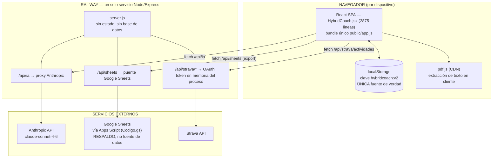
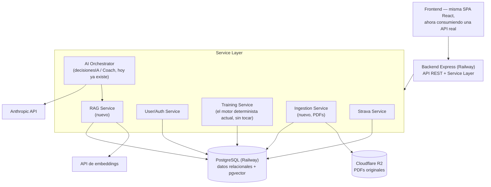
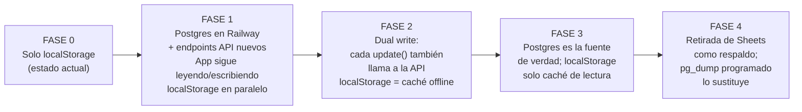
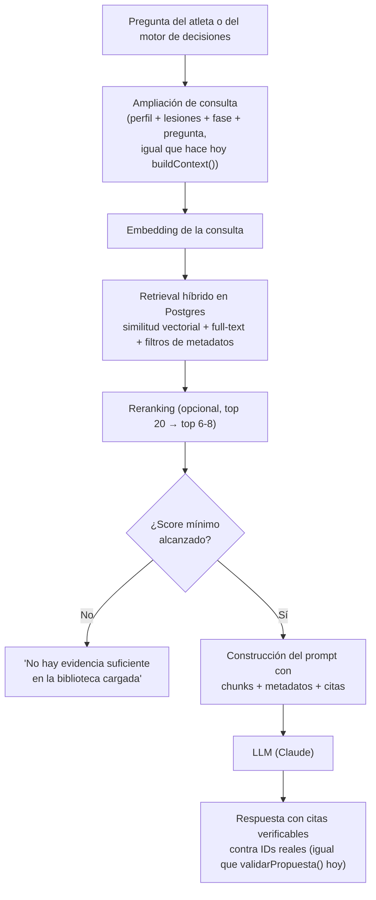
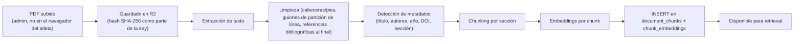
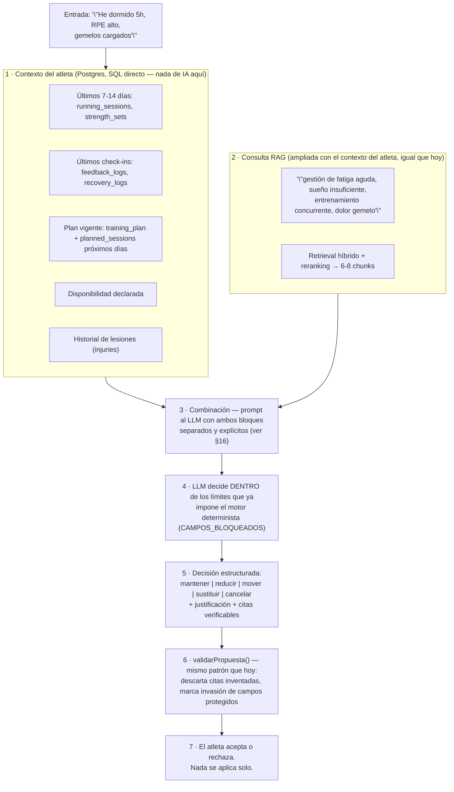
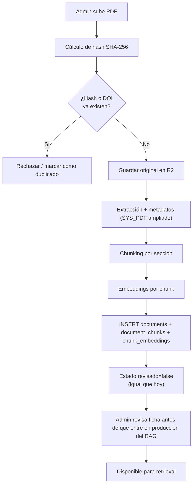
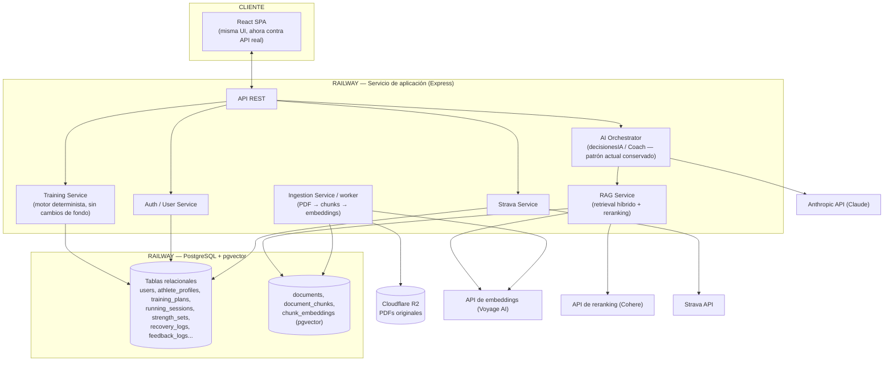

# Hybrid Coach — de localStorage + hoja de cálculo a PostgreSQL + RAG científico

**Documento de investigación y arquitectura. No implementa nada.**
Autor: análisis técnico solicitado por Roberto · Fecha: agosto 2026

---

## 0. Resumen ejecutivo

Antes de entrar en detalle, la conclusión corta, porque cambia el diagnóstico que traías:

Tu problema no es "migrar Excel a una base de datos". **Hoy no existe ninguna base de datos ni ningún backend con estado.** Toda la aplicación —perfil, plan, historial de carreras y fuerza, check-ins, bibliografía, chat— vive en un único blob JSON dentro de `localStorage` del navegador. El servidor Express en Railway es un proxy sin estado: reenvía llamadas a la API de Anthropic, hace de puente hacia una hoja de Google Sheets (que es un **respaldo de solo escritura**, no la fuente de datos de la app) y gestiona el OAuth de Strava con un token guardado en una variable en memoria del proceso. Si borras el navegador o cambias de móvil, pierdes todo salvo lo que se haya escrito en la hoja.

La buena noticia es que el resto del proyecto está mejor pensado de lo que el enunciado sugiere. Ya existe:
- Un **motor determinista** de planificación (`buildPlan`) que calcula la estructura del plan (semanas, taper, riesgo, sesiones) y que la IA tiene prohibido tocar por diseño (`CAMPOS_BLOQUEADOS` / `AJUSTES_PERMITIDOS`).
- Una **bibliografía estructurada** de 40 referencias (`BIBLIO_SEED`) con campos ya pensados para RAG: tema, tags, grado de evidencia, población, límites, aplicación práctica.
- Un **selector de relevancia por palabras clave** (`refsRelevantes`) que ya hace, de forma rudimentaria, lo que un retriever RAG hace con embeddings: puntuar y seleccionar solo las referencias pertinentes para no mandar la biblioteca entera en cada prompt.
- Un **prompt de coach que se reconstruye desde cero en cada mensaje** a partir del estado real (perfil, plan, últimos registros), en vez de depender de memoria de conversación. Es exactamente el patrón correcto para evitar alucinaciones por contexto viejo.
- Validación de las propuestas de la IA (`validarPropuesta`) que descarta citas inventadas y marca los intentos de tocar la estructura protegida.

Esto importa porque la evolución que propongo no es "construir un sistema RAG desde cero": es **llevar a base de datos real un patrón que ya está bien diseñado**, y **sustituir el emparejamiento por palabras clave por embeddings + búsqueda híbrida**, manteniendo intactas las reglas de negocio y los guardarraíles que ya tienes.

Recomendación técnica en una frase: **PostgreSQL gestionado en Railway + extensión `pgvector`**, un único backend con estado (hoy no existe ninguno), objetos PDF en Cloudflare R2, sin microservicios, sin cola de mensajes, sin base de datos vectorial separada.

---

## 1. Estado actual de mi proyecto

### 1.1 Mapa de arquitectura real



### 1.2 Stack tecnológico (verificado en el código, no supuesto)

| Capa | Tecnología | Detalle |
|---|---|---|
| Lenguaje | JavaScript (ESM), JSX | `"type": "module"` en `package.json` |
| Frontend | React 18 + Recharts | Un único componente `HybridCoach.jsx` de 2875 líneas, sin router, navegación por pestañas con `useState` |
| Build | esbuild | `build.mjs` compila `src/index.jsx` a `public/app.js` (bundle IIFE minificado, sin sourcemaps) |
| Backend | Express 4 | `server.js`, 12.5 KB, sin ORM, sin base de datos |
| Persistencia real | **`localStorage` del navegador** | Clave `hybridcoach:v2`; interfaz `store.get/set` con fallback a `window.storage` (modo artifact de claude.ai) |
| Respaldo | Google Sheets vía Apps Script | `Codigo.gs`, 15 hojas con cabeceras fijas (`HEADERS`), solo escritura desde la app (con lectura puntual para Strava) |
| IA | Anthropic API (`claude-sonnet-4-6`) | Proxied por `/api/ia`; la clave nunca llega al navegador |
| Autenticación | Contraseña única compartida | Cookie `hc_pase`, sin cuentas de usuario reales |
| Despliegue | Railway, Nixpacks | Un servicio, `npm install && npm run build` → `npm start` |
| Integraciones | Strava (OAuth), Google Sheets (Apps Script o cuenta de servicio) | Token de Strava vive en una variable de proceso: no sobrevive a un redeploy y no distingue usuarios |

### 1.3 Cómo funciona ahora, paso a paso

1. **Carga inicial** (`loadState()`): intenta leer `hybridcoach:v2` de `localStorage`. Si no existe, mira si hay un estado `v1` antiguo y lo migra. Si tampoco hay nada, arranca con un **perfil semilla** hardcodeado (`perfilSemilla()`, los datos de Roberto) y genera el plan con `buildPlan()`.
2. **Generación del plan** (`buildPlan(perfil, hoy)`): motor determinista en JavaScript puro. Calcula semanas totales, fases, taper, techo de tirada larga, número de sesiones de carrera/gimnasio, y una puntuación de riesgo estructural a partir de lesiones, experiencia y parón. Nada de esto pasa por la IA.
3. **Registro de sesiones**: `Running` (carrera), `Fuerza` (gimnasio, con RIR/RPE), `Feedback`/checkins (RPE, dolor, energía) y `Recovery` (sueño, fatiga, estrés) se añaden como arrays dentro del perfil activo, en el mismo blob de `localStorage`. Cada `update()` hace un `JSON.parse(JSON.stringify(...))` (clonado profundo) y guarda el estado entero de nuevo — no hay escritura incremental.
4. **Bibliografía**: 40 referencias semilla más las que se añaden a mano o por PDF. Viven en `st.biblio`, un array plano dentro del mismo blob.
5. **Importación de PDF**: ocurre **enteramente en el navegador**. `pdf.js` extrae texto (máx. 14 páginas / 55 000 caracteres), se manda ese texto a `/api/ia` con un prompt (`SYS_PDF`) que pide **una ficha estructurada única** (autor, año, tema, grado de evidencia, resumen, límites, aplicación práctica). **El PDF original no se sube ni se guarda en ningún sitio**: solo persiste la ficha. No hay chunking, no hay embeddings, no hay recuperación a nivel de párrafo o página.
6. **Selección de evidencia para la IA** (`refsRelevantes`): puntuación léxica (no semántica) sobre los ~40 registros de la biblioteca — coincidencia de tokens en tema, tags, título, aplicación, resumen, ponderada por el grado de evidencia. Selecciona entre 4 y 14 referencias según el contexto (chat vs. razonamiento del plan) y las inyecta como texto en el prompt.
7. **Razonamiento del plan** (`decisionesIA`): envía a Claude los "hechos" ya calculados por el motor (`hechosPlan`) más las referencias relevantes, con un system prompt (`SYS_DECISIONES`) que prohíbe expresamente recalcular la estructura y exige citar solo IDs de referencias existentes. La respuesta pasa por `validarPropuesta()`, que descarta citas inventadas y marca (sin bloquear) las propuestas que parecen tocar campos protegidos. Nada se aplica solo: el usuario acepta o rechaza cada decisión.
8. **Coach conversacional** (`Coach` + `buildContext`): en cada mensaje se reconstruye desde cero un system prompt con el perfil completo, el plan y sus decisiones activas, el estado de la semana, las últimas 8 carreras, las últimas cargas por ejercicio, los últimos 6 check-ins y registros de recuperación, la nutrición del día (calculada, no generada por IA) y entre 4 y 10 referencias bibliográficas relevantes a la pregunta. Se envían los últimos 12 turnos de chat como mensajes. La respuesta puede incluir un bloque `<<CAMBIO>>{...}<<FIN>>` con una propuesta de cambio concreta, que queda pendiente de aceptación.
9. **Respaldo en Google Sheets**: si hay `APPS_SCRIPT_URL` configurada, ciertos cambios (rutinas, ejercicios propios) se empujan a una hoja de cálculo. El propio `Codigo.gs` distingue "hojas de estado" (se sustituyen las filas del perfil) de "hojas de historial" (se acumulan). **Es una exportación, no una fuente de la que la app se recargue.**
10. **Multiusuario real: no existe.** `APP_PASSWORD` es una puerta compartida, no un sistema de cuentas. Cada perfil vive en el `localStorage` de un navegador concreto. Si dos personas comparten servidor y hoja de Google, pueden verse los datos entre sí salvo que cada una despliegue su propio servicio (así lo dice tu propio README).

### 1.4 El archivo `.xlsx` del repositorio

`HybridCoach-BaseDeDatos.xlsx` **no lo lee ni lo escribe ningún código** (verificado por búsqueda en todo el repo). Es un artefacto de referencia/plantilla que refleja manualmente el mismo esquema que `Codigo.gs` crea en Google Sheets. No forma parte del flujo de datos en producción. Esto simplifica la migración: no hay que "parsear archivos Excel", hay que sustituir dos cosas — el blob de `localStorage` y el respaldo en Sheets — por un backend con base de datos real.

### 1.5 Variables de entorno actuales

`APP_PASSWORD`, `ANTHROPIC_API_KEY`, `APPS_SCRIPT_URL` (o `SHEET_ID` + `GOOGLE_SERVICE_ACCOUNT_JSON`), `STRAVA_CLIENT_ID`, `STRAVA_CLIENT_SECRET`, `MODELO_IA`. Todas opcionales salvo que quieras cada capa activa.

---

## 2. Problemas actuales (más allá de "usamos Excel")

1. **No hay persistencia de servidor.** El dato vive y muere con el navegador. Es el problema real, y es más grave que "migrar de formato de archivo".
2. **El respaldo en Sheets es unidireccional y frágil.** No hay lectura de vuelta hacia la app salvo para Strava; si la hoja y el `localStorage` divergen, no hay reconciliación.
3. **Multiusuario inexistente a nivel de servidor.** Un `APP_PASSWORD` no es autenticación por persona; Strava guarda un único token global en memoria de proceso, que además se pierde en cada redeploy.
4. **La "biblioteca científica" no escala como RAG.** Con 40 referencias funciona porque cabe en memoria y el matching léxico es barato. Con 300-500 papers (chunks, no fichas de una línea) esto se rompe: no hay full-text real, no hay embeddings, no hay recuperación a nivel de párrafo, no hay página ni cita verificable.
5. **El PDF original no se conserva.** No puedes volver a comprobar de dónde salió una cifra, ni reprocesar con mejor chunking más adelante, porque el archivo no se guarda en ningún sitio.
6. **Sin control de duplicados.** Nada evita subir el mismo paper dos veces con distinto `id`.
7. **Escritura no incremental.** Cada guardado reescribe el blob completo de `localStorage`; con historial largo (meses de entrenos) esto crece de forma no acotada y ralentiza cada `update()`.
8. **Sin backups reales.** `localStorage` no se respalda; perder el dispositivo o limpiar el navegador borra el historial salvo lo exportado a Sheets.
9. **Acoplamiento a Google Apps Script** para cualquier persistencia server-side, con un modelo de permisos ("Cualquier usuario con el enlace") que no es apto para datos de salud si crece a más gente.

Todo esto confirma tu intuición de fondo (hay que salir de hojas de cálculo), pero cambia el orden de prioridades: **primero backend con estado, después RAG serio.**

---

## 3. Arquitectura objetivo



Un único backend, una única base de datos con dos funciones (relacional + vectorial), un bucket de objetos para los PDF. Nada de microservicios separados: el "Service Layer" es organización de carpetas dentro del mismo proceso Node, no despliegues distintos. Ver §33 para por qué.

---

## 4. PostgreSQL vs. MongoDB (y el resto) para este proyecto concreto

Tu dato es abrumadoramente relacional: un atleta tiene un plan, que tiene semanas, que tienen sesiones, que tienen sets, con claves foráneas naturales en todas direcciones (perfil → plan → semana → sesión → ejercicio → serie). Necesitas agregaciones (volumen semanal, tendencia de RPE, adherencia), y necesitas transacciones cuando "dual write" a dos tablas relacionadas. Eso es el terreno de un motor relacional, no de un almacén documental.

| Criterio | PostgreSQL | MongoDB | SQLite | Supabase | Neon |
|---|---|---|---|---|---|
| Ajuste al modelo de datos | Excelente — el dato ya es relacional (perfil→plan→semana→sesión→set) | Forzado — tendrías que desnormalizar o simular joins en aplicación | Excelente para dev local, mal para producción concurrente en Railway (un solo archivo, sin réplica gestionada) | Es PostgreSQL + capa extra (auth, storage, realtime) | Es PostgreSQL serverless con branching |
| Consultas analíticas (tendencia RPE, volumen semanal) | SQL + funciones de ventana, nativo | Agregaciones posibles pero más verboso | Igual que Postgres en SQL, pero sin concurrencia real | Igual que Postgres | Igual que Postgres |
| Vectores / RAG | `pgvector` en el mismo motor | Mongo Atlas Vector Search (solo en Atlas gestionado, no en Community/self-host) | No | pgvector disponible (es Postgres) | pgvector disponible |
| Integración con Railway | Plantilla oficial de un clic, red privada, backups automáticos | No hay plantilla de primera clase de Mongo en Railway; se puede desplegar Community en un contenedor propio, sin backups gestionados | Trivial pero vive en el filesystem del contenedor: **se borra en cada redeploy** salvo volumen persistente, y no soporta bien escritura concurrente | Requiere salir de Railway o usarlo como servicio externo | Igual, servicio externo |
| Backups | Automáticos en el plan gestionado de Railway (snapshots), + `pg_dump` manual | Depende de cómo lo despliegues; sin plantilla gestionada, backups son cosa tuya | Manual (copiar el archivo) | Gestionado por Supabase | Gestionado por Neon, con point-in-time recovery |
| Coste en tu escala | Incluido en el consumo normal de Railway (~unos $ al mes con tu volumen) | Similar si autogestionas; Atlas gestionado añade otra factura y otro proveedor | Gratis, pero no apto para producción multiusuario | Gratis hasta cierto límite, luego otra factura aparte de Railway | Gratis hasta cierto límite, otra factura aparte |
| Migraciones de esquema | Herramientas maduras (Prisma, Drizzle, node-pg-migrate) | Sin esquema fijo — la disciplina de migración depende de ti | Igual que Postgres en sintaxis, ecosistema más pequeño | Igual que Postgres | Igual que Postgres |
| Soporte multiusuario | Row-level security nativo, roles, `user_id` como llave foránea en todo | Posible pero sin RLS nativo — el aislamiento es responsabilidad de la aplicación | Posible pero no es su caso de uso | Nativo (es su producto principal) | Requiere construirlo tú (es solo la BD) |

**Tecnología recomendada: PostgreSQL, gestionado como servicio de Railway.**

Por qué, en una frase por alternativa: MongoDB obligaría a modelar de forma no natural un dominio que ya es relacional, y su soporte de vectores serio exige Atlas (otro proveedor, otra factura, sales de Railway). SQLite no sobrevive un redeploy de Railway sin volumen dedicado y no está pensado para escritura concurrente multiusuario. Supabase y Neon son en el fondo Postgres — añadirlos aquí sería sumar un proveedor externo y una segunda factura sin ganar nada que Railway Postgres no dé ya, salvo que en el futuro quieras auth/storage gestionados de Supabase (posible más adelante, no ahora).

---

## 5. PostgreSQL + pgvector frente a bases de datos vectoriales dedicadas

Para tu escala (una biblioteca de cientos, quizá un par de miles de papers; consultas de pocos por segundo, no miles) la pregunta no es "¿pgvector es tan rápido como Pinecone a gran escala?" — es "¿necesito esa escala?". No la necesitas.

| | pgvector | Pinecone | Qdrant | Weaviate | MongoDB Atlas Vector Search |
|---|---|---|---|---|---|
| Dónde vive | Dentro de tu Postgres de Railway | Servicio gestionado aparte | Self-host o cloud gestionado aparte | Self-host o cloud gestionado aparte | Solo en Atlas (otro proveedor) |
| Coste adicional | Ninguno (extensión, no servicio) | Facturación propia por índice/consulta | Gratis self-host, o factura de Qdrant Cloud | Gratis self-host, o factura de Weaviate Cloud | Factura de Atlas |
| Joins con datos relacionales | Directo — `JOIN` en la misma consulta SQL entre `document_chunks` y, por ejemplo, `athlete_profiles` | Imposible sin traer los IDs y cruzarlos en aplicación | Igual que Pinecone | Igual que Pinecone | Mejor que las tres anteriores por vivir junto al dato documental, pero tú no tienes dato documental, tienes relacional |
| Operación | Un backup, un servicio, una conexión | Dos sistemas que mantener sincronizados (¿qué pasa si borras una fila en Postgres y no en Pinecone?) | Igual problema de sincronización | Igual | Igual, aunque menos grave si migraras todo a Mongo (no es tu caso) |
| Rendimiento a tu escala (miles de chunks, no millones) | Sobrado con índice HNSW (`pgvector` ≥ 0.5) | Sobrado, pero es usar un Ferrari para ir a la panadería | Sobrado | Sobrado | Sobrado |
| Filtrado combinado (vector + metadatos: "solo RCT después de 2015") | SQL normal: `WHERE study_type='RCT' AND year>2015 ORDER BY embedding <=> query` | Soportado pero con sintaxis y límites propios del proveedor | Soportado, buen filtrado nativo | Soportado | Soportado |
| Curva de aprendizaje añadida | Ninguna si ya usas SQL | Nueva API, nuevo SDK, nuevo modelo mental | Nueva API, nuevo SDK | Nueva API, nuevo SDK, GraphQL propio | Nuevo SDK de Atlas |

**Conclusión: `pgvector` sobre el mismo Postgres.** Evita el problema número uno de las arquitecturas RAG mal dimensionadas: dos fuentes de verdad (la BD relacional y la BD vectorial) que se desincronizan. Aquí un `chunk` y su `embedding` viven en la misma fila, y puedes hacer en una sola consulta SQL "recupera los 8 fragmentos más similares a este vector, que además sean de estudios sobre corredores y de calidad ≥ moderada, ordenados por similitud y por grado de evidencia" — sin salir de la base de datos. Si algún día tu biblioteca supera decenas de miles de chunks y la latencia de `pgvector` se vuelve un problema real (no lo será a tu escala), migrar a Qdrant en ese momento es un proyecto acotado, no una reescritura.

`pgvector` en Railway: hay plantillas oficiales de un clic (Postgres 17 con pgvector preinstalado), y también se puede activar `CREATE EXTENSION vector;` sobre un Postgres de Railway ya existente. [Deploy & Host pgvector-pg17 | Railway](https://railway.com/deploy/qcuy_M) · [Enable pgvector extension for PostgreSQL service — Railway Help Station](https://station.railway.com/questions/enable-pgvector-extension-for-postgre-sql-e861e033)

---

## 6. Modelo de datos

Diseño relacional, pensado para multiusuario desde el primer día aunque hoy solo lo uses tú: **todo cuelga de `user_id`**, con `athlete_profiles` separado de `users` para permitir en el futuro que una cuenta gestione más de un perfil (como ya hace tu app hoy con "perfiles" dentro de un mismo navegador).

### 6.1 Núcleo de usuarios y perfiles

- **`users`** — cuenta con la que se entra en la aplicación. Campos: `id (uuid, pk)`, `email`, `password_hash` (o proveedor OAuth), `created_at`. Sustituye al `APP_PASSWORD` compartido.
- **`athlete_profiles`** — el "perfil" actual (cuestionario completo). `id (pk)`, `user_id (fk → users)`, `nombre`, todos los campos del cuestionario (edad, sexo, distancia objetivo, fecha de carrera, lesiones como JSONB o tabla propia, disponibilidad, etc.), `created_at`, `updated_at`. Índice en `user_id`.
- **`injuries`** / **`pain_points`** — normalmente conviene extraer las lesiones a tabla propia en vez de JSONB si vas a consultarlas (p. ej. "dame todos los atletas con historial de sóleo" para estudios de cohortes propios más adelante). `id`, `athlete_profile_id (fk)`, `zona`, `recurrente (bool)`, `contexto`.

### 6.2 Plan y estructura

- **`training_plans`** — un plan generado por el motor determinista. `id`, `athlete_profile_id (fk)`, `distancia_objetivo`, `fecha_carrera`, `total_semanas`, `taper_semanas`, `riesgo_score`, `riesgo_causas (jsonb)`, `generado_en`, `version` (cada regeneración crea una fila nueva; nunca se hace `UPDATE` destructivo sobre la estructura).
- **`training_weeks`** — una semana del plan. `id`, `training_plan_id (fk)`, `numero_semana`, `fase`, `techo_tirada_larga_min`.
- **`planned_sessions`** — sesión prevista por el planificador para un día concreto. `id`, `training_week_id (fk)`, `dia_semana`, `codigo_sesion` (`RUN A`, `GYM B`…), `tipo (run|gym)`, `descripcion`, `duracion_min`.
- **`plan_decisions`** — equivalente a tu `Decisiones_Plan` de Sheets. `id`, `training_plan_id (fk)`, `titulo`, `justificacion`, `fuente (motor|ia)`, `confianza`, `estado (pendiente|aceptada|rechazada)`, `creado_en`. Relación N:N con `document_chunks` a través de `plan_decision_citations` (ver §6.5).
- **`plan_modifications`** — tu `Cambios_Plan`. `id`, `athlete_profile_id (fk)`, `fecha`, `semana`, `plan_original`, `cambio (jsonb)`, `motivo`, `origen (usuario|coach_ia)`.

### 6.3 Registro de entrenamiento (histórico, se acumula, nunca se sobreescribe)

- **`completed_sessions`** — sesión realmente ejecutada, enlazada opcionalmente a `planned_sessions`. `id`, `athlete_profile_id (fk)`, `planned_session_id (fk nullable)`, `fecha`, `tipo (run|gym)`.
- **`running_sessions`** — detalle de carrera. `id`, `completed_session_id (fk)`, `distancia_km`, `duracion_min`, `ritmo`, `fc_media`, `fc_max`, `desnivel`, `cadencia`, `rpe`, `dolor`, `notas`, `origen (manual|strava)`, `external_id` (id de actividad Strava, con índice único para evitar duplicados).
- **`strength_sessions`** — cabecera de una sesión de gimnasio. `id`, `completed_session_id (fk)`, `codigo_sesion`.
- **`strength_exercises`** — catálogo de ejercicios (equivalente a `Ejercicios_Propios` + el catálogo interno). `id`, `nombre`, `grupo_muscular`, `incremento_kg_default`, `athlete_profile_id (fk nullable — null si es del catálogo global, no null si es un ejercicio propio del usuario)`.
- **`strength_sets`** — cada serie. `id`, `strength_session_id (fk)`, `strength_exercise_id (fk)`, `orden`, `peso_kg`, `reps`, `rir`, `notas`. Índice en `(strength_exercise_id, fecha)` para calcular progresión rápido.

### 6.4 Recuperación y sensaciones

- **`recovery_logs`** — tu `Recovery`. `id`, `athlete_profile_id (fk)`, `fecha`, `horas_sueno`, `calidad_sueno`, `fatiga`, `agujetas`, `estres`, `motivacion`, `dolor`.
- **`feedback_logs`** — tu `Feedback`/checkins. `id`, `athlete_profile_id (fk)`, `fecha`, `rpe`, `dolor`, `zona_dolor`, `tipo_dolor`, `cuando_aparece`, `energia`, `comentario`.
- **`availability`** — disponibilidad semanal declarada, si quieres que sea histórica (hoy vive dentro del perfil, sin versión temporal): `id`, `athlete_profile_id (fk)`, `vigente_desde`, `dias (int[])`, `min_gym`, `min_run`, `min_finde`.

### 6.5 Bibliografía y RAG

- **`documents`** — un paper. `id`, `titulo`, `autores`, `anio`, `fuente_revista`, `doi (unique, nullable)`, `hash_archivo (unique)` — para detectar duplicados aunque no tengan DOI —, `study_type` (meta-análisis, revisión sistemática, RCT, observacional, posicionamiento…), `poblacion`, `sample_size`, `training_level`, `tema_principal`, `tags (text[])`, `grado_evidencia`, `resumen`, `limites`, `aplicacion_practica`, `storage_url` (ruta en R2 del PDF original), `origen (semilla|manual|pdf)`, `revisado (bool)`, `subido_por (fk users, nullable)`, `creado_en`.
- **`document_chunks`** — fragmentos del texto completo para retrieval fino (nuevo; no existe hoy). `id`, `document_id (fk)`, `chunk_index`, `seccion` (introducción/métodos/resultados/discusión/conclusión, ver §8), `pagina_inicio`, `pagina_fin`, `texto`, `num_tokens`.
- **`chunk_embeddings`** — separada de `document_chunks` para poder reindexar o cambiar de modelo de embeddings sin tocar el texto. `id`, `document_chunk_id (fk, unique)`, `modelo` (para poder convivir varias generaciones de embeddings durante una migración), `embedding (vector(1024))`, `creado_en`. Índice `ivfflat` o `hnsw` sobre `embedding`.
- **`plan_decision_citations`** — tabla puente N:N entre `plan_decisions` (o `ai_recommendations`, ver abajo) y `document_chunks`, para saber exactamente qué fragmento (no solo qué paper) respalda cada frase. `plan_decision_id (fk)`, `document_chunk_id (fk)`, `similarity_score`.

### 6.6 IA y conversación

- **`ai_recommendations`** — generalización de "decisiones IA" y "cambios propuestos por el coach", para no duplicar estructura entre `decisionesIA()` y el `<<CAMBIO>>` del chat. `id`, `athlete_profile_id (fk)`, `origen (razonamiento_plan|coach_chat)`, `tipo`, `contenido (jsonb)`, `confianza`, `estado`, `modelo_usado`, `creado_en`.
- **`conversations`** — hilo de chat (hoy es un array plano `chat[]` dentro del blob, sin límite de crecimiento salvo el `.slice(-40)` manual). `id`, `athlete_profile_id (fk)`, `iniciada_en`, `resumen` (para compactar turnos antiguos, ver §23).
- **`messages`** — `id`, `conversation_id (fk)`, `role (user|assistant)`, `contenido`, `cambio_propuesto (jsonb, nullable)`, `creado_en`.

### 6.7 Nutrición

- **`nutrition_targets`** — tu `Nutricion_Objetivos`, calculado por el motor, no por la IA. `id`, `athlete_profile_id (fk)`, `fecha`, `kcal`, `proteina_g`, `carbohidrato_g`, `grasa_g`, `fibra_g`, `agua_l`, `momento_entreno`, `fijado_por_usuario (bool)`.
- **`meal_catalog`** — `id`, `athlete_profile_id (fk)`, `categoria`, `opcion`.

### 6.8 Índices importantes

`user_id` en cada tabla que dependa de usuario; `(athlete_profile_id, fecha)` en toda tabla de historial (es tu patrón de consulta constante: "últimos N días"); índice único en `documents.doi` y en `documents.hash_archivo` para deduplicar; índice `ivfflat`/`hnsw` sobre `chunk_embeddings.embedding`; índice GIN sobre `documents.tags` y sobre un `tsvector` generado para full-text search híbrido (§13); índice único en `running_sessions.external_id` para no duplicar actividades de Strava reimportadas.

---

## 7. Migración desde el estado actual (localStorage + Sheets)

No es una migración desde archivos Excel sueltos: es una migración desde **un blob JSON por navegador** más **una hoja de Google usada como respaldo**. El plan seguro:

1. **Inspección**: exportar el blob `hybridcoach:v2` de tu propio navegador (ya existe un botón o se puede leer directamente de `localStorage` con las herramientas de desarrollador) y, en paralelo, exportar cada hoja de `Codigo.gs` a CSV. Comparar ambas fuentes fila a fila: la hoja puede tener menos historial que el navegador (solo se sincronizan `Rutinas`, `Ejercicios_Propios` y poco más hoy) o divergir en ediciones manuales.
2. **Mapeo de columnas**: es mecánico porque `HEADERS` de `Codigo.gs` ya define el esquema deseado columna por columna — es prácticamente un mapeo 1:1 con las tablas de §6 (`Running` → `running_sessions`, `Fuerza` → `strength_sets`, `Recovery` → `recovery_logs`, `Feedback` → `feedback_logs`, `Bibliografia` → `documents`, `Cambios_Plan` → `plan_modifications`).
3. **Limpieza**: valores vacíos de Sheets (`""`) → `NULL`; campos numéricos que llegaron como texto (`+p.grasa || null` es un patrón que verás repetido en el código, indicio de que ya lidias con esto) → *cast* explícito y validado.
4. **Normalización de fechas**: el código usa `iso(new Date())` de forma consistente (formato `YYYY-MM-DD`), lo cual ayuda mucho — no hay formatos mixtos de fecha que reconciliar.
5. **Gestión de IDs**: hoy los IDs son `uid()` generados en cliente (probablemente `Math.random` o similar) y a veces `Date.now()` (ver `id: Date.now()` en el registro de carrera manual — riesgo de colisión si se registran dos sesiones en el mismo milisegundo, poco probable pero real). En la migración, generar `uuid v4` nuevos en el backend y mantener una tabla temporal `legacy_id_map (old_id, new_id, tabla)` para poder rastrear cualquier discrepancia.
6. **Duplicados**: cruzar por `(athlete_profile_id, fecha, tipo_sesion)` para detectar si una sesión ya se exportó a Sheets y también sigue en `localStorage`.
7. **Validación de integridad**: contar filas por tabla en origen y destino; sumar totales (km totales corridos, kg totales movidos) antes y después como checksum grosero pero eficaz.
8. **Compatibilidad temporal con Sheets**: no hace falta — a diferencia de un Excel que alguien edita a mano, la hoja aquí es generada por la app y nadie la edita directamente salvo tú de forma puntual. Se puede mantener el *export* a Sheets como capa de "por si acaso" durante la fase de transición (barato de dejar encendido) sin necesidad de *dual write* real hacia ella como fuente de verdad.
9. **Cuándo retirar Sheets**: cuando lleves 2-3 semanas con el backend en Postgres como única fuente de verdad y hayas verificado que el respaldo (ahora sí, un backup real: `pg_dump` programado) funciona.

### Estrategia de fases, adaptada a tu caso real



Esta estrategia sí tiene sentido para ti, con un matiz respecto a la que planteabas: como hoy no hay ningún backend, la Fase 1 no es "migrar Excel" sino "construir el backend y las tablas, y empezar a escribir en ellas desde cero mientras `localStorage` sigue siendo la copia que ve el usuario". El riesgo real está en la Fase 2 (dual write): asegúrate de que cada escritura a Postgres sea *idempotente* (usa `UPSERT` con una clave natural, no solo `INSERT`), porque un fallo de red a mitad de sincronización no debe duplicar filas.

---

## 8. Arquitectura RAG — visión general



Esto sustituye a `refsRelevantes()` conservando su función exacta (seleccionar solo lo relevante para no saturar el prompt) pero operando sobre fragmentos de texto real con significado semántico, no sobre una ficha resumen de una línea por paper.

---

## 9. Pipeline de ingesta de PDFs



**Extracción de texto — herramienta recomendada: PyMuPDF (`fitz`).** Es más rápido y más preciso conservando el orden de lectura que `pypdf`, y no arrastra las dependencias pesadas de `Unstructured` (que internamente usa OCR y modelos de layout, útiles para PDFs escaneados o con tablas complejas, pero sobredimensionado para papers científicos con texto nativo). `pdfplumber` es buena alternativa si necesitas extraer tablas de resultados con estructura, algo que sí te puede interesar para papers de nutrición con tablas de macros — vale la pena tenerlo como herramienta secundaria solo para esas tablas, no como extractor por defecto. Los PDF escaneados como imagen sin capa de texto (mismo límite que ya documenta tu `GUIA-INSTALACION.md` para el flujo actual en cliente) necesitarían OCR (`Tesseract` u OCR del propio LLM) como paso aparte; no lo trataría como caso general, solo como excepción marcada manualmente.

**¿LangChain o LlamaIndex?** No para este proyecto. Ambos aportan valor cuando necesitas orquestar muchas fuentes heterogéneas, agentes con múltiples herramientas, o cambiar de proveedor de LLM/vector store constantemente. Aquí tienes: un tipo de documento (papers en PDF), un almacén vectorial (Postgres), un proveedor de LLM (Anthropic) y un flujo de recuperación bien definido. Meter LangChain añade una capa de abstracción, dependencias y "magia" (prompts internos que no controlas del todo) para resolver un problema que son, en la práctica, 200-300 líneas de Python directo: extraer texto, trocear, pedir embeddings, insertar en Postgres. Es exactamente el mismo principio de diseño que ya aplicaste en el frontend: tu app no usa un framework de gestión de estado (Redux, Zustand) para 2875 líneas — usa `useState` y una función `update()`. Mismo criterio aquí: la complejidad debe estar justificada por la necesidad, no por la costumbre del ecosistema.

**Dónde vive este pipeline**: no en el navegador (como hoy el análisis de PDF), porque vas a mover el procesamiento a algo reproducible, versionable y que pueda reprocesar la biblioteca entera si cambias de modelo de embeddings. Un script/servicio Python o Node que corre como *worker* en Railway (ver §20), disparado manualmente desde un panel de administración o por una tarea en background, no por el navegador del atleta.

---

## 10. Chunking para papers científicos

Cortar cada N caracteres es la opción más simple y la peor para este caso: rompe frases a mitad, mezcla métodos con resultados, y hace casi imposible responder bien a "¿qué volumen semanal es adecuado para un principiante?" porque la respuesta puede quedar repartida en dos chunks arbitrarios sin contexto.

**Recomendación: chunking por sección + límite de tokens dentro de cada sección.**

1. Detectar secciones estándar de un paper (Abstract, Introduction, Methods, Results, Discussion, Conclusion) por patrones de encabezado (mayúsculas, numeración, negrita perdida en la extracción pero detectable por salto de línea + patrón). No siempre están perfectamente marcadas tras la extracción de texto — para eso sirve el paso de limpieza previo.
2. Dentro de cada sección, trocear por párrafos, agrupando párrafos consecutivos hasta un tope de ~400-600 tokens por chunk (suficiente para una unidad de sentido completa, poco para que el embedding se diluya). Solape de ~15% entre chunks consecutivos de la misma sección para no cortar una frase clave justo en el límite.
3. Metadato de sección en cada chunk (§6.5, campo `seccion`) para poder filtrar: una pregunta tipo "¿qué encontraron?" prioriza `results` y `discussion`; una pregunta tipo "¿en quién se estudió esto?" prioriza `methods`.
4. Para tu ejemplo concreto — *"¿es recomendable colocar fuerza de piernas el día antes de intervalos?"* — lo relevante casi siempre está en Discussion/Conclusion (interpretación aplicada) y en Results (magnitud del efecto de interferencia), rara vez en Methods. El chunking por sección permite ponderar la búsqueda hacia esas secciones sin descartar Methods (necesario para juzgar si la población se parece al atleta).

No recomiendo *semantic chunking* (cortar donde el embedding de frases consecutivas diverge) como método principal aquí: añade una llamada de embeddings extra por documento en tiempo de ingesta y, para papers con estructura tan estandarizada como los de ciencias del deporte, el chunking por sección ya captura casi toda la señal estructural que el semantic chunking intenta descubrir a ciegas. Sería sobreingeniería para el problema que tienes.

---

## 11. Metadatos científicos

Tu `normRef()` actual ya define casi el conjunto correcto de campos — la tabla `documents` de §6.5 es en gran parte una versión con tipos estrictos de lo que ya tienes en `BIBLIO_SEED`. Los metadatos que sí conviene añadir porque hoy no existen y sirven para filtrar consultas como las que pides ("solo estudios con corredores", "prioriza revisiones sistemáticas", "solo después de 2015"):

- `study_type` como enum controlado (no texto libre): `meta_analysis | systematic_review | rct | observational | position_statement | narrative_review | preprint`. Es más fiable para filtrar que tu `grado` actual (`fuerte/moderada/débil/práctica`), que mezcla tipo de estudio y confianza en una sola etiqueta. Propongo **separar ambos conceptos**: `study_type` (qué es) y `evidence_grade` (cuánto pesa) — ver §17.
- `sample_size` (entero, nullable): permite ordenar/filtrar por robustez cuando el tipo de estudio no basta.
- `population_type`: `runners | strength_athletes | general_population | mixed` — tu campo `poblacion` hoy es texto libre ("n=24, hombres jóvenes entrenados"); mantenlo como texto descriptivo pero añade esta categoría normalizada para poder filtrar con un `WHERE` en vez de con regex sobre texto libre.
- `year` ya existe (`anio`); indexarlo para filtros de rango es trivial.
- `doi`: ya existe; hazlo `UNIQUE NOT NULL` cuando exista, para deduplicación real (§27).

---

## 12. Embeddings

Tu caso concreto — **papers mayoritariamente en inglés, consultas en español** — es exactamente el escenario donde importa elegir un modelo con buen soporte multilingüe cross-idioma, no solo buen inglés.

| Modelo | Multilingüe ES↔EN | Dimensión | Coste (por 1M tokens) | Notas |
|---|---|---|---|---|
| OpenAI `text-embedding-3-small` | Aceptable | 1536 | $0,02 | Barato, buen punto de partida, algo por detrás en cross-lingual fino |
| OpenAI `text-embedding-3-large` | Bueno | hasta 3072 (truncable por Matryoshka a 1536 sin perder mucho) | $0,13 | Mejor calidad; truncar a 1536 dimensiones reduce almacenamiento sin apenas coste de precisión |
| Voyage AI `voyage-3.5` / familia `voyage-4` | Muy bueno — Voyage reporta mejor rendimiento cross-lingual que OpenAI v3 large en benchmarks de retrieval multilingüe | Variable (1024 típico) | `voyage-4-lite` $0,02 · `voyage-4` $0,06 · `voyage-4-large` $0,12 · 200M tokens gratis en el tier voyage-4 al abrir cuenta | Mi recomendación por defecto para este proyecto |
| Cohere `embed-v4` | Muy bueno, uno de los mejores en multilingüe según comparativas 2026 | Variable | Similar rango a Voyage | Válida alternativa si ya vas a usar Cohere para reranking (mismo proveedor, una factura menos) |
| BGE-M3 (open-source, self-hosted) | Muy bueno, gratis | 1024 | Coste de cómputo propio, no de API | Solo tiene sentido si quieres evitar dependencia de API externa; para tu volumen de documentos, el ahorro no compensa la complejidad operativa de servir el modelo tú mismo |

**Recomendación: Voyage AI (`voyage-4` o `voyage-4-lite` para empezar)** por el mejor rendimiento cross-lingual reportado para tu combinación exacta (consulta en español sobre corpus en inglés), coste bajo a tu volumen, y 200M tokens gratis que probablemente cubran toda tu ingesta inicial de biblioteca sin gastar nada. Alternativa igualmente razonable: `text-embedding-3-large` de OpenAI truncado a 1536 dimensiones si prefieres un único proveedor (ya usas Anthropic para el LLM, no OpenAI — así que Voyage no añade más proveedores de los que ya tendrías con OpenAI). Dimensión final: guarda **1024** en `pgvector` salvo que las pruebas de evaluación (§19) muestren una mejora real con dimensión mayor — cada bit de dimensión extra es coste de almacenamiento e índice.

Fuentes: [New embedding models and API updates — OpenAI](https://openai.com/index/new-embedding-models-and-api-updates/) · [OpenAI Embedding Pricing 2026 — EmbeddingCost.com](https://embeddingcost.com/openai) · [Voyage AI Embedding Pricing — EmbeddingCost.com](https://embeddingcost.com/voyage) · [Models Overview — Voyage AI (MongoDB Docs)](https://www.mongodb.com/docs/voyageai/models/)

---

## 13. Retrieval: híbrido, no solo semántico

Búsqueda puramente semántica falla en dos casos frecuentes en bibliografía científica: (1) términos técnicos exactos (nombres de escalas, siglas como "ACWR", "RIR", nombres propios de autores) donde la coincidencia léxica exacta es más fiable que la semántica, y (2) consultas cortas y muy específicas donde el embedding pierde precisión frente a un simple `ILIKE`/full-text.

**Diseño recomendado**: combinar en la misma consulta SQL
1. **Similitud vectorial** (`embedding <=> query_embedding`, operador de `pgvector`) sobre `chunk_embeddings`.
2. **Full-text search nativo de Postgres** (`tsvector`/`tsquery`, con `to_tsvector('english', chunk.texto)` dado que el corpus es mayoritariamente inglés) sobre `document_chunks.texto`.
3. **Filtros de metadatos** duros (`study_type`, `year`, `population_type`, `evidence_grade`) aplicados antes de rankear, no después.
4. Combinar los dos rankings (vectorial + léxico) con **Reciprocal Rank Fusion** (fórmula simple, sin dependencias: `score = Σ 1/(k + rank_i)` para cada lista), un método estándar y barato de computar directamente en SQL o en la capa de aplicación.

Para tu ejemplo — *"¿cuánto tiempo debería separar fuerza pesada de una sesión de intervalos?"* — el componente léxico ayuda a traer directamente los chunks que mencionan literalmente "concurrent training" o "interference effect" (términos técnicos que un embedding podría diluir entre resultados temáticamente cercanos pero menos precisos), mientras el componente semántico trae papers que hablan del mismo fenómeno con otro vocabulario ("residual fatigue", "neuromuscular interference").

Esto sustituye a `refsRelevantes()` en funcionalidad exacta, pero operando sobre fragmentos con significado real en vez de una única línea resumen por paper.

---

## 14. Reranking

Vale la pena, con matices de coste. El patrón estándar (retrieval inicial → 20-30 candidatos → reranker → mejores 6-8 → LLM) mejora notablemente la precisión de lo que finalmente ve el modelo, porque el reranker es un modelo entrenado específicamente para juzgar relevancia pregunta-documento, más fino que la similitud coseno de embeddings genéricos.

- **Cohere Rerank 3.5**: $0,001 por búsqueda (hasta 100 documentos), soporta más de 100 idiomas — encaja con tu escenario ES↔EN. [Rerank v3.5 — API Pricing & Providers | OpenRouter](https://openrouter.ai/cohere/rerank-v3.5)
- Alternativa: usar el propio LLM (Claude) como reranker con un prompt corto de "puntúa relevancia 0-10" sobre los 20 candidatos — más caro por token que un reranker dedicado y más lento, solo lo consideraría si quieres evitar un proveedor más.

**Recomendación**: sí, incluir reranking, porque el coste marginal es mínimo ($0,001/consulta es irrelevante a tu volumen) y la mejora de precisión es justo lo que necesitas para no fundamentar una recomendación de entrenamiento en el chunk equivocado. Es opcional para la primera versión funcional (Fase 6 del roadmap, §32) pero lo metería antes de dar por buena la calidad del sistema en producción.

---

## 15. Motor de decisiones: datos del atleta + RAG científico

Este es, con diferencia, el bloque donde menos tienes que inventar, porque **ya existe una versión funcional de este flujo** en `decisionesIA()` y `buildContext()`. La evolución es sustituir la fuente de "evidencia" (de ficha-resumen con scoring léxico, a chunks con scoring híbrido) sin tocar el resto del patrón.



La diferencia clave con el diseño actual no está en el flujo (que ya es correcto) sino en la **calidad y trazabilidad de lo que se cita**: hoy una decisión cita `"b5"` (un ID de ficha-resumen de una línea); con el nuevo diseño cita `document_chunk_id` concretos, lo que permite mostrar el fragmento exacto y la página (§16), no solo "esto está basado en algo de Wilson 2012 en general".

---

## 16. Separar datos y conocimiento — explícito, como pides

- **Base de datos (`athlete_profiles`, `running_sessions`, `strength_sets`, `recovery_logs`, `feedback_logs`...)**: responde "**qué está pasando con este atleta**". Es determinista, se consulta con SQL normal, no pasa por ningún LLM para obtenerse. Ejemplo: *ayer corrió 8 km, RPE 8, durmió 5h, dolor de gemelo 3/10.*
- **RAG (`documents`, `document_chunks`, `chunk_embeddings`)**: responde "**qué dice la evidencia**", de forma general, sin saber nada de este atleta en particular. Ejemplo: *la acumulación de fatiga aguda combinada con sueño insuficiente reduce la tolerancia al entrenamiento de alta intensidad [tal estudio].*
- **Modelo IA (orquestador)**: la única pieza que ve ambos bloques a la vez y decide qué hacer, exactamente como hace hoy `buildContext()` al construir un prompt con una sección de "ESTADO ACTUAL" (datos) y otra de "BASE DE EVIDENCIA" (RAG) claramente delimitadas por encabezados de texto. Mantén esa separación textual explícita en el prompt (no las mezcles en un párrafo): ayuda al modelo a no confundir "lo que le pasa a este atleta" con "lo que dice la ciencia en general", y te permite a ti auditar qué bloque influyó en qué frase de la respuesta.

---

## 17. Nivel de evidencia

Separaría, como se apuntaba en §11, dos ejes que tu `grado` actual mezcla en una sola etiqueta:

1. **Tipo de estudio** (`study_type`, jerarquía metodológica objetiva): meta-análisis / revisión sistemática → ECA → estudio observacional → serie de casos / opinión / posicionamiento.
2. **Confianza aplicada** (`evidence_grade`, tu campo actual `fuerte/moderada/débil/práctica`): un metaanálisis con muestra pequeña y alta heterogeneidad puede merecer menos confianza que un ECA grande y bien ejecutado, así que no conviertas el tipo de estudio en la única señal de calidad.

Ambos campos, no uno derivado automáticamente del otro. El sistema de retrieval puede ponderar por ambos (como ya hace `PESO_GRADO` hoy, que puedes conservar casi igual) y el usuario puede pedir "prioriza revisiones sistemáticas" filtrando por `study_type` directamente, sin ambigüedad.

---

## 18. Conflictos entre estudios

Cuando la literatura no es consistente, el sistema no debe promediar ni elegir arbitrariamente. Diseño concreto:

- En el prompt de síntesis, instruir explícitamente (como ya hace `SYS_DECISIONES` con "si una decisión no tiene respaldo, dilo") que si los chunks recuperados contienen posiciones contradictorias, la respuesta debe **presentar ambas** con sus respectivas citas y marcar el tema como "evidencia mixta" en vez de forzar una conclusión única.
- Técnicamente, esto se detecta con un heurístico simple antes incluso de llegar al LLM: si entre los top-8 chunks recuperados hay documentos con `study_type` de peso alto que abordan el mismo tema pero fueron etiquetados en la ingesta con conclusiones de signo distinto (esto requiere que el paso de extracción de metadatos, ya lo hace tu `SYS_PDF` actual, incluya un campo de "dirección del hallazgo" — añadir en la tabla `documents` algo como `finding_direction` no es imprescindible en la v1, pero facilita detectar conflictos de forma automática más adelante).
- Nivel más simple y suficiente para empezar: dejar que sea el LLM quien, viendo los chunks completos (no solo el resumen de una línea), identifique la discrepancia en lenguaje natural — es lo que ya haces implícitamente con el campo `sin_respaldo` de `validarPropuesta()`. Extenderlo a un campo `evidencia_mixta: string[]` en el JSON de salida.

---

## 19. Guardrails: reglas duras vs. IA vs. RAG

Tu sistema ya resuelve esto correctamente para la estructura del plan (`CAMPOS_BLOQUEADOS`/`AJUSTES_PERMITIDOS`). La arquitectura híbrida que propongo generaliza el mismo principio a todo el sistema:

| Decisión | Quién decide | Por qué |
|---|---|---|
| Semanas totales, taper, techo de tirada larga, número de sesiones | **Reglas (motor determinista)** | Son la protección estructural del tejido; no son negociables ni deben depender de la calidad de un prompt |
| Progresión de carga en gimnasio (incremento de kg) | **Reglas** | Ya calculado hoy por `progresionSugerida` con criterios objetivos (RIR, repeticiones al tope) |
| Dolor ≥ umbral, síntomas de alarma (dolor en reposo, hinchazón) | **Reglas, con corte duro** | Ya existe hoy como aviso en el código (`c.dolor >= 5` → mensaje de derivación a profesional sanitario); debe seguir siendo un `if` de código, nunca depender de que el LLM "se acuerde" de decirlo |
| Descanso mínimo entre sesiones (R1-R9 del planificador) | **Reglas** | Igual que hoy, hardcodeadas |
| Justificación de por qué una estructura es razonable para este atleta | **IA + RAG** | Es interpretación, no cálculo — aquí sí aporta valor un LLM que redacte con matices |
| Ajustes de énfasis, pliometría, tempo, notas | **IA, dentro de una whitelist** (tu `AJUSTES_PERMITIDOS`) | Bajo riesgo si se equivoca, alto valor de personalización |
| "¿Qué dice la evidencia sobre X?" | **RAG puro** (retrieval + síntesis), sin que el LLM añada conocimiento general no citado | Es exactamente para lo que pides evitar alucinaciones (§20 más abajo) |

No cambies este reparto: amplíalo. La regla general para decidir dónde va cada nueva funcionalidad: **si un error puede causar daño físico o es objetivamente calculable, va en código; si es una síntesis o justificación matizada, va al LLM; si es "qué dice la ciencia", pasa siempre por RAG y nunca se responde de memoria del modelo.**

---

## 20. Evitar alucinaciones — grounding obligatorio

Mecanismos concretos, construyendo sobre lo que `validarPropuesta()` ya hace:

1. **Prohibición explícita en el prompt** de usar conocimiento general no presente en los chunks entregados — ya está en tu `SYS_DECISIONES` ("apoyándote EXCLUSIVAMENTE en la bibliografía que se te entrega"); mantenlo palabra por palabra en el nuevo sistema.
2. **Score mínimo de relevancia**: si tras el retrieval híbrido + reranking ningún chunk supera un umbral de similitud/relevancia razonable para la consulta, el sistema no debe intentarlo — debe devolver directamente el mensaje de "no hay evidencia suficiente en la biblioteca cargada", como pides literalmente. Esto se implementa como una comprobación *antes* de llamar al LLM (ahorra tokens y evita que el modelo "rellene" con conocimiento general cuando no hay nada bueno que darle).
3. **Validación de citas post-respuesta**: exactamente el patrón de `validarPropuesta()` — cualquier ID de chunk/documento citado que no exista en la lista de chunks realmente entregados en el prompt se descarta automáticamente y se registra como aviso, nunca se muestra como si fuera válido.
4. **Formato de salida forzado a JSON estructurado** (ya lo haces con `extraerJSON`) en vez de texto libre para cualquier output que vaya a citar evidencia — mucho más fácil de validar mecánicamente que parsear prosa.
5. **Fallback explícito y visible al usuario**, no un error genérico: el propio texto "No existe evidencia suficiente en la biblioteca cargada para justificar esta decisión" como respuesta legítima del sistema, no como fallo.

---

## 21. Sistema de citas

Con chunks reales (no solo fichas-resumen) puedes ofrecer una experiencia de "Ver evidencia" real:

- Cada frase citable en la respuesta del LLM lleva asociado un `document_chunk_id` (vía la tabla puente `plan_decision_citations` de §6.5, o un array de IDs en el JSON de respuesta del chat).
- La UI (tu componente `RefChips`, que ya existe y ya abre un modal al pulsar una referencia — solo hay que ampliarlo) muestra: paper (`título`, `autores`, `año`), fragmento textual exacto (`document_chunks.texto`), página (`pagina_inicio`), y DOI si existe, con enlace a `storage_url` en R2 para abrir el PDF original en esa página si el visor lo soporta.
- Guardar el `similarity_score` de cada cita permite además, en depuración, distinguir una cita "fuerte" (score alto) de una "de relleno" (tu concepto actual de `_relleno` en `refsRelevantes`, que merece mantenerse igual: si no hay nada realmente relevante, se puede mostrar la referencia de mayor grado disponible pero marcada explícitamente como no directamente relacionada).

---

## 22. Evaluación del sistema RAG

No basta con que la respuesta "suene bien". Plan de evaluación concreto y accionable a tu escala:

1. **Dataset de evaluación (50-100 preguntas)**: construir a mano una tabla `eval_questions (pregunta, chunks_esperados[], respuesta_esperada_resumen)` cubriendo las categorías reales de uso: volumen/progresión, interferencia fuerza-resistencia, taper, lesiones/dolor, nutrición, RPE/RIR. Reutiliza las preguntas de ejemplo que ya tienes en `sugerencias` del componente `Coach` como semilla, y añade variantes.
2. **Métricas de retrieval** (automatizables, sin LLM): *precision@k* y *recall@k* — de los chunks recuperados para cada pregunta del dataset, ¿cuántos son de los `chunks_esperados` marcados a mano? Esto ya te dice si el chunking/embeddings funcionan, sin ni siquiera llegar al LLM.
3. **Context relevance**: para cada chunk recuperado, un juicio binario (a mano en las primeras 50 preguntas, después con un LLM barato como clasificador) de si es realmente relevante a la pregunta — detecta retrieval que trae texto temáticamente cercano pero inútil.
4. **Groundedness / faithfulness**: ¿toda afirmación de la respuesta final está respaldada por alguno de los chunks entregados? Se puede automatizar con un segundo paso de LLM ("dado este chunk y esta afirmación, ¿la afirmación se sigue del chunk? sí/no") sobre cada frase citada — barato porque son llamadas cortas.
5. **Citation correctness**: ¿los IDs citados existen y corresponden a lo que dicen citar? Esto ya lo resuelve mecánicamente `validarPropuesta()` — es una métrica que sale gratis de un mecanismo que ya vas a construir por otras razones.
6. **Cadencia**: correr esta evaluación cada vez que cambies el modelo de embeddings, la estrategia de chunking, o el prompt de síntesis — no es una tarea de una sola vez.

---

## 23. Observabilidad

Registrar, por cada consulta al orquestador de IA (tabla nueva, p. ej. `ai_query_logs`): `athlete_profile_id`, `consulta_original`, `consulta_ampliada`, `chunks_recuperados (ids + scores)`, `chunks_tras_reranking`, `respuesta_generada`, `modelo`, `tokens_entrada`, `tokens_salida`, `coste_estimado`, `latencia_ms`, `citas_descartadas (de validarPropuesta)`.

Qué **no** guardar sin necesidad: el texto completo de datos de salud sensibles duplicado en logs si ya vive en las tablas relacionales — basta con guardar el `athlete_profile_id` y referenciar, no copiar. Rotación/purga de estos logs (p. ej. 90 días) para no acumular indefinidamente algo que es solo para depuración, no para negocio.

---

## 24. Prompt del sistema — bloques, no contenido final

Sin escribir el prompt definitivo, la estructura de bloques que ya usa `buildContext()` es correcta y debe mantenerse, ampliando la sección de evidencia:

```
SYSTEM
├── Rol y tono (ya existe, tal cual)
├── PERFIL — datos estables del atleta (ya existe)
├── PLAN GENERADO + decisiones activas (ya existe)
├── ESTADO ACTUAL — ventana temporal reciente (ya existe: últimos 7-14 días)
├── REGLAS DE DISTRIBUCIÓN — R1-R9, hardcodeadas (ya existe)
├── BASE DE EVIDENCIA — ahora chunks reales con página/DOI, no fichas de una línea
├── INSTRUCCIONES DE CITADO Y GROUNDING (ya existe, ampliar con el umbral de score mínimo de §20)
└── FORMATO DE SALIDA (ya existe: JSON estructurado + bloque <<CAMBIO>>)

USER
└── Pregunta del atleta / trigger del motor de decisiones
```

---

## 25. Qué contexto se envía al modelo (nunca la base de datos entera)

Ya resuelto en el diseño actual y debe conservarse: el backend selecciona antes de llamar al LLM, no al revés.
- Ventana temporal fija: últimos 7-14 días de `running_sessions`/`strength_sets` (no todo el histórico).
- Última marca conocida por ejercicio (tu patrón actual de `lifts[s.exercise]` quedándose con la fecha más reciente) en vez de todas las series históricas.
- Plan de los próximos días, no el plan completo de 16-20 semanas.
- Chunks seleccionados por relevancia (§13), nunca la biblioteca completa.
- Tendencias resumidas (p. ej. "minutos corridos últimos 7 días": ya lo calculas hoy con un `reduce`) en vez de mandar cada fila individual cuando baste el agregado.

---

## 26. Memoria: permanente, histórica, contexto dinámico

- **Memoria permanente** (`athlete_profiles`, `injuries`): perfil, objetivos, lesiones, preferencias declaradas. Cambia poco, se lee siempre entera.
- **Memoria histórica** (`running_sessions`, `strength_sets`, `feedback_logs`, `recovery_logs`): se consulta agregada o acotada por fecha, nunca entera.
- **Contexto dinámico**: la ventana de últimos días + la sesión de chat en curso.

Coincide exactamente con la separación que ya implementa `buildContext()` reconstruyendo el prompt desde el estado en cada mensaje, en vez de depender del historial de chat como memoria — es el diseño correcto y no depende de LangChain, "memory objects" ni nada equivalente: es solo una función que consulta la base de datos.

---

## 27. Conversaciones sin explotar el contexto

Con `conversations`/`messages` en base de datos (§6.6) en vez de un array plano con `.slice(-40)` manual:

- Enviar al LLM solo los últimos N turnos (tu límite actual de 12 es razonable, mantenlo).
- Cuando una conversación supere cierto tamaño (p. ej. 30-40 mensajes), generar un **resumen** de los turnos antiguos con una llamada barata al LLM y guardarlo en `conversations.resumen`; a partir de ahí, el prompt incluye el resumen + los últimos N turnos literales, no el historial completo. Esto evita tanto explotar el contexto como perder continuidad ("la semana pasada dijiste que ibas a bajar el volumen por el gemelo").
- No hace falta un sistema de memoria vectorial para el chat: el patrón resumen + ventana reciente es suficiente a tu escala y mucho más fácil de depurar que "memoria semántica" sobre la propia conversación.

---

## 28. Arquitectura Railway

Todo cabe en la disciplina de "un servicio de aplicación + un Postgres", con dos añadidos puntuales:

| Componente | Tipo de servicio en Railway | Notas |
|---|---|---|
| App principal (frontend servido + API REST + orquestador IA) | Servicio Node existente, ampliado | El mismo `server.js` de hoy, con rutas nuevas y conexión a Postgres |
| PostgreSQL + pgvector | Plugin/servicio gestionado de Railway | Plantilla oficial con pgvector preinstalado, o `CREATE EXTENSION vector` sobre el Postgres que ya tendrías |
| Worker de ingesta de PDFs | Servicio separado (opcional; puede ser el mismo proceso al principio) | Solo lo separaría cuando el volumen de PDFs a procesar sea suficiente para bloquear al servicio principal; para un uso personal, un endpoint de admin protegido en el mismo proceso es suficiente al principio |
| Almacenamiento de PDFs | Externo (R2, §29), no un volumen de Railway | Ver razones en §29 |

No crear microservicios separados por "Training Service", "AI Orchestrator", etc. — eso es organización de código (carpetas/módulos dentro del mismo proceso Express), no despliegues independientes. Separar de verdad solo el worker de ingesta si algún día procesar PDFs empieza a tardar minutos y bloquea peticiones normales; con tu volumen (decenas o cientos de papers, no miles al día) no hace falta desde el principio.

Variables de entorno nuevas: `DATABASE_URL` (Railway la inyecta automáticamente al enlazar el servicio de Postgres), `EMBEDDINGS_API_KEY` (Voyage u OpenAI), `RERANK_API_KEY` (si usas Cohere), `R2_ACCOUNT_ID`/`R2_ACCESS_KEY_ID`/`R2_SECRET_ACCESS_KEY`/`R2_BUCKET`, más las que ya existen (`ANTHROPIC_API_KEY`, `APP_PASSWORD` → sustituida por autenticación real, `STRAVA_*`).

Backups: los planes gestionados de Postgres en Railway ofrecen snapshots; complementarlo con un `pg_dump` programado (cron, o una tarea de Railway) hacia el mismo bucket R2 que ya vas a tener para PDFs, con rotación de 30 días.

---

## 29. Dónde guardar los PDFs originales

| Opción | Coste | Encaje |
|---|---|---|
| **Cloudflare R2** | $0,015/GB-mes de almacenamiento, **egress $0** | Recomendado. Sin coste de salida de datos (relevante si el visor de PDF los sirve directamente al navegador), compatible con API S3 estándar |
| Railway Volume | Incluido en el consumo de disco del plan | Funciona, pero acopla el almacenamiento al ciclo de vida del servicio (más frágil ante recreación del servicio; sin CDN ni servido eficiente de binarios grandes) |
| AWS S3 | ~$0,023/GB-mes + egress $0,09/GB | Más caro en egress que R2 para el mismo caso de uso, sin ventaja aquí |
| Supabase Storage | Requiere adoptar Supabase como proveedor adicional | Solo tendría sentido si migraras todo el stack a Supabase, que no es la recomendación (§4) |
| Google Drive | No pensado para servir binarios desde una app en producción | Descartado |

**Nunca en PostgreSQL** (ni siquiera como `bytea`): infla los backups, degrada el rendimiento del motor relacional, y no gana nada frente a un object store dedicado. Guarda solo `storage_url`/`storage_key` en la tabla `documents`. [Cloudflare R2 Pricing 2026 — EgressCost.com](https://egresscost.com/cloudflare/)

---

## 30. Actualización de la biblioteca — flujo de administración



Deduplicación en dos capas, como ya insinúa tu propio modelo (`documents.doi UNIQUE`, `documents.hash_archivo UNIQUE`): el hash detecta el mismo archivo exacto re-subido; el DOI detecta el mismo paper subido desde un PDF distinto (otra fuente, otra maquetación). Mantener el paso de revisión humana antes de marcar `revisado=true` — es exactamente el patrón que ya usas hoy para las fichas generadas por IA desde PDF, y sigue siendo correcto: un modelo puede equivocarse leyendo, y aquí las consecuencias de una ficha mal extraída se propagan a cada recomendación futura que la cite.

---

## 31. Seguridad

- **Autenticación real**: sustituir `APP_PASSWORD` compartida por cuentas (`users` + contraseña con hash `bcrypt`/`argon2`, o directamente un proveedor OAuth si prefieres no gestionar contraseñas tú). Con tu volumen, email + contraseña con `bcrypt` es suficiente y no añade dependencias.
- **Autorización y separación entre usuarios**: cada consulta debe filtrar siempre por `athlete_profile_id` derivado del usuario autenticado en el token/sesión, nunca aceptado como parámetro de la petición sin verificar. `Row-Level Security` de Postgres es una capa adicional de defensa si en el futuro hay más de un desarrollador tocando el código y quieres que un bug de autorización en una query no filtre datos entre usuarios.
- **API keys y secretos**: siguen viviendo solo en variables de entorno de Railway, nunca en el repositorio — ya es así hoy (`ANTHROPIC_API_KEY` no llega al navegador) y hay que mantener el mismo criterio para `EMBEDDINGS_API_KEY`, `RERANK_API_KEY`, credenciales de R2.
- **Strava**: el token debe pasar de una variable de proceso global a una fila en base de datos ligada a `user_id`, con el `refresh_token` cifrado en reposo (`pgcrypto` o cifrado a nivel de aplicación antes de insertar) — hoy, al ser un único token compartido en memoria, ya es un problema de seguridad y de corrección funcional en cuanto haya más de un usuario real.
- **Backups**: automatizados (Railway + `pg_dump` a R2), con acceso restringido por credenciales separadas de las de la app.
- **Datos sensibles**: peso, lesiones, dolor son datos de salud — mantener el repositorio privado (ya lo indicas en tu README), cifrado en tránsito (HTTPS, ya lo tienes vía Railway), y no registrar estos campos en logs de observabilidad más allá de IDs de referencia (§23).
- **Logs**: nunca contraseñas ni tokens completos; enmascarar cualquier valor sensible antes de loguear errores de integraciones externas.

---

## 32. Costes — órdenes de magnitud, no cifras exactas

| Escala | Railway (app + Postgres) | Embeddings (ingesta inicial ~300 papers) | LLM (uso normal, coach + razonamiento) | Almacenamiento R2 (PDFs) | Total aproximado/mes |
|---|---|---|---|---|---|
| 1 usuario (tú) | Dentro del plan Hobby $5/mes | Un par de dólares una sola vez (ingesta inicial), luego marginal | Unos pocos dólares/mes con uso diario moderado de chat + Claude Sonnet | Céntimos ($0,015/GB, tu biblioteca son unos cientos de MB) | **~$8-15/mes** |
| 10 usuarios | Plan Hobby o el arranque del Pro ($20) según consumo de CPU/RAM | Ya amortizada, marginal por usuario nuevo (comparten biblioteca) | Escala linealmente con uso — quizá $20-40/mes agregados | Igual, marginal | **~$40-80/mes** |
| 100 usuarios | Probablemente Pro ($20 base + consumo real de CPU/RAM/egress) | Marginal (biblioteca compartida) | Aquí empieza a dominar el coste — cientos de dólares/mes si el uso de chat es diario por persona | Sigue siendo marginal | **~$300-800/mes**, dominado por el LLM, no por la infraestructura |
| 1000 usuarios | Necesitarías dimensionar Postgres (más RAM/CPU) y probablemente separar el worker de ingesta | Marginal | El coste dominante con diferencia — aquí es donde valdría la pena revisar caching de prompts (Anthropic ofrece descuento del 90% en tokens de contexto cacheados) y/o un modelo más barato para partes del flujo que no requieran el modelo más potente | Sigue siendo marginal (unos pocos GB) | **Varios miles de dólares/mes**, y en este punto el diseño de arquitectura cambia (más allá del alcance "no sobreingeniería" de este documento) |

El patrón importante: **la infraestructura (Railway + Postgres + R2) es barata y escala suavemente; el coste real que crece con usuarios es el LLM.** Esto es una razón adicional para el diseño con guardarraíles (§19): cuanta más decisión resuelve el código determinista sin llamar al modelo, menor es el coste marginal por usuario.

Fuentes: [Pricing Plans — Railway Docs](https://docs.railway.com/pricing/plans) · [Railway Pricing 2026 — costbench.com](https://costbench.com/software/developer-tools/railway/) · [Anthropic API Pricing 2026 — cloudzero.com](https://www.cloudzero.com/blog/claude-pricing/) · [Cloudflare R2 Pricing 2026](https://egresscost.com/cloudflare/)

---

## 33. Por qué NO recomiendo microservicios, colas ni bases de datos separadas

Tu propio código ya demuestra la disciplina correcta: un componente React de 2875 líneas sin librería de gestión de estado, un servidor Express de 300 líneas sin framework, sin ORM pesado. La arquitectura objetivo debe seguir ese mismo criterio. Concretamente, para tu volumen (un usuario hoy, quizá decenas en el horizonte visible, biblioteca de cientos de papers):

- Kafka/colas de mensajes: resuelven problemas de throughput y desacoplamiento que no tienes. Un `INSERT` directo tras procesar un PDF es más simple, más fácil de depurar, y suficientemente rápido.
- Kubernetes: Railway ya te da despliegue, redeploy automático y escalado vertical sencillo sin gestionar orquestación tú mismo. K8s sería resolver un problema de escala que no existe a costa de mucha complejidad operativa nueva.
- Múltiples bases de datos: cada base de datos adicional es una fuente de verdad más que puede desincronizarse, un backup más que gestionar, una conexión más que puede fallar. `pgvector` existe justo para evitarte esto.
- Microservicios por dominio (Training Service, RAG Service como despliegues separados): a tu escala, la latencia de red entre servicios y la complejidad de coordinarlos (versionado de contratos, despliegues coordinados) cuesta más de lo que aporta. La separación en módulos/carpetas dentro del mismo proceso da el mismo beneficio de organización sin el coste operativo.

Regla práctica: separarías un componente en su propio servicio cuando (a) necesita escalar de forma independiente al resto (no es tu caso), o (b) su ciclo de despliegue es genuinamente distinto y arriesgado de acoplar (el worker de ingesta de PDFs podría llegar a este punto, no antes).

---

## 34. Roadmap de implementación

| Fase | Objetivo | Tareas principales | Dificultad | Riesgo principal | Criterio de "terminada" |
|---|---|---|---|---|---|
| **0** | Auditoría del proyecto | Exportar `localStorage` real, exportar hojas de Sheets, documentar discrepancias entre ambas fuentes | Baja | Ninguno relevante | Tienes un volcado completo y verificado de tu estado actual |
| **1** | PostgreSQL en Railway | Crear servicio Postgres con pgvector, definir esquema de §6 con una herramienta de migraciones (Prisma o Drizzle), backend conecta pero la app sigue usando `localStorage` | Media | Modelar mal una relación desde el principio (mitigado por partir del esquema que ya tienes en `Codigo.gs`) | Esquema desplegado, migraciones versionadas en el repo, conexión probada desde `server.js` |
| **2** | Migración de datos existentes | Script de migración desde el volcado de Fase 0 hacia Postgres, con `legacy_id_map` | Media | Pérdida silenciosa de filas — mitigar con checksums de §7 | Totales (nº de sesiones, km, kg) coinciden entre origen y destino |
| **3** | API real + autenticación | Endpoints CRUD para perfil/plan/historial, sistema de usuarios reemplazando `APP_PASSWORD`, frontend empieza a leer/escribir contra la API en vez de (o además de) `localStorage` | Media-alta | Romper flujos existentes del frontend que asumen lectura síncrona de `localStorage` | Puedes borrar `localStorage` y la app sigue funcionando igual desde otro navegador con las mismas credenciales |
| **4** | Modelo de documentos | Tablas `documents`/`document_chunks`/`chunk_embeddings`, migrar las 40 referencias semilla actuales a `documents` (sin chunks todavía, son solo fichas resumen) | Baja | Ninguno relevante | Tu bibliografía actual vive en Postgres y el chat sigue funcionando igual que hoy usando esas fichas |
| **5** | Ingesta de PDFs con chunking real | Pipeline PyMuPDF → limpieza → chunking por sección, panel de administración para subir PDFs, guardado en R2 | Alta | Calidad de extracción variable según maquetación del PDF — mitigar con revisión humana obligatoria antes de `revisado=true` | Puedes subir un PDF nuevo y aparece troceado y con metadatos correctos en la base de datos |
| **6** | Embeddings + pgvector | Generar embeddings para todos los chunks (Voyage AI), índice HNSW, primera consulta de similitud funcionando | Media | Elegir mal la dimensión/modelo y tener que reprocesar — mitigado porque `chunk_embeddings.modelo` permite convivir varias generaciones | Una consulta vectorial trae chunks razonables para preguntas de prueba manuales |
| **7** | Retrieval híbrido + reranking | RRF entre full-text y vectorial, integrar Cohere Rerank | Media | Ninguno grave — es composición de piezas ya probadas por separado | El dataset de evaluación de §22 da precision@k razonable |
| **8** | Integración con el motor de decisiones y el coach | Sustituir `refsRelevantes()` por el nuevo retrieval en `decisionesIA()` y `buildContext()`, manteniendo `validarPropuesta()` con la nueva forma de citas | Alta | Regresión en la calidad de las respuesta si el nuevo retrieval es peor que el léxico actual en algún caso concreto — mitigar corriendo ambos en paralelo un tiempo y comparando | El coach cita chunks reales con página, y el conjunto de preguntas de prueba de §22 no empeora frente al sistema actual |
| **9** | Citas y evidencia en UI | Ampliar `RefChips` para mostrar fragmento + página + enlace al PDF en R2 | Baja | Ninguno relevante | "Ver evidencia" muestra el fragmento exacto, no solo el título del paper |
| **10** | Evaluación formal y observabilidad | Dataset de 50-100 preguntas, métricas de §22, tabla `ai_query_logs` | Media | Ninguno grave | Puedes ejecutar la evaluación completa en un comando y obtener las métricas de §22 |
| **11** | Retirada de Sheets como respaldo | `pg_dump` programado a R2, apagar `APPS_SCRIPT_URL` | Baja | Ninguno si Fase 3-10 están estables | Llevas 2+ semanas sin usar Sheets y los backups de Postgres están verificados |
| **12** | Optimización | Revisar coste real de LLM en uso, prompt caching de Anthropic, ajustar tamaño de contexto si hace falta | Baja-media | Ninguno grave | Coste mensual dentro de lo estimado en §32 para tu escala real |

---

## 35. Riesgos

- **Calidad de extracción de PDF variable** según maquetación (columnas, tablas, figuras con texto incrustado) — mitigado con revisión humana obligatoria antes de que una ficha entre en producción del RAG, igual que ya haces hoy.
- **Coste de LLM creciendo más rápido que lo previsto** si el uso del coach se dispara — mitigado por el diseño de guardarraíles (mucha decisión resuelta sin LLM) y por prompt caching.
- **Migración de datos con pérdida silenciosa** — mitigado con los checksums y el `legacy_id_map` de §7/§34.
- **Divergencia entre `localStorage` y Postgres durante la Fase 3** (dual write) si algún flujo de escritura queda solo en un lado — mitigado acotando estrictamente la ventana de dual write y con `UPSERT` idempotente.
- **Retrieval peor que el sistema léxico actual** en casos concretos durante la transición — mitigado corriendo ambos sistemas en paralelo con el dataset de evaluación antes de apagar `refsRelevantes()`.
- **Dependencia de proveedores externos** (Voyage/OpenAI para embeddings, Cohere para reranking, Anthropic para el LLM) — mitigado porque ninguno de los tres está profundamente acoplado al esquema de datos: cambiar de proveedor de embeddings implica reprocesar `chunk_embeddings` (posible gracias al campo `modelo`), no rediseñar el sistema.
- **Falsa sensación de "ya no necesito revisar la evidencia" por el aspecto pulido de las citas** — mitigado manteniendo visible siempre el nivel de confianza y el aviso de "sin respaldo" cuando corresponda, tal como ya haces.

---

## 36. Recomendación final (resumen técnico)

**Tecnología recomendada: PostgreSQL gestionado en Railway + extensión `pgvector`.** Un único backend Express (evolución del actual `server.js`, no una reescritura), object storage externo (Cloudflare R2) solo para los PDF originales, sin bases de datos vectoriales separadas, sin microservicios, sin colas de mensajes. Embeddings con Voyage AI por su rendimiento cross-lingual ES↔EN. Reranking con Cohere Rerank 3.5 por su coste marginal casi nulo. Chunking por sección de paper, no por caracteres fijos. Todo el patrón de guardarraíles, validación de citas y reconstrucción de contexto por consulta que ya implementa tu código actual se mantiene intacto — se le cambia la fuente de datos (de `localStorage`/fichas-resumen a Postgres/chunks reales), no la filosofía.

---

## 37. Diagrama completo de arquitectura



---

## 38. "Qué haría yo si este fuera mi proyecto"

Sin ambigüedad, con orden concreto:

1. **Primero backend con estado, antes que RAG.** Empezaría por la Fase 1-3 del roadmap: Postgres en Railway, el esquema de §6 (que en un 80% ya está definido por tu propio `Codigo.gs`, así que es trabajo de traducción, no de diseño desde cero), autenticación real sustituyendo el `APP_PASSWORD`, y migración de los datos existentes. Sin esto, cualquier trabajo en RAG se construye sobre una base que puede perderse si alguien borra el navegador.
2. **Migraría la bibliografía actual (40 referencias) a `documents` tal cual, sin chunks todavía, en la misma fase que el resto de tablas.** Es gratis hacerlo a la vez y el chat sigue funcionando exactamente igual que hoy mientras tanto (usando las fichas-resumen, como ahora).
3. **No tocaría `buildPlan()`, `CAMPOS_BLOQUEADOS`, `AJUSTES_PERMITIDOS` ni el patrón de `validarPropuesta()`.** Están bien diseñados. La evolución a RAG cambia de dónde sale la evidencia, no cómo se decide ni cómo se valida.
4. **Metería el pipeline de PDF con chunking real como el siguiente bloque de trabajo aislado**, con un panel de administración simple (aunque sea una página protegida por tu usuario, no algo elaborado) — es el único punto donde de verdad hay trabajo nuevo de diseño (extracción, chunking, embeddings) en vez de traducción de lo existente.
5. **Añadiría reranking desde el principio, no como optimización posterior** — el coste marginal es tan bajo ($0,001/consulta) que no hay razón real para no incluirlo ya en la Fase 7, salvo querer una entrega mínima aún más rápida.
6. **Construiría el dataset de evaluación de 50-100 preguntas en paralelo a la ingesta de PDFs**, no después — así sabes desde el primer PDF si el chunking elegido funciona para tus preguntas reales, en vez de descubrirlo tarde.
7. **Dejaría Google Sheets encendido como red de seguridad hasta tener 2-3 semanas de Postgres estable con backups verificados**, y solo entonces lo apagaría. No hay prisa en retirarlo y el coste de mantenerlo unas semanas más es cero.
8. **No introduciría Pinecone/Qdrant/Weaviate, ni LangChain/LlamaIndex, ni microservicios separados, en ningún punto de este roadmap**, salvo que en el futuro el volumen real (miles de usuarios, decenas de miles de papers) lo justifique — y si llega ese día, migrar desde `pgvector` es un proyecto acotado con los datos ya bien modelados, no una reescritura.
9. **El orden de valor percibido**: backend real (arregla el riesgo de pérdida de datos, hoy tu problema más grave aunque no se sintiera como el más urgente) → biblioteca en base de datos (barato, habilita todo lo siguiente) → chunking/embeddings/retrieval (el verdadero salto de calidad del coach) → citas visibles en UI (lo que el usuario final percibe como "ahora sí se justifica de verdad") → evaluación (para poder decir con datos, no con intuición, que el sistema mejoró).

Si solo pudiera dar un consejo: no dejes que el entusiasmo por el RAG científico retrase la Fase 1. Es la parte menos interesante de construir y la más importante para que el resto del trabajo no se pierda.
