# 01 · Estado actual del proyecto

Verificado leyendo el código, no supuesto. Cada afirmación de este documento se puede
comprobar en el fichero y la línea que se indica. Lo que no se ha podido verificar no
está escrito.

Punto de partida de la auditoría: `HEAD` en `f91b5d2`.

---

## 1. Mapa real

El documento anterior describía una aplicación sin base de datos, con `localStorage` como
única fuente de verdad y un Express sin estado que solo hacía de proxy. Eso ya no es
cierto. Hoy hay PostgreSQL con pgvector, cuentas reales, sesiones revocables, ingesta de
bibliografía, retrieval híbrido y un planificador que genera el plan con IA sobre
evidencia recuperada. El cliente conserva `localStorage`, pero como caché y cola de
sincronización, no como sistema de registro.

```mermaid
flowchart TD
    subgraph Nav["NAVEGADOR"]
        UI["React 18 SPA — src/HybridCoach.jsx (5162 líneas)"]
        LS[("localStorage 'hybridcoach:v3:&lt;userId&gt;'<br/>caché local + cola de sync")]
        PDFJS["pdf.js desde cdnjs<br/>(importación heredada en cliente)"]
        UI <--> LS
        UI --> PDFJS
    end

    subgraph RW["RAILWAY — un servicio Node/Express"]
        S["server.js"]
        AUTH["/api/auth/* — Argon2id + sesiones"]
        SYNC["/api/sync, /api/sync-state<br/>/api/reconciliation-*"]
        API["/api — perfiles, sesiones,<br/>recovery, nutrición, documentos"]
        PLAN["/api/planning/* — semanal y maestro"]
        COACH["/api/coach/* — chat, decisiones,<br/>conversaciones, comparar"]
        EV["/api/evidence/chunks/:id"]
        ADM["/api/admin/* — ingesta, retrieval,<br/>embeddings, planning runs"]
        FOOD["/api/foods/*"]
        EXER["/api/exercises/*"]
        AIS["/api/ai/settings"]
        JOB["Job de conciliación (setInterval 24 h)"]
    end

    subgraph DB["POSTGRESQL + PGVECTOR"]
        PG[("41 tablas, 13 migraciones<br/>node-pg-migrate")]
        VEC[("chunk_embeddings vector(1024)<br/>índice HNSW coseno")]
        FTS[("document_chunks.tsv<br/>tsvector generado")]
    end

    subgraph EXT["EXTERNOS (todos opcionales)"]
        LLM["LLM: anthropic | openai |<br/>openai-compatible | ollama"]
        EMB["Embeddings: voyage | openai |<br/>openai-compatible"]
        RER["Rerank: cohere | openai-compatible | noop"]
        NDL["Needle — enrutado local de herramientas"]
        R2["Cloudflare R2 — PDF originales"]
        OFF["Open Food Facts"]
        EDB["ExerciseDB"]
        GS["Google Sheets (heredado)"]
        ST["Strava (heredado, monousuario)"]
        PY["Python + PyMuPDF (subproceso)"]
    end

    UI --> AUTH & SYNC & API & PLAN & COACH & EV & FOOD & EXER & AIS
    S --> ADM
    AUTH & SYNC & API & PLAN & COACH & EV & ADM & FOOD --> PG
    PLAN & COACH --> VEC & FTS
    PLAN & COACH --> LLM & EMB & RER
    COACH --> NDL
    ADM --> R2 & PY
    EV --> R2
    FOOD --> OFF
    EXER --> EDB
    S --> GS & ST
    JOB --> PG
```

## 2. Stack

| Capa | Qué es | Dónde |
|---|---|---|
| Lenguaje | JavaScript ESM + JSX, Node ≥ 20.11 | `package.json:7-9` |
| Frontend | React 18 + Recharts, un componente monolítico | `src/HybridCoach.jsx` (5162 líneas) |
| Build | esbuild → bundle en `public/app.js` | `build.mjs`, `package.json:13` |
| Backend | Express 4, SQL a mano, sin ORM | `server.js`, `server/routes/*` |
| Base de datos | PostgreSQL + `pgvector` + `pgcrypto` | `server/db/migrations/0001_init.js:18-19` |
| Migraciones | `node-pg-migrate`, 13 ficheros `0001`–`0013` | `package.json:17` |
| Búsqueda | Híbrida: HNSW coseno + `tsvector`, fusión RRF | `server/rag/retrieval.js` |
| Autenticación | Argon2id + cookie de sesión firmada y revocable | `server/routes/auth.js`, `server/middleware/auth.js` |
| Almacén de PDF | Cloudflare R2 vía SDK de S3, URLs firmadas | `server/integrations/storage/r2.js` |
| Extracción de PDF | Subproceso Python con PyMuPDF | `server/integrations/pdf-extractor.js`, `extract.py` |
| Cliente local | `localStorage` como caché y cola de sync | `src/HybridCoach.jsx:1296-1345`, `src/sync.js` |
| Despliegue | Railway, Nixpacks, migración en `preDeploy` | `railway.json`, `nixpacks.toml` |

Dependencias de producción declaradas: `@aws-sdk/client-s3`, `@aws-sdk/s3-request-presigner`,
`@node-rs/argon2`, `esbuild`, `express`, `express-rate-limit`, `googleapis`,
`node-pg-migrate`, `pg`, `react`, `react-dom`, `recharts` (`package.json:30-43`). Sigue sin
haber ORM, ni gestor de estado, ni framework de agentes: la austeridad se ha mantenido
aunque la superficie haya crecido mucho.

## 3. Cómo funciona hoy, paso a paso

### 3.1 Arranque del servidor

`server.js` **exige** `SESSION_SECRET` con al menos 32 caracteres y lanza si falta
(`server.js:85-87`). Es la única variable verdaderamente obligatoria, y el motivo es que sin
ella no se puede firmar la cookie de sesión: arrancar sin secreto significaría servir
sesiones falsificables.

El resto de proveedores se crean con `crearProveedorOpcional()` (`server.js:95-100`), que
captura el fallo de configuración, lo registra y devuelve `null`. La decisión está razonada
en el propio comentario: poner `LLM_PROVIDER` y olvidar `LLM_MODEL` hacía que el proceso
muriera al importar el módulo, y Railway entraba en bucle de reinicio dejando fuera toda la
aplicación por una capa que es opcional por diseño.

Lo mismo ocurre con los embeddings: `validateEmbeddingStartup()` se envuelve en `try`
(`server.js:129-134`) y su fallo se guarda en `embeddingsDegradados` y se publica en
`/api/estado` en lugar de tumbar el proceso. La justificación técnica está en el código: la
búsqueda vectorial filtra por `(provider, model, dimensions)`, así que un índice de otro
modelo no devuelve fragmentos equivocados —devuelve cero— y el retrieval continúa en modo
léxico, que es un camino soportado y probado.

El extractor de PDF se comprueba **una sola vez** al arrancar y se cachea
(`server.js:144`), porque `comprobarExtractor()` lanza un subproceso y exponerlo bajo
demanda sería un vector de saturación trivial.

Hay dos oyentes de supervivencia: `pool.on("error")` para las conexiones ociosas que
PostgreSQL cierra tras un reinicio, y `process.on("unhandledRejection")`
(`server.js:59-64`). `uncaughtException` **no** se captura a propósito.

### 3.2 Cuentas y sesiones

No existe contraseña compartida. La ruta heredada `/api/entrar` devuelve **410**
(`server.js:238`) y no hay ningún fallback.

| Paso | Qué pasa | Dónde |
|---|---|---|
| Alta | Argon2id (`memoryCost` 19456, `timeCost` 2, `parallelism` 1) | `server/routes/auth.js:25` |
| | El rol es siempre `athlete`; la elevación a admin es una operación explícita en base de datos | `server/routes/auth.js:41-44` |
| | Se crea un `athlete_profile` en el mismo alta | `server/routes/auth.js:45` |
| Sesión | Token aleatorio de 32 bytes, se guarda solo su SHA-256 | `server/routes/auth.js:28-29` |
| Cookie | `token.HMAC(token)` con `SESSION_SECRET`; `httpOnly`, `sameSite=lax`, `secure` en producción | `server/middleware/auth.js:11`, `auth.js:23` |
| Verificación | Comparación en tiempo constante de la firma; luego se busca la sesión activa | `server/middleware/auth.js:20-26,33` |
| Revocación | Logout marca `revoked_at`; cambiar contraseña revoca **todas** las demás sesiones | `server/routes/auth.js:70,105` |
| Baja | Borrado real de la fila `users`, en cascada, previa verificación de contraseña | `server/routes/auth.js:119-133` |
| Exportación | `GET /api/auth/export` devuelve los datos del usuario como adjunto JSON | `server/routes/auth.js:111-117` |

La cookie **nunca** contiene la contraseña ni un identificador adivinable: contiene un token
aleatorio cuyo hash es lo único que se persiste, de modo que una filtración de la tabla
`user_sessions` no permite iniciar sesión.

El perfil de atleta activo sale de la sesión (`req.auth.athleteProfileId`,
`server/middleware/auth.js:35`), **nunca** de un parámetro de la petición. Es la frontera de
autorización real: `requireActiveProfile` y `ownedProfile`
(`server/middleware/authorization.js:3-15`) impiden que un usuario nombre el perfil de otro.

Límites de tasa, todos por cuenta o por IP+email (`server/middleware/auth.js:41-86`):
login 5 intentos / 15 min, registro 5 / hora, IA 30 / min (desactivable con
`AI_RATE_LIMIT_PER_MINUTE=0`), subidas 60 / hora.

### 3.3 Datos: PostgreSQL como sistema de registro

41 tablas repartidas en 13 migraciones. Agrupadas por lo que hacen:

| Grupo | Tablas | Migración |
|---|---|---|
| Identidad | `users`, `user_sessions`, `athlete_profiles`, `injuries`, `availability` | 0001, 0002 |
| Plan maestro | `training_plans`, `training_weeks`, `planned_sessions`, `plan_decisions`, `plan_modifications` | 0001 |
| Registro real | `completed_sessions`, `running_sessions`, `strength_sessions`, `strength_exercises`, `strength_sets`, `routines`, `recovery_logs`, `feedback_logs` | 0001 |
| Nutrición | `nutrition_targets`, `meal_catalog`, `consumed_foods` | 0001, 0013 |
| Evidencia | `documents`, `document_chunks`, `chunk_embeddings`, `plan_decision_citations`, `embedding_index_state` | 0001, 0005 |
| Conversación | `conversations`, `messages`, `ai_recommendations` | 0001 |
| Planificador IA | `planning_runs`, `weekly_plan_revisions`, `weekly_plan_sessions`, `planning_run_evidence`, `guardrail_results`, `plan_change_proposals` | 0010 |
| Sincronización | `sync_operations`, `client_state_snapshots`, `reconciliation_runs` | 0003 |
| Ajustes | `user_ai_settings`, `instance_embedding_settings` | 0008, 0009 |
| Integraciones | `strava_connections` | 0001 |

La integridad no se delega a la capa de aplicación. Lo importante está en la base:

- **Enums separados por tabla** en vez de un `origen` compartido
  (`0001_init.js:3-15`): un paper no viene «de Strava» y una rutina no se «regenera»,
  así que un enum compartido dejaría que la base aceptara combinaciones sin sentido.
- **Rangos clínicos como `CHECK`**: RPE, dolor, fatiga, estrés y motivación acotados a
  0–10; peso y repeticiones no negativos (`0007_integrity_hardening.js:16-34`,
  `0010_weekly_planning.js:57-63`). No son validaciones de formulario, son invariantes.
- **Un solo plan activo por perfil** e **identidad externa única de carreras**, ambos como
  índices únicos parciales (`0007_integrity_hardening.js:36-39`).
- **Una sola revisión semanal aceptada** por semana de entrenamiento, índice único parcial
  sobre `status='accepted'` (`0010_weekly_planning.js:143-144`), más un `CHECK` que ata
  cada estado a sus marcas de tiempo (`0010_weekly_planning.js:134-139`). El estado
  imposible no se detecta: no se puede escribir.
- **Una ficha no es evidencia hasta que tiene fragmentos reales.** Dos triggers lo
  garantizan: uno impide marcar `revisado=true` sin `document_chunks`, y otro
  desmarca la ficha si se borran sus fragmentos (`0011_planning_and_evidence_integrity.js:23-56`).
  La migración además desactivó todas las fichas de origen `pdf` existentes, porque no
  había forma histórica de distinguir revisión humana de autoaprobación del extractor.
- **`planning_context_version`**, un contador monotónico en `athlete_profiles` que suben
  triggers cuando cambian datos que afectan a la planificación
  (`0011_planning_and_evidence_integrity.js:10-11,60-135`). Una propuesta guarda la versión
  con la que se generó, y aceptarla falla si el contexto ya ha cambiado. Es lo que impide
  aplicar una semana calculada con un perfil que ya no existe.
- **Una sola fila de ajustes de embeddings**, forzada por `PRIMARY KEY` booleana con
  `CHECK` (`0009_instance_embedding_settings.js:14-30`): toda la biblioteca tiene que
  vectorizarse con el mismo modelo, y eso es un ajuste de instancia, no de cuenta.

La conexión resuelve TLS según el destino (`server/db/pool.js:19-24`): la red privada de
Railway y `localhost` no lo necesitan, cualquier conexión externa sí. Nunca baja
silenciosamente a texto plano; para eso hay que poner `DATABASE_SSL=disable` de forma
explícita.

### 3.4 Sincronización con el cliente

El frontend mantiene su estado en `localStorage` bajo `hybridcoach:v3:<userId>`
(`src/HybridCoach.jsx:1296`, `5082`) y lo envía entero al servidor como *snapshot*.

`createSyncController` (`src/sync.js:35-136`) implementa una cola persistente con
identificador de operación, reintentos con retroceso exponencial y *jitter*, pausa ante un
401 y aplazamiento de seis horas ante un error no reintentable. Un snapshot más nuevo del
mismo perfil sustituye a cualquier pendiente, porque enviar dos estados completos seguidos
del mismo perfil no aporta nada.

`POST /api/sync` (`server/routes/sync.js:294-333`) es idempotente por `operationId`
(inserción con `ON CONFLICT DO NOTHING` en `sync_operations`), rechaza snapshots con
`capturedAt` inválido o más de cinco minutos en el futuro, y descarta los más antiguos que
el ya almacenado (`stale_snapshot`). Dentro de la transacción, `replaceProfileState()`
reescribe perfil, lesiones, disponibilidad, plan, historial de carrera, series de fuerza,
check-ins y recuperación.

`loadState()` (`src/HybridCoach.jsx:1321-1344`) intenta primero la copia local; si está
ausente o corrupta, pide `/api/sync-state` y rehidrata desde el servidor. Es lo que hace que
cambiar de dispositivo ya no signifique empezar de cero.

El **job de conciliación** (`server/jobs/reconciliation.js`) compara cada 24 h los totales
declarados por el cliente contra los calculados por SQL (número de carreras, kilómetros,
series, kilos movidos, check-ins) y clasifica el resultado en `green`, `red` o `stale` —
`stale` cuando el snapshot tiene más de 36 horas. `GET /api/reconciliation-status`
(`server/routes/sync.js:349-367`) devuelve la racha de días verdes y marca
`readyForCutover` a los siete. Es el criterio explícito para apagar el doble camino de
escritura; hasta que se cumpla, el cliente sigue siendo la fuente de verdad del historial.

### 3.5 Evidencia: de PDF a fragmento citable

`server/ingestion/pipeline.js` ordena las etapas por coste creciente, y el comentario de
cabecera explica por qué: primero lo barato que puede rechazar, después lo caro, y por
último lo que deja rastro. Así un duplicado no gasta ni una llamada al modelo ni un objeto
en el bucket.

1. **Tipo real por *magic bytes*** (`%PDF-`), no por extensión ni `Content-Type`
   (`pipeline.js:17`): esos dos los controla quien sube. Tope de 50 MB por defecto.
2. **Deduplicación por SHA-256** del archivo antes de gastar nada (`pipeline.js:60-62`).
3. **Extracción** en subproceso Python. Los códigos de salida 2, 4 y 5 se traducen a 422
   («el problema está en este PDF») y el resto a 503 («este servidor no puede extraer»)
   (`pipeline.js:21,66-74`). Devolver 500 para ambos hacía que un despliegue sin extractor
   pareciera un PDF malo.
4. **Rechazo de escaneados**: sin capa de texto se responde 422 con instrucciones. No hay
   OCR (`pipeline.js:75-77`).
5. **Deduplicación por DOI**, para el mismo paper llegado desde otro archivo.
6. Troceado, vectorizado por lotes y persistencia. El binario original va a R2 si está
   configurado; si no, la ingesta continúa y solo se pierde el enlace al original.

La subida entra como cuerpo binario en bruto (`express.raw`), no como *multipart*
(`server/routes/admin.js:49-53`). El razonamiento está escrito: para un solo archivo no hace
falta una dependencia de parseo, y así no existe siquiera un nombre de archivo del cliente
del que fiarse.

`/api/evidence/chunks/:chunkId` (`server/routes/evidence.js`) solo acepta el identificador
opaco del fragmento; comprueba que pertenece a un documento **revisado** y deriva la clave de
R2 desde PostgreSQL. Nunca se acepta un *bucket* o una clave enviados por el navegador. Las
URLs firmadas duran entre 60 y 900 segundos (`r2.js:53-56`).

### 3.6 Retrieval híbrido

`server/rag/retrieval.js` sustituye al emparejamiento léxico sobre fichas de una línea:

1. **Ampliación de consulta** con un diccionario español–inglés propio
   (`server/rag/query-expansion.js`, `diccionario-es-en.js`). Necesario porque el atleta
   escribe en español y los papers están en inglés.
2. **Vectorial y léxico en paralelo**, con los filtros duros dentro de cada rama. El
   vectorial usa `inputType: "query"` en lugar de `"document"`, que es lo que Voyage y
   Cohere recomiendan.
3. **Fusión RRF sobre rangos, no sobre scores** (`retrieval.js:26-43`). El comentario señala
   exactamente el error que evita: una distancia coseno y un `ts_rank` viven en escalas
   incomparables, y sumarlos o normalizarlos introduce sesgos arbitrarios.
4. **Reranking siempre**, porque sin proveedor el adaptador es `noop` y conserva el orden.
   Cero ramas `if`.
5. **Umbral antes de llamar al LLM** (`retrieval.js:146-163`). La señal que se umbraliza
   depende de lo que haya: score del reranker si es absoluto, similitud coseno si hay
   vectorial, y en modo léxico puro no se aplica umbral y se declara el aviso en el
   diagnóstico. El RRF explícitamente **no** sirve para esto: su valor solo depende de la
   posición, así que siempre habría un «mejor» y nunca se detectaría la ausencia de
   evidencia.
6. **Relleno solo si hace falta**: se devuelven los que superan el umbral, y únicamente si
   son menos de `RAG_MIN_RESULTS` se completa con los mejores restantes marcados como
   relleno. Rellenar siempre metería ruido pagado en el prompt cuando ya hay evidencia
   buena.

Un `NaN` colándose en el `Math.max` convertiría una consulta con evidencia buena en un «sin
evidencia»; por eso todo pasa por el saneador `numero()` (`retrieval.js:45-53`).

### 3.7 Planificación

Hay dos niveles, ambos en el servidor y ambos con IA + RAG:

- **Plan maestro** — `POST /api/planning/master` genera la estructura completa
  (`server/domain/planning/masterPlanApplication.js`). Sustituye al motor determinista del
  frontend como fuente de verdad de la estructura, según dice el propio comentario de la
  ruta (`server/routes/planning.js:56-57`).
- **Plan semanal** — `POST /api/planning/weeks/:week/proposals` produce una propuesta que
  **nunca** se activa al generarla. Aceptar y rechazar son transiciones explícitas
  (`/proposals/:id/accept`, `/reject`) que exigen `expectedRevision`, es decir, control
  optimista de concurrencia (`server/routes/planning.js:39-45,111-126`).

El límite de IA está montado **solo** sobre los endpoints que invocan un modelo, no sobre el
router entero (`server/routes/planning.js:74-80`). El comentario documenta el fallo que
corrige: leer la semana aceptada —algo que la pantalla hace en cada cambio de semana—
consumía cuota de IA sin llamar a nadie, y pulsar diez veces las flechas dejaba el
planificador bloqueado.

Cada generación deja rastro auditable en `planning_runs`: versiones de prompt, esquema y
reglas, proveedor, modelo, snapshot y hash de la entrada, diagnóstico del retrieval, salida
validada, resultados de validación, fallo y latencia (`0010_weekly_planning.js:65-98`).
`planning_run_evidence` guarda qué fragmentos concretos se usaron y en qué orden, y
`guardrail_results` qué comprobaciones se ejecutaron. Es lo que permite responder «por qué
salió esta semana» meses después.

Los **guardarraíles** son posteriores a la generación y distinguen fallos duros de blandos:
los duros invalidan la propuesta, los blandos se muestran, «pero nunca se *arreglan*
cambiando carga» (`server/domain/planning/guardrails.js:1-2`).

### 3.8 Coach

`POST /api/coach/chat` (`server/routes/coach.js:75-109`) es el único camino del coach: el
contexto, el retrieval y el historial son del servidor. Cuando el modelo propone un cambio
validado, el coach **no** lo aplica: delega en `generateWeeklyPlanningProposal()` con
`kind: "coach_change"`, de modo que el cambio entra por la misma puerta auditada que
cualquier otra propuesta y queda pendiente de aceptación.

El contexto de pantalla que envía el cliente se filtra por lista blanca en
`describirPantalla()`, para que el navegador no pueda inyectar texto arbitrario en el
prompt (`server/routes/coach.js:101-104`).

Las **acciones de servidor** están limitadas a una lista cerrada. Hoy solo
`buscar_alternativas`, que es lectura, y el equipamiento sale del perfil en base de datos,
nunca de lo que diga el modelo (`server/routes/coach.js:38-56`). El mismo criterio se repite
en `/api/exercises/alternativas` (`server/routes/exercises.js:6-9`): si el equipamiento
viniera del cliente, bastaría con manipularlo para que se propusieran ejercicios que el
atleta no puede hacer.

`POST /api/coach/comparar` ejecuta las mismas preguntas contra el sistema RAG y el anterior
de selección léxica. Existe para detectar regresiones **antes** de apagar el viejo, que es
el riesgo principal de esta fase (`server/routes/coach.js:182-184`).

### 3.9 Capa de IA

Neutral por proveedor. La factoría (`server/ai/factory.js:15-18`) admite `anthropic`,
`openai`, `openai-compatible` y `ollama` para el LLM; `voyage`, `openai` y
`openai-compatible` para embeddings; `cohere`, `openai-compatible` y `noop` para rerank; y
`needle` para el enrutado local de herramientas.

Cada usuario puede poner su propia clave en Ajustes: se cifra con
`AI_SETTINGS_ENCRYPTION_KEY` (derivada de `SESSION_SECRET` si no se define) y se guarda en
`user_ai_settings` (`server/routes/ai-settings.js`, `0008_user_ai_settings.js`). La clave
nunca vuelve al cliente y nunca se guarda en `localStorage`. `resolveUserLLMProvider()`
antepone la del usuario y cae al proveedor del servidor si no la hay (`server.js:245`).

El tope de tokens de salida es global (`LLM_MAX_TOKENS`, 8000 por defecto) y todas las
tareas derivan de él, con afinado opcional por tarea acotado por arriba
(`.env.example:44-63`). El valor anterior de 1400 recortaba el JSON del planificador a media
generación.

### 3.10 Salud y despliegue

| Endpoint | Qué hace | Autenticación |
|---|---|---|
| `/health/live` | Responde siempre `{ok:true}` | Ninguna |
| `/health/ready` | 200 solo si hay base de datos y —salvo `PGVECTOR_ENABLED=false`— pgvector | Ninguna |
| `/health` | Base de datos más integraciones opcionales como `available`/`unavailable` | Ninguna |
| `/api/estado` | Estado de IA, hoja, Strava, base, pgvector, embeddings (con motivo de degradación), extractor de PDF y modelo local | Ninguna |

Ninguno devuelve el mensaje crudo del driver de PostgreSQL: se registra en el log pero no se
publica, porque `/health/ready` y `/api/estado` son públicos y el mensaje de `pg` puede
incluir host y usuario (`server/db/status.js:14-20`). Tragarse el error del todo, sin
embargo, dejaba un 503 sin ninguna pista, que es exactamente lo que impide diagnosticar una
caída.

`railway.json` ejecuta `npm run migrate` como `preDeployCommand` y usa `/health/ready` como
sonda con 120 s de margen. `nixpacks.toml` añade `python3` y `python3-venv` por apt —no por
Nix, porque la imagen base es Ubuntu y así las ruedas binarias de PyMuPDF encuentran las
librerías donde las esperan— y crea el `.venv` que busca `pdf-extractor.js`.
`railway.cron.json` define un servicio aparte que ejecuta `npm run reconcile:once`, para
quien prefiera sacar la conciliación fuera del proceso web (`RECONCILIATION_MODE=external`).

Cabeceras de seguridad y CSP se aplican a todo (`server/middleware/security.js:1-10`), y las
mutaciones exigen `Origin` de confianza: si `APP_ORIGIN` no está configurada se compara
contra el `Host`, y una mutación con cookie pero sin `Origin` se rechaza con 403
(`security.js:12-31`).

## 4. Qué está bien hecho y hay que conservar

- **El estado imposible se impide en la base, no se detecta en el código.** Índices únicos
  parciales para «un plan activo» y «una revisión aceptada», `CHECK` que atan estado y
  marcas de tiempo, triggers que ligan «revisado» a la existencia de fragmentos.
- **Nada de la IA se aplica solo.** Propuestas semanales, cambios del coach y decisiones de
  plan tienen todos estados explícitos de aceptación y rechazo, con control optimista de
  revisión.
- **Auditoría completa de cada generación.** `planning_runs` + `planning_run_evidence` +
  `guardrail_results` permiten reconstruir qué se preguntó, qué se recuperó, qué se validó y
  qué falló.
- **El perfil sale de la sesión, nunca de la petición.** Es la única forma de que la
  autorización no dependa de acordarse de comprobarla en cada ruta.
- **Degradación visible en lugar de silenciosa.** Sin proveedor de IA, sin embeddings, sin
  R2 o sin extractor, la aplicación arranca y lo dice en `/api/estado`. La alternativa —
  morir al arrancar— convertía cualquier problema de una capa opcional en una caída total.
- **Umbral de evidencia antes de llamar al modelo.** Ahorra tokens y, sobre todo, evita que
  el modelo rellene el hueco con conocimiento general.
- **Fusión por rangos y no por scores.** Es el punto donde más fácil sería equivocarse.
- **Secretos que no vuelven.** Claves de proveedor cifradas en base de datos, sesiones
  guardadas solo por hash, mensajes de error de PostgreSQL saneados antes de cualquier log.
- **Los avisos clínicos siguen siendo código.** Los rangos de dolor, RPE y fatiga son
  restricciones de la base de datos; no dependen de que un prompt se porte bien.

## 5. Problemas reales

Todos verificados en el código. No hay ninguno inferido.

| # | Problema | Dónde | Gravedad |
|---|---|---|---|
| 1 | **La expresión regular de UUID del planificador nunca casa.** Tiene un grupo `-[0-9a-f]{4}` de más y espera seis segmentos en vez de cinco. Comprobado ejecutándola contra un UUID v4 real: devuelve `false`. En consecuencia, `GET /proposals/:id`, `POST /proposals/:id/accept` y `/reject` responden siempre `INVALID_PROPOSAL_ID`, es decir, **no se puede aceptar ni rechazar una propuesta semanal por esa vía**. El cliente las usa (`src/planningApi.js:123`) | `server/routes/planning.js:27` | Crítica |
| 2 | **Strava sigue con un único token en memoria del proceso.** El objeto `const strava = { refresh, access, expira }` es global, se pierde en cada redespliegue y no distingue usuarios | `server.js:368` | Alta |
| 3 | **La tabla `strava_connections` y su repositorio existen pero no los usa nadie.** Ninguna importación de `server/db/repositories/strava.js` en todo el repositorio. El propio fichero se describe como «resuelve el token único en memoria de server.js», pero la sustitución no llegó a hacerse | `server/db/repositories/strava.js`, `0001_init.js:371` | Alta |
| 4 | **`/api/sync` borra y reescribe todo el historial en cada sincronización.** `DELETE FROM completed_sessions WHERE athlete_profile_id=$1` más los inserciones completas. Es coherente con el doble camino de escritura declarado, pero significa que **cualquier dato creado directamente en el servidor y ausente del snapshot del cliente desaparece** | `server/routes/sync.js:212` | Alta |
| 5 | **`GET /api/documents` no filtra por revisión ni por propietario.** Cualquier usuario autenticado lista la biblioteca entera, incluidas fichas con `revisado=false` que la base considera explícitamente no utilizables como evidencia | `server/routes/api.js:129-132`, `documents.js:60-74` | Media |
| 6 | **La cabecera de `server.js` y de `.env.example` siguen describiendo la aplicación antigua.** «Hace cuatro cosas», «sin claves configuradas la aplicación funciona igual», «Todas son opcionales» — contradicho por el `throw` de `SESSION_SECRET` treinta líneas más abajo | `server.js:1-12`, `.env.example:1-2` vs `server.js:85-87` | Media |
| 7 | **TLS a PostgreSQL sin validar el certificado.** `rejectUnauthorized: false` en los dos caminos que activan SSL: el tráfico va cifrado, pero no hay autenticación del servidor | `server/db/pool.js:22-23` | Media |
| 8 | **CSP con `script-src 'unsafe-inline'` y un CDN de terceros.** `https://cdnjs.cloudflare.com` está permitido porque el cliente carga pdf.js desde ahí; `'unsafe-inline'` desactiva buena parte de la protección contra XSS | `server/middleware/security.js:7`, `src/HybridCoach.jsx:1222-1223` | Media |
| 9 | **`/health/ready` exige pgvector por defecto y es la sonda de despliegue.** Si la extensión no está instalada, el healthcheck de Railway falla de forma permanente aunque la aplicación funcione, salvo que se ponga `PGVECTOR_ENABLED=false` | `server/health.js:2`, `railway.json` | Media |
| 10 | **`touchSession()` se lanza sin esperar ni capturar** (`void touchSession(...)`). Un fallo de escritura acaba en `unhandledRejection`; lo salva el oyente global del proceso, no la ruta | `server/middleware/auth.js:36` | Baja |
| 11 | **El frontend sigue siendo un único componente de 5162 líneas**, con el motor determinista, la biblioteca, la nutrición y toda la interfaz dentro | `src/HybridCoach.jsx` | Baja |
| 12 | **El texto completo se indexa con `to_tsvector('english')`** mientras que las consultas del atleta llegan en español. Está compensado con el diccionario de ampliación de consulta, pero la rama léxica no tiene *stemming* español | `0001_init.js:292` | Baja |

## 6. Aclaración sobre «los Excel»

Sigue siendo cierto: `HybridCoach-BaseDeDatos.xlsx` no lo lee ni lo escribe ningún código, y
el fichero ni siquiera está en el repositorio. Ya no es una aclaración relevante, porque la
migración que describía **ya se ha hecho**: el modelo de datos vive en las 13 migraciones de
`server/db/migrations/`, no en una plantilla de hoja de cálculo.

## 7. Google Sheets y Strava: integraciones heredadas

`Codigo.gs` y las rutas `/api/sheets` (`server.js:293-362`) siguen presentes y funcionando
por dos caminos: reenvío a Apps Script o escritura directa con cuenta de servicio. La
distinción entre hojas de *estado* (se sustituyen las filas del perfil) y de *historial* (se
acumulan) se mantiene (`server.js:291`).

Ya no es un respaldo necesario —lo es PostgreSQL— pero tampoco estorba: es una exportación
opcional para quien la quiera.

Strava está en peor situación. Las credenciales se leen, pero el flujo heredado está
**bloqueado por defecto** y hay que habilitarlo con
`STRAVA_LEGACY_SINGLE_USER_ENABLED=true` (`.env.example:162-164`,
`server/integrations/strava-config.js`). El motivo está escrito en la propia variable: el
flujo actual usa un token global en memoria y solo es aceptable en una instancia
estrictamente monousuario. Reconocer el problema y cerrar la puerta es correcto; la deuda
real es la de los puntos 2 y 3 de §5.

## 8. Variables de entorno

Una sola obligatoria: **`SESSION_SECRET`**, mínimo 32 caracteres (`server.js:85-87`). Sin
ella el proceso no arranca.

`DATABASE_URL` es obligatoria de hecho: sin ella `/health/ready` devuelve 503
(`server/db/status.js:6`), Railway retira el despliegue y no funcionan ni cuentas ni
sincronización ni planificador. Es además obligatoria de forma explícita si los embeddings
están activados (`server.js:113-115`).

| Grupo | Variables |
|---|---|
| Autenticación | `SESSION_SECRET`, `SESSION_TTL_DAYS`, `PASSWORD_MIN_LENGTH`, `AUTH_LOGIN_WINDOW_MINUTES`, `AUTH_LOGIN_MAX_ATTEMPTS`, `AUTH_COOKIE_NAME`, `REGISTRATION_ENABLED`, `APP_ORIGIN` |
| Base de datos | `DATABASE_URL`, `DATABASE_SSL`, `PGVECTOR_ENABLED`, `POSTGRES_POOL_MAX` |
| LLM | `LLM_PROVIDER`, `LLM_MODEL`, `LLM_API_KEY`, `LLM_BASE_URL`, `LLM_MAX_TOKENS` (+ afinado por tarea), `LLM_THINKING`, `LLM_TIMEOUT_MS`, `AI_SETTINGS_ENCRYPTION_KEY`, `OLLAMA_KEEP_ALIVE`, `OLLAMA_ALLOW_REMOTE` |
| Embeddings | `EMBEDDING_PROVIDER`, `EMBEDDING_MODEL`, `EMBEDDING_API_KEY`, `EMBEDDING_BASE_URL`, `EMBEDDING_DIMENSIONS`, `EMBEDDING_BATCH_SIZE`, `EMBEDDING_MAX_RETRIES` |
| Rerank | `RERANK_PROVIDER`, `RERANK_MODEL`, `RERANK_API_KEY`, `RERANK_BASE_URL` |
| Retrieval | `RAG_TOP_K_RETRIEVAL`, `RAG_TOP_K_FINAL`, `RAG_MIN_RESULTS`, `RAG_MIN_SCORE`, `RAG_RRF_K`, `RAG_WEIGHT_BY_GRADE` |
| Contexto | `PLANNER_EVIDENCE_CHARS`, `PLANNER_REPAIR_CHARS`, `CHAT_TURNOS_LITERALES`, `CHAT_RESUMEN_UMBRAL` |
| Modelo local | `TOOL_ROUTER_PROVIDER`, `NEEDLE_BASE_URL`, `NEEDLE_MIN_CONFIDENCE`, `NEEDLE_TIMEOUT_MS`, `NEEDLE_ALLOW_REMOTE` |
| Límites | `AI_RATE_LIMIT_PER_MINUTE`, `UPLOAD_RATE_LIMIT_PER_HOUR` |
| Almacenamiento | `R2_ACCOUNT_ID`, `R2_ACCESS_KEY_ID`, `R2_SECRET_ACCESS_KEY`, `R2_BUCKET`, `R2_PUBLIC_BASE_URL`, `R2_SIGNED_URL_TTL_SECONDS`, `R2_ENDPOINT` |
| Ingesta | `PYTHON_BIN`, `PDF_MAX_BYTES`, `PDF_EXTRACT_TIMEOUT_MS` |
| Conciliación | `RECONCILIATION_ENABLED`, `RECONCILIATION_MODE`, `RECONCILIATION_WEBHOOK_URL` |
| Integraciones | `FOOD_PROVIDER`, `FOOD_LANG`, `EXERCISE_PROVIDER`, `EXERCISEDB_API_KEY`, `EXERCISEDB_HOST`, `EXERCISEDB_BASE_URL`, `APPS_SCRIPT_URL`, `SHEET_ID`, `GOOGLE_SERVICE_ACCOUNT_JSON`, `STRAVA_CLIENT_ID`, `STRAVA_CLIENT_SECRET`, `STRAVA_LEGACY_SINGLE_USER_ENABLED` |

Las cuatro variables de R2 son «todas o ninguna»: ponerlas a medias es peor que no ponerlas,
porque la ingesta procesa el documento entero y falla al guardar (`.env.example:173-177`).
