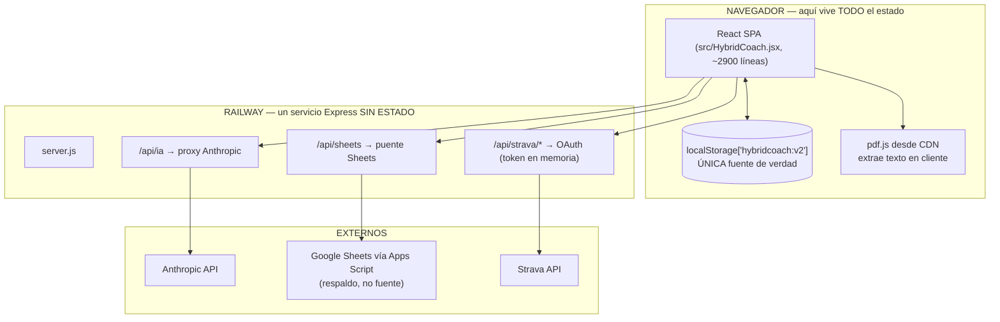

# 01 · Estado actual del proyecto

Verificado leyendo el código, no supuesto. Fecha de auditoría: agosto 2026.

---

## 1. Mapa real

## 2. Stack

| Capa | Qué es | Dónde |
|---|---|---|
| Lenguaje | JavaScript ESM + JSX | todo el repo |
| Frontend | React 18 + Recharts, un solo componente monolítico | `src/HybridCoach.jsx` |
| Build | esbuild → bundle IIFE minificado | `build.mjs` → `public/app.js` |
| Backend | Express 4, sin ORM, sin BD | `server.js` |
| Persistencia | `localStorage` (blob JSON) | navegador |
| Respaldo | Google Sheets (15 hojas) | `Codigo.gs` |
| LLM | Anthropic `claude-sonnet-4-6` | vía `/api/ia` |
| Auth | contraseña compartida en cookie `hc_pase` | `server.js` |
| Deploy | Railway, Nixpacks | `railway.json` |
| Integraciones | Strava OAuth, Google Sheets | `server.js`, `Codigo.gs` |

## 3. Cómo funciona hoy, paso a paso

1. **Arranque** — `loadState()` lee `hybridcoach:v2` de `localStorage`. Si no existe, migra
   desde `hybridcoach:v1`. Si tampoco, arranca con `perfilSemilla()` (datos de Roberto
   hardcodeados) y genera el plan.
2. **Plan** — `buildPlan(perfil, hoy)` es un motor **determinista en JS puro**: calcula
   semanas totales, fases, taper, techo de tirada larga, número de sesiones y una
   puntuación de riesgo estructural. **Ningún LLM interviene aquí.**
3. **Registro** — carreras, series de gimnasio, check-ins (RPE, dolor, energía) y
   recuperación (sueño, fatiga, estrés) se acumulan como arrays dentro del perfil activo.
   Cada `update()` clona el estado entero y reescribe el blob completo.
4. **Bibliografía** — 40 referencias en `BIBLIO_SEED` más las añadidas a mano o por PDF.
   Cada una es una **ficha resumen de una línea**, no texto completo del paper.
5. **PDF** — se procesa **entero en el navegador**: pdf.js extrae texto (máx. 14 páginas /
   55 000 caracteres), se manda a `/api/ia` con `SYS_PDF` y devuelve una ficha estructurada.
   **El PDF original no se guarda en ningún sitio.**
6. **Selección de evidencia** — `refsRelevantes()` puntúa las fichas por coincidencia
   **léxica** de tokens (tema y tags pesan 4, título y aplicación 2,5, resumen 1,5),
   ponderada por grado de evidencia. Devuelve entre 4 y 14 referencias.
7. **Razonamiento del plan** — `decisionesIA()` manda a Claude los hechos ya calculados
   (`hechosPlan()`) + referencias relevantes, con `SYS_DECISIONES` prohibiendo recalcular la
   estructura. La respuesta pasa por `validarPropuesta()`, que descarta citas inventadas.
   Nada se aplica solo: el usuario acepta o rechaza cada decisión.
8. **Coach** — `buildContext()` **reconstruye el system prompt entero en cada mensaje** desde
   el estado real: perfil, plan, decisiones activas, últimas 8 carreras, últimas cargas por
   ejercicio, últimos 6 check-ins, nutrición del día y 4-10 referencias. Se mandan los
   últimos 12 turnos de chat. La respuesta puede incluir `<<CAMBIO>>{...}<<FIN>>` con una
   propuesta pendiente de aceptación.
9. **Sheets** — exportación unidireccional. `Codigo.gs` distingue hojas de *estado*
   (se sustituyen las filas del perfil) de hojas de *historial* (se acumulan).

## 4. Qué está bien hecho y hay que conservar

Esto no es una reescritura. El diseño de fondo es correcto y sobrevive a la migración:

- **Motor determinista separado del LLM.** La estructura que protege al atleta no depende
  de la calidad de un prompt.
- **Lista blanca de lo que la IA puede tocar** (`CAMPOS_BLOQUEADOS` / `AJUSTES_PERMITIDOS`).
- **Validación de citas** contra IDs reales, con aviso cuando el modelo inventa.
- **Prompt reconstruido desde el estado en cada mensaje**, no memoria de conversación.
  Es exactamente el patrón correcto para evitar deriva por contexto viejo.
- **Selección de evidencia por relevancia** en vez de mandar la biblioteca entera.
- **Revisión humana** de las fichas generadas por IA antes de darlas por buenas
  (`revisado: false`).
- **Avisos clínicos como código**, no como instrucción de prompt.

## 5. Problemas reales

| # | Problema | Gravedad |
|---|---|---|
| 1 | **No hay persistencia de servidor.** Borrar el navegador o cambiar de móvil = perder todo | Crítica |
| 2 | Strava guarda **un único token en memoria del proceso**: se pierde en cada redeploy y no distingue usuarios | Alta |
| 3 | **No hay multiusuario real.** `APP_PASSWORD` es una puerta compartida, no cuentas | Alta |
| 4 | La biblioteca **no escala como RAG**: matching léxico sobre fichas de una línea, sin embeddings ni recuperación a nivel de párrafo | Alta |
| 5 | **El PDF original no se conserva** — no se puede reprocesar ni verificar una cifra | Media |
| 6 | **Sin deduplicación** de papers (nada impide subir el mismo dos veces) | Media |
| 7 | Escritura **no incremental**: cada guardado reescribe el blob completo | Media |
| 8 | **Sin backups reales** | Media |
| 9 | Acoplamiento a Google Apps Script para cualquier persistencia server-side | Baja |
| 10 | **Acoplado a Anthropic**: `llamarIA()` habla el formato de la API de Anthropic directamente | Media |

## 6. Aclaración sobre "los Excel"

`HybridCoach-BaseDeDatos.xlsx` **no lo lee ni escribe ningún código** (comprobado por
búsqueda en todo el repositorio). Es una plantilla que refleja el mismo esquema que
`Codigo.gs` crea en Google Sheets.

Consecuencia práctica: **la migración no consiste en parsear archivos Excel**, sino en
sustituir dos cosas — el blob de `localStorage` y el respaldo en Sheets — por un backend
con base de datos. Es más sencillo de lo que parecía y menos frágil.

## 7. Esquema ya definido en `Codigo.gs`

`HEADERS` define 15 hojas con columnas fijas. Es prácticamente el modelo de datos ya
diseñado, lo que reduce mucho el trabajo de la Fase 1:

`Perfiles`, `Plan_Maestro`, `Plan_Semanal`, `Running`, `Fuerza`, `Recovery`, `Feedback`,
`Cambios_Plan`, `Bibliografia`, `Config`, `Rutinas`, `Ejercicios_Propios`,
`Decisiones_Plan`, `Nutricion_Objetivos`, `Nutricion_Catalogo`, `Nutricion_Config`.

Mapeo a tablas en [`03-modelo-datos.md`](03-modelo-datos.md).

## 8. Variables de entorno actuales

`APP_PASSWORD`, `ANTHROPIC_API_KEY`, `APPS_SCRIPT_URL`, `SHEET_ID`,
`GOOGLE_SERVICE_ACCOUNT_JSON`, `STRAVA_CLIENT_ID`, `STRAVA_CLIENT_SECRET`, `MODELO_IA`.

Todas opcionales: sin ninguna, la app arranca y funciona, solo pierde IA y respaldo.
