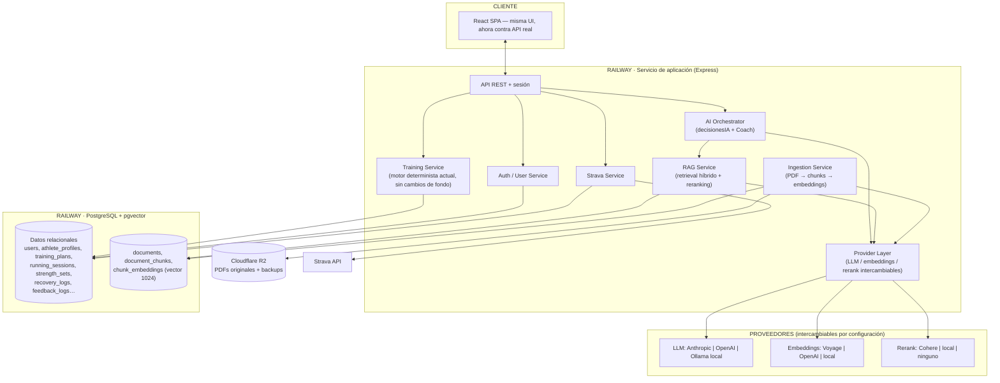
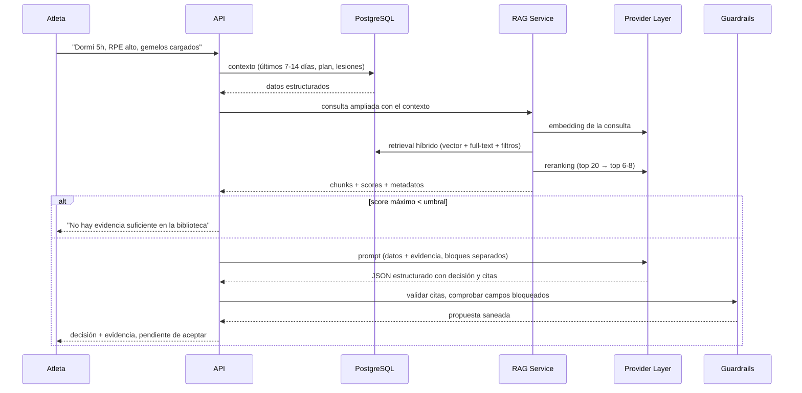

# 02 · Arquitectura objetivo

---

## 1. Vista completa



## 2. Qué cambia y qué no

| Componente | Hoy | Objetivo | ¿Reescritura? |
|---|---|---|---|
| Motor de plan (`buildPlan`) | JS en el navegador | El mismo código, movido al servidor | No — se traslada |
| Estado del atleta | blob en `localStorage` | Tablas en PostgreSQL | Sí, capa de acceso a datos nueva |
| Bibliografía | array de fichas en memoria | `documents` + `document_chunks` + embeddings | Sí |
| Selección de evidencia | `refsRelevantes()` léxico | Retrieval híbrido (vector + full-text + rerank) | Sustitución |
| Validación de salida IA | `validarPropuesta()` | **El mismo patrón**, con IDs de chunk | No |
| Guardarraíles | `CAMPOS_BLOQUEADOS` / `AJUSTES_PERMITIDOS` | Idénticos | No |
| Construcción del prompt | `buildContext()` | El mismo patrón, leyendo de SQL | Adaptación |
| Llamada al LLM | `llamarIA()` acoplado a Anthropic | Capa de proveedor neutra | Sí — ver [`04-capa-ia.md`](04-capa-ia.md) |
| Ingesta de PDF | En el navegador, sin guardar el archivo | Worker en servidor, PDF a R2, chunking real | Sí |
| Auth | contraseña compartida | cuentas reales + sesión | Sí |
| Google Sheets | respaldo unidireccional | se retira al final | Eliminación |

## 3. Capas del backend

**No son microservicios.** Son carpetas dentro del mismo proceso Express. La separación es
de responsabilidad, no de despliegue. Ver [`10-decisiones-tecnicas.md`](10-decisiones-tecnicas.md) §4.

```
server/
├── api/                  Rutas Express, validación de entrada, sesión
├── domain/
│   ├── training/         buildPlan, generateWeek, progresión — el motor determinista
│   ├── nutrition/        cálculo de objetivos (determinista)
│   └── guardrails/       CAMPOS_BLOQUEADOS, validarPropuesta, avisos clínicos
├── ai/
│   ├── providers/        adaptadores: anthropic, openai, ollama, voyage, cohere…
│   ├── orchestrator/     decisionesIA, coach, construcción de contexto
│   └── prompts/          plantillas de system prompt por bloques
├── rag/
│   ├── ingest/           extracción PDF, limpieza, chunking
│   ├── retrieval/        búsqueda híbrida, RRF, reranking
│   └── eval/             dataset y métricas
├── db/
│   ├── migrations/       versionadas, nunca editadas retroactivamente
│   └── repositories/     acceso a datos por agregado
└── integrations/         strava, storage (R2)
```

> Este árbol es el destino, no el estado actual. Ojo con crear carpetas vacías «para ir
> preparando»: `domain/guardrails/` y `domain/nutrition/` existieron como esbozos sin usar y
> el primero llegó a contener una lista de campos bloqueados **desactualizada y más
> permisiva** que la real. Hoy los guardarraíles viven en `server/domain/coach/prompt.js`
> (`CAMPOS_BLOQUEADOS`, `AJUSTES_PERMITIDOS`, que consume `coach/validacion.js`) y su reflejo
> en `src/HybridCoach.jsx`. Una segunda copia de una regla de seguridad es peor que ninguna.

**Regla de dependencias:** `domain/` no importa nada de `ai/` ni de `db/`. El motor
determinista debe poder ejecutarse y testearse sin base de datos ni proveedor de IA.

## 4. Flujo de una decisión de entrenamiento



## 5. Separación datos / conocimiento / decisión

Esta separación debe ser **explícita en el prompt**, con encabezados distintos, no mezclada
en prosa. Es lo que ya hace `buildContext()` y hay que conservarlo.

| Capa | Pregunta que responde | Fuente | ¿Pasa por LLM? |
|---|---|---|---|
| **Datos** | ¿Qué le está pasando a este atleta? | Tablas relacionales, SQL | No |
| **Conocimiento** | ¿Qué dice la evidencia científica? | `document_chunks` + retrieval | No (solo se recupera) |
| **Decisión** | ¿Qué hago con este atleta, dado ambos? | Orquestador | Sí, dentro de la lista blanca |

## 6. Reparto de responsabilidad: reglas vs. IA vs. RAG

| Decisión | Quién decide | Por qué |
|---|---|---|
| Semanas totales, taper, techo de tirada larga, nº de sesiones | **Reglas** | Protección estructural del tejido, no negociable |
| Progresión de carga (kg) | **Reglas** | Criterio objetivo (RIR + reps al tope) |
| Dolor ≥ umbral, síntomas de alarma | **Reglas, corte duro** | Seguridad clínica; nunca depender de que el modelo se acuerde |
| Descanso mínimo, orden de sesiones (R1-R9) | **Reglas** | Ya implementadas |
| Suelo calórico / disponibilidad energética | **Reglas** | Riesgo de salud |
| Justificar por qué la estructura encaja con este atleta | **IA + RAG** | Requiere matiz, no cálculo |
| Énfasis, pliometría, tempo, notas, calentamiento | **IA, lista blanca** | Bajo riesgo, alto valor de personalización |
| "¿Qué dice la evidencia sobre X?" | **RAG puro** | Nunca de memoria del modelo |

**Regla para decidir dónde va algo nuevo:** si un error puede causar daño físico o es
objetivamente calculable → código. Si es síntesis o justificación → LLM. Si es "qué dice la
ciencia" → RAG obligatorio, sin excepción.

## 7. Stack objetivo

| Pieza | Elección | Alternativa descartada |
|---|---|---|
| Base de datos | PostgreSQL gestionado en Railway | MongoDB, SQLite, Supabase, Neon |
| Vectores | `pgvector` en la misma BD | Pinecone, Qdrant, Weaviate |
| Migraciones | Drizzle o node-pg-migrate | ORM pesado |
| Objetos (PDFs, backups) | Cloudflare R2 (egress $0) | S3, volumen de Railway, Postgres |
| LLM | **Neutro** — Anthropic / OpenAI / Ollama por configuración | Acoplarse a uno |
| Embeddings | **Neutro**, dimensión 1024 fija como contrato | — |
| Reranking | Cohere Rerank 3.5, o local, o desactivado | — |
| Extracción PDF | PyMuPDF (fallback pdfplumber para tablas) | Unstructured, LangChain loaders |
| Orquestación | Código propio | LangChain, LlamaIndex |

Justificación de cada una en [`10-decisiones-tecnicas.md`](10-decisiones-tecnicas.md).
