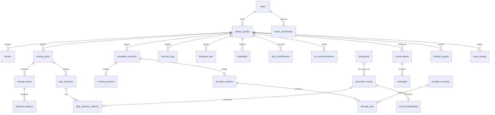

# 03 · Modelo de datos

PostgreSQL. **Multiusuario desde el primer día** aunque hoy solo lo use una persona:
rehacer el esquema más tarde cuesta mucho más que diseñarlo bien ahora.

Convenciones: `id` es `uuid` (v4) en todas las tablas; toda tabla de datos personales
cuelga en última instancia de `users`; timestamps `created_at` / `updated_at` con zona.

---

## 1. Diagrama de relaciones

---

## 2. Usuarios y perfiles

### `users`
Cuenta de acceso. Sustituye a `APP_PASSWORD`.

| Campo | Tipo | Notas |
|---|---|---|
| `id` | uuid PK | |
| `email` | text UNIQUE NOT NULL | |
| `password_hash` | text | null si usa OAuth |
| `role` | text | `athlete` \| `admin` (admin puede subir papers) |
| `created_at` | timestamptz | |

### `athlete_profiles`
El "perfil" actual. Un usuario puede tener varios (como hoy en la app).

Campos: `id`, `user_id` FK, `nombre`, `edad`, `sexo`, `altura_cm`, `peso_kg`, `grasa_pct`,
`distancia_objetivo`, `fecha_carrera`, `meta_tipo`, `meta_tiempo`, `prioridades` (text[]),
`exp_carrera`, `km_semana`, `sesiones_carrera`, `tirada_larga_min`, `ritmo_comodo`, `paron`,
`superficie` (text[]), `exp_fuerza`, `equipamiento`, `cargas` (jsonb), `tecnica`,
`estructural` (text[]), `cirugias`, `banderas` (text[]), `momento_entreno`,
`cross_training`, `horas_sueno`, `calidad_sueno`, `estres`, `trabajo`, `nutricion_objetivo`,
`suplementos` (text[]), `reloj`, `created_at`, `updated_at`.

> Los campos son un mapeo casi 1:1 de `perfilSemilla()` en `src/HybridCoach.jsx`.

Índice: `(user_id)`.

### `injuries`
Extraído a tabla propia (hoy es un array dentro del perfil) para poder consultarlo.

`id`, `athlete_profile_id` FK, `zona`, `recurrente` bool, `contexto`, `activa` bool,
`created_at`.

Índice: `(athlete_profile_id, activa)`.

---

## 3. Plan y estructura

### `training_plans`
Un plan generado por el motor determinista. **Nunca se hace UPDATE destructivo sobre la
estructura**: regenerar crea una fila nueva con `version` incrementada.

`id`, `athlete_profile_id` FK, `version` int, `distancia_objetivo`, `fecha_carrera`,
`total_semanas`, `taper_semanas`, `run_dias`, `gym_dias`, `techo_tirada_larga_min`,
`riesgo_score`, `riesgo_causas` (jsonb), `activo` bool, `generado_en`.

Índice: `(athlete_profile_id, activo)`.

### `training_weeks`
`id`, `training_plan_id` FK, `numero_semana`, `fase`, `techo_tirada_larga_min`,
`es_deload` bool, `es_taper` bool, `checkpoint` text.

Índice único: `(training_plan_id, numero_semana)`.

### `planned_sessions`
`id`, `training_week_id` FK, `dia_semana` int (0-6), `codigo_sesion` (`RUN A`, `GYM B`…),
`tipo` (`run` \| `gym` \| `recovery`), `descripcion`, `duracion_min`, `intensidad`
(`facil` \| `calidad`).

Índice: `(training_week_id, dia_semana)`.

### `plan_decisions`
Equivale a `Decisiones_Plan`. Cada decisión del plan y su justificación.

`id`, `training_plan_id` FK, `titulo`, `justificacion`, `fuente` (`motor` \| `ia`),
`confianza` (`alta` \| `media` \| `baja`), `estado` (`pendiente` \| `aceptada` \| `rechazada`),
`sin_respaldo` bool, `invade_estructura` bool, `created_at`.

### `plan_modifications`
Equivale a `Cambios_Plan`. Historial de cambios reales sobre el plan.

`id`, `athlete_profile_id` FK, `fecha`, `semana`, `plan_original`, `cambio` (jsonb),
`motivo`, `origen` (`usuario` \| `coach_ia` \| `regenerado`), `created_at`.

### `availability`
Disponibilidad con historia (hoy vive sin versión temporal dentro del perfil).

`id`, `athlete_profile_id` FK, `vigente_desde` date, `dias` (int[]), `min_gym`, `min_run`,
`min_finde`.

---

## 4. Registro de entrenamiento

Estas tablas **solo crecen**. Nunca se sobreescriben.

### `completed_sessions`
Cabecera común. Permite enlazar lo ejecutado con lo planificado.

`id`, `athlete_profile_id` FK, `planned_session_id` FK nullable, `fecha` date,
`tipo` (`run` \| `gym`), `semana`, `created_at`.

Índice: `(athlete_profile_id, fecha DESC)` — **es la consulta más frecuente del sistema**
("últimos N días").

### `running_sessions`
`id`, `completed_session_id` FK, `codigo_sesion`, `distancia_km`, `duracion_min`, `ritmo`,
`fc_media`, `fc_max`, `desnivel`, `cadencia`, `rpe` (1-10), `dolor` (0-10), `notas`,
`origen` (`manual` \| `strava`), `external_id` text.

Índice **único parcial**: `(external_id) WHERE external_id IS NOT NULL` — evita duplicar
actividades de Strava reimportadas. Hoy no existe esa protección.

### `strength_sessions`
`id`, `completed_session_id` FK, `codigo_sesion` (`GYM A`…).

### `strength_exercises`
Catálogo. `athlete_profile_id` null = ejercicio global; no null = ejercicio propio del
usuario (equivale a `Ejercicios_Propios`).

`id`, `nombre`, `grupo_muscular`, `patron` (el `pat` actual: `rodilla`, `soleo`…),
`incremento_kg_default`, `athlete_profile_id` FK nullable.

### `strength_sets`
`id`, `strength_session_id` FK, `strength_exercise_id` FK, `orden`, `peso_kg`, `reps`,
`rir` nullable, `notas`.

Índice: `(strength_exercise_id, created_at DESC)` — necesario para `progresionSugerida()`,
que busca la última serie de cada ejercicio.

> **Ojo con la progresión:** hoy se asocia por *nombre* de ejercicio para no perder
> historial al reordenar rutinas. Con `strength_exercise_id` como FK esto queda resuelto
> de forma más robusta, pero la migración debe mapear nombres → IDs con cuidado.

### `routines`
Rutinas de gimnasio editadas por el usuario (hoja `Rutinas`, hoja de *estado*).

`id`, `athlete_profile_id` FK, `codigo_sesion`, `orden`, `strength_exercise_id` FK,
`series`, `reps`, `rir`, `prioritario` bool, `nota`, `origen` (`generada` \| `editada`).

---

## 5. Recuperación y sensaciones

### `recovery_logs`
`id`, `athlete_profile_id` FK, `fecha` date, `horas_sueno`, `calidad_sueno`, `fatiga`,
`agujetas`, `estres`, `motivacion`, `dolor`.

Índice único: `(athlete_profile_id, fecha)` — un registro por día.

### `feedback_logs`
Los check-ins post-sesión.

`id`, `athlete_profile_id` FK, `fecha` date, `semana`, `rpe`, `sensacion`, `dolor`,
`zona_dolor`, `tipo_dolor`, `cuando_aparece`, `energia`, `comentario`, `created_at`.

Índice: `(athlete_profile_id, fecha DESC)`.

---

## 6. Bibliografía y RAG

### `documents`
Un paper. Generalización de `BIBLIO_SEED` + `normRef()`.

| Campo | Tipo | Notas |
|---|---|---|
| `id` | uuid PK | |
| `titulo`, `autores`, `anio` | text/int | |
| `fuente_revista` | text | |
| `doi` | text UNIQUE nullable | deduplicación entre PDFs distintos del mismo paper |
| `hash_archivo` | text UNIQUE | SHA-256 del PDF: deduplicación del mismo archivo |
| `study_type` | enum | `meta_analysis` \| `systematic_review` \| `rct` \| `observational` \| `position_statement` \| `narrative_review` \| `preprint` |
| `evidence_grade` | enum | `fuerte` \| `moderada` \| `debil` \| `practica` — **separado de `study_type`** |
| `poblacion` | text | descripción libre ("n=24, hombres jóvenes entrenados") |
| `population_type` | enum | `runners` \| `strength_athletes` \| `general_population` \| `mixed` — normalizado para filtrar |
| `sample_size` | int nullable | |
| `tema_principal` | text | |
| `tags` | text[] | índice GIN |
| `resumen`, `limites`, `aplicacion_practica` | text | los tres campos que ya genera `SYS_PDF` |
| `storage_key` | text | ruta del PDF en R2 |
| `origen` | enum | `semilla` \| `manual` \| `pdf` |
| `revisado` | bool | Única condición para participar en retrieval. La ingesta lo pone a true si la ficha automática sale completa; si no, espera confirmación (docs/05-rag.md §2.5) |
| `subido_por` | uuid FK users nullable | |
| `created_at` | timestamptz | |

> **Por qué separar `study_type` de `evidence_grade`:** hoy el campo `grado` mezcla el tipo
> de estudio con la confianza que merece. Un metaanálisis con muestra pequeña y alta
> heterogeneidad puede merecer menos confianza que un ECA grande. Con dos campos puedes
> filtrar por "solo revisiones sistemáticas" sin ambigüedad y ponderar por calidad aparte.

### `document_chunks`
**Nuevo.** Fragmentos de texto real del paper. No existe hoy.

`id`, `document_id` FK, `chunk_index` int, `seccion` (`abstract` \| `introduction` \|
`methods` \| `results` \| `discussion` \| `conclusion` \| `other`), `pagina_inicio`,
`pagina_fin`, `texto` text, `num_tokens` int, `tsv` tsvector GENERATED.

Índices: `(document_id, chunk_index)`, GIN sobre `tsv` para full-text search.

### `chunk_embeddings`
**Separada de `document_chunks`** para poder reindexar o cambiar de modelo sin tocar el texto.

`id`, `document_chunk_id` FK, `provider` text, `model` text, `dimensions` int,
`embedding vector(1024)`, `created_at`.

Índice: `hnsw (embedding vector_cosine_ops)`.

> **Contrato de dimensión: 1024.** Ver [`04-capa-ia.md`](04-capa-ia.md) §5. Todo proveedor
> de embeddings debe producir 1024 dimensiones (Voyage nativo, OpenAI truncado por
> Matryoshka, BGE-M3 nativo). Así la columna `vector(1024)` no cambia al cambiar de
> proveedor. Los campos `provider`/`model` permiten convivir dos generaciones durante una
> reindexación.

### `plan_decision_citations`
Puente N:N. Permite mostrar el **fragmento exacto**, no solo "esto lo dice Wilson 2012".

`plan_decision_id` FK, `document_chunk_id` FK, `similarity_score` real, `rank` int.

PK compuesta: `(plan_decision_id, document_chunk_id)`.

---

## 7. IA y conversación

### `ai_recommendations`
Generaliza las decisiones de `decisionesIA()` y los `<<CAMBIO>>` del chat, para no duplicar
estructura.

`id`, `athlete_profile_id` FK, `origen` (`razonamiento_plan` \| `coach_chat`), `tipo`,
`contenido` (jsonb), `confianza`, `estado` (`pendiente` \| `aceptada` \| `rechazada`),
`provider`, `model`, `created_at`.

### `conversations`
`id`, `athlete_profile_id` FK, `titulo`, `resumen` text (compactación de turnos antiguos,
ver [`04-capa-ia.md`](04-capa-ia.md) §8), `iniciada_en`, `ultimo_mensaje_en`.

### `messages`
`id`, `conversation_id` FK, `role` (`user` \| `assistant`), `contenido`,
`cambio_propuesto` (jsonb nullable), `citas` (uuid[] de `document_chunks`), `created_at`.

Índice: `(conversation_id, created_at)`.

---

## 8. Nutrición

### `nutrition_targets`
Calculado por el motor, **nunca por la IA**.

`id`, `athlete_profile_id` FK, `fecha`, `semana`, `sesiones`, `min_entreno`, `kcal`,
`proteina_g`, `carbohidrato_g`, `grasa_g`, `fibra_g`, `agua_l`, `momento_entreno`,
`fijado_por_usuario` bool, `recortado_por_suelo` bool.

### `meal_catalog`
`id`, `athlete_profile_id` FK, `categoria` (`desayuno`, `pre`, `post`…), `opcion` text.

---

## 9. Integraciones y operación

### `strava_connections`
Resuelve el problema #2 de [`01-estado-actual.md`](01-estado-actual.md): hoy hay un único
token en memoria del proceso.

`id`, `user_id` FK, `athlete_id_strava`, `access_token` (cifrado), `refresh_token` (cifrado),
`expires_at`, `scope`, `created_at`.

### `ai_query_logs`
Observabilidad. Ver [`09-evaluacion-observabilidad.md`](09-evaluacion-observabilidad.md).

`id`, `athlete_profile_id` FK, `tipo` (`coach` \| `razonamiento` \| `ingesta`),
`consulta_original`, `consulta_ampliada`, `chunks_recuperados` (jsonb: ids + scores),
`chunks_finales` (jsonb), `provider`, `model`, `tokens_in`, `tokens_out`, `coste_estimado`,
`latencia_ms`, `citas_descartadas` (jsonb), `created_at`.

> No duplicar aquí datos de salud: guardar `athlete_profile_id` y referenciar, no copiar.
> Purga automática a los 90 días.

### `legacy_id_map`
Temporal, solo durante la migración. `old_id`, `new_id`, `tabla`, `fuente`
(`localstorage` \| `sheets`). Se elimina al cerrar la Fase 2.

---

## 10. Índices críticos (resumen)

| Índice | Por qué |
|---|---|
| `completed_sessions (athlete_profile_id, fecha DESC)` | La consulta más repetida: "últimos N días" |
| `strength_sets (strength_exercise_id, created_at DESC)` | Progresión de carga |
| `running_sessions (external_id) UNIQUE WHERE NOT NULL` | Evitar duplicados de Strava |
| `recovery_logs (athlete_profile_id, fecha) UNIQUE` | Un registro por día |
| `documents (doi) UNIQUE`, `documents (hash_archivo) UNIQUE` | Deduplicación de papers |
| `chunk_embeddings` HNSW sobre `embedding` | Búsqueda vectorial |
| `document_chunks` GIN sobre `tsv` | Full-text search del componente léxico |
| `documents` GIN sobre `tags` | Filtrado por tema |
| `(user_id)` en toda tabla raíz | Aislamiento multiusuario |

## 11. Aislamiento entre usuarios

Toda query filtra por `athlete_profile_id` derivado de la **sesión autenticada**, nunca de
un parámetro de la petición sin verificar. Opcionalmente, Row-Level Security de PostgreSQL
como segunda capa de defensa. Ver [`08-seguridad.md`](08-seguridad.md) §3.

**Excepción deliberada:** `documents` / `document_chunks` / `chunk_embeddings` son
**compartidos entre todos los usuarios** (la biblioteca científica es común, como ya lo es
hoy: `st.biblio` está fuera de los perfiles). Solo un `admin` puede escribir en ellas.
