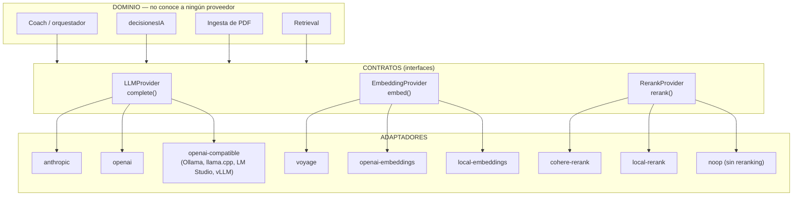

# 04 · Capa de IA — proveedores intercambiables

**Decisión: el proyecto es neutro respecto al proveedor.** No hay proveedor "por defecto"
privilegiado en el código. Anthropic, OpenAI y un modelo local son tres implementaciones
del mismo contrato, elegidas por configuración.

---

## 1. El problema que resuelve

Hoy, `llamarIA()` en `src/HybridCoach.jsx` habla el formato de la API de Anthropic
directamente: `x-api-key`, `anthropic-version`, `system` como parámetro separado, respuesta
en `data.content[].text`. Cambiar de proveedor implicaría tocar cada sitio que llama a la IA.

Además hay tres tipos distintos de llamada a modelos, que hoy no están diferenciados:

| Tipo | Uso actual | Uso futuro |
|---|---|---|
| **Generación (LLM)** | coach, razonamiento del plan, análisis de PDF | igual + síntesis RAG |
| **Embeddings** | no existe | vectorizar chunks y consultas |
| **Reranking** | no existe | reordenar candidatos del retrieval |

Cada uno necesita su propio contrato y puede tener un proveedor distinto: puedes usar
Anthropic para el LLM, Voyage para embeddings y Cohere para reranking — o los tres locales.

## 2. Arquitectura



**Regla de oro:** ningún archivo fuera de `server/ai/providers/` puede importar el SDK de
un proveedor ni construir una URL de su API. Si Claude Code encuentra `api.anthropic.com`
o `api.openai.com` fuera de esa carpeta, es un bug.

## 3. Contratos

### 3.1 `LLMProvider`

```
complete({
  system:        string,
  messages:      [{ role: 'user'|'assistant', content: string }],
  maxTokens:     number,
  temperature?:  number,
  responseFormat?: 'text' | 'json',
  stopSequences?: string[]
}) → {
  text:      string,
  usage:     { inputTokens, outputTokens },
  provider:  string,
  model:     string,
  stopReason: 'stop' | 'max_tokens' | 'other'
}
```

Además, cada adaptador declara sus **capacidades**:

```
capabilities = {
  reliableStructuredOutput: boolean,  // ¿devuelve JSON válido de forma fiable?
  nativeJsonMode:           boolean,  // ¿tiene modo JSON forzado por API?
  promptCaching:            boolean,
  maxContextTokens:         number,
  supportsSystemRole:       boolean
}
```

Esto no es decoración: **determina el comportamiento del orquestador**. Ver §7.

### 3.2 `EmbeddingProvider`

```
embed(texts: string[], { inputType: 'document' | 'query' }) → {
  vectors:    number[][],   // longitud = dimensions
  dimensions: number,
  provider:   string,
  model:      string,
  usage:      { tokens }
}
```

`inputType` importa: Voyage y Cohere producen mejores resultados si se les dice si el texto
es un documento a indexar o una consulta. Los adaptadores que no lo soporten lo ignoran.

### 3.3 `RerankProvider`

```
rerank(query: string, documents: string[], topN: number) → {
  results: [{ index: number, score: number }],  // ordenados por score desc
  provider: string,
  model: string
}
```

El adaptador `noop` devuelve los documentos en el orden original con score neutro: permite
desactivar el reranking sin ramas `if` en el código del retrieval.

## 4. Adaptadores

### 4.1 LLM

| Adaptador | Cubre | Notas de implementación |
|---|---|---|
| `anthropic` | Claude (lo que se usa hoy) | `system` va como parámetro aparte, no como mensaje. Respuesta en `content[].text`. Soporta prompt caching (90% de descuento en contexto cacheado) |
| `openai` | GPT vía API oficial | `system` va como primer mensaje con `role: 'system'`. Respuesta en `choices[0].message.content`. Tiene `response_format: { type: 'json_object' }` nativo |
| `openai-compatible` | **Ollama, llama.cpp server, LM Studio, vLLM, OpenRouter, Together…** | Mismo código que `openai` con `baseURL` configurable y API key opcional |

> **Simplificación clave:** Ollama y prácticamente todos los servidores de modelos locales
> exponen un endpoint compatible con `/v1/chat/completions` de OpenAI. Por eso **no hace
> falta un adaptador "local" separado**: el adaptador `openai-compatible` con
> `LLM_BASE_URL=http://localhost:11434/v1` cubre el caso local completo. Un adaptador
> menos que mantener.

### 4.2 Embeddings

| Adaptador | Modelo típico | Dimensión nativa | Coste aprox. |
|---|---|---|---|
| `voyage` | `voyage-4` / `voyage-4-lite` | 1024 | $0,06 / $0,02 por 1M tokens; 200M tokens gratis al abrir cuenta |
| `openai` | `text-embedding-3-large` | 3072 → **truncar a 1024** vía parámetro `dimensions` (Matryoshka) | $0,13 por 1M tokens |
| `openai-compatible` | `bge-m3` servido por Ollama / TEI | 1024 nativo | coste de cómputo propio |

### 4.3 Reranking

| Adaptador | Modelo | Coste |
|---|---|---|
| `cohere` | `rerank-v3.5`, 100+ idiomas | ~$0,001 por búsqueda (query + hasta 100 docs) |
| `openai-compatible` / `local` | `bge-reranker-v2-m3` servido localmente | cómputo propio |
| `noop` | — | gratis, sin reranking |

## 5. El contrato de dimensión: 1024

**Regla del proyecto: todos los embeddings son de 1024 dimensiones.**

Motivo: la columna es `vector(1024)` en PostgreSQL. Cambiar la dimensión implica alterar la
tabla y reconstruir el índice HNSW — un dolor innecesario cada vez que pruebes un proveedor.

Los tres candidatos principales pueden producir 1024:
- Voyage: nativo.
- OpenAI `text-embedding-3-large`: se trunca con el parámetro `dimensions: 1024`; la
  técnica Matryoshka con la que se entrenó está diseñada exactamente para esto y pierde muy
  poca precisión.
- BGE-M3 (local): nativo.

Si algún día quieres probar una dimensión distinta, el camino es: nueva tabla
`chunk_embeddings_v2` con la dimensión nueva, reindexar en paralelo, comparar con el dataset
de evaluación, y solo entonces cambiar. Los campos `provider` / `model` / `dimensions` en
`chunk_embeddings` existen precisamente para permitir esa convivencia.

## 6. Configuración por variables de entorno

```bash
# --- LLM ---
LLM_PROVIDER=anthropic            # anthropic | openai | openai-compatible
LLM_MODEL=claude-sonnet-4-6
LLM_API_KEY=
LLM_BASE_URL=                     # solo para openai-compatible
LLM_MAX_TOKENS=1400

# --- Embeddings ---
EMBEDDING_PROVIDER=voyage         # voyage | openai | openai-compatible
EMBEDDING_MODEL=voyage-4
EMBEDDING_API_KEY=
EMBEDDING_BASE_URL=
EMBEDDING_DIMENSIONS=1024         # el contrato; el adaptador debe cumplirlo o fallar al arrancar

# --- Reranking ---
RERANK_PROVIDER=cohere            # cohere | openai-compatible | noop
RERANK_MODEL=rerank-v3.5
RERANK_API_KEY=
RERANK_BASE_URL=
```

### Ejemplos de configuración completa

**Producción hoy (lo que ya funciona):**
```bash
LLM_PROVIDER=anthropic
LLM_MODEL=claude-sonnet-4-6
EMBEDDING_PROVIDER=voyage
RERANK_PROVIDER=cohere
```

**Todo OpenAI:**
```bash
LLM_PROVIDER=openai
LLM_MODEL=gpt-...
EMBEDDING_PROVIDER=openai
EMBEDDING_MODEL=text-embedding-3-large
EMBEDDING_DIMENSIONS=1024
RERANK_PROVIDER=noop
```

**Todo local (sin conexión, sin coste por token):**
```bash
LLM_PROVIDER=openai-compatible
LLM_BASE_URL=http://localhost:11434/v1
LLM_MODEL=llama3.1:8b-instruct
EMBEDDING_PROVIDER=openai-compatible
EMBEDDING_BASE_URL=http://localhost:11434/v1
EMBEDDING_MODEL=bge-m3
RERANK_PROVIDER=noop
```

**Mixto (LLM local, embeddings en la nube por calidad):**
```bash
LLM_PROVIDER=openai-compatible
LLM_BASE_URL=http://localhost:11434/v1
EMBEDDING_PROVIDER=voyage
RERANK_PROVIDER=cohere
```

### Validación al arrancar

El servidor debe fallar en el arranque, con un mensaje claro, si:
- el proveedor configurado no existe,
- falta la API key de un proveedor que la requiere,
- `EMBEDDING_DIMENSIONS` no coincide con la dimensión de la columna `vector(...)`,
- el modelo de embeddings configurado difiere del que generó los embeddings ya almacenados
  (comparar contra `chunk_embeddings.model`) — esto evita el error más caro posible:
  buscar con un modelo distinto del que indexó, que devuelve resultados silenciosamente malos.

## 7. Degradación por capacidades — importante para modelos locales

Los modelos pequeños locales son **claramente peores** en dos cosas que este proyecto
necesita: devolver JSON estrictamente válido y negarse a responder cuando no hay evidencia.
El diseño debe absorberlo, no ignorarlo.

| Capacidad | Si `true` | Si `false` (típico en local pequeño) |
|---|---|---|
| `nativeJsonMode` | usar el modo JSON de la API | añadir instrucciones de formato más estrictas al prompt |
| `reliableStructuredOutput` | parsear directo | bucle de reparación: si `extraerJSON()` falla, reintentar 1 vez con el error como feedback; si vuelve a fallar, degradar a respuesta de texto marcada como "no estructurada" y **no aplicar ningún cambio** |
| `promptCaching` | cachear el bloque de perfil/plan, que es estable | ignorar |
| `maxContextTokens` bajo | contexto completo | recortar primero la ventana histórica, luego el número de chunks; **nunca** recortar los guardarraíles ni los avisos clínicos |

**Regla no negociable:** los guardarraíles (`validarPropuesta()`, comprobación de citas,
umbral mínimo de relevancia, avisos clínicos) se aplican **igual sea cual sea el
proveedor**. Un modelo local peor no relaja la validación: la hace más necesaria.

> `extraerJSON()`, que ya existe en el código actual y tolera que el modelo envuelva el JSON
> en ```` ```json ```` o añada texto alrededor, es exactamente la pieza que hace viable usar
> modelos locales. Consérvala.

## 8. Gestión de contexto y coste

Independiente del proveedor:

- **Ventana histórica fija**: últimos 7-14 días de sesiones, no todo el historial.
- **Agregados en vez de filas**: "minutos corridos últimos 7 días" en vez de las 20 filas.
- **Última marca por ejercicio**, no todas las series (patrón ya presente en `buildContext()`).
- **Chunks seleccionados por relevancia**, nunca la biblioteca entera.
- **Conversaciones**: enviar los últimos ~12 turnos. Al superar ~30-40 mensajes, generar un
  resumen con una llamada barata y guardarlo en `conversations.resumen`; a partir de ahí el
  prompt lleva resumen + últimos turnos literales.

No hace falta memoria vectorial para el chat. El patrón resumen + ventana reciente es
suficiente a esta escala y mucho más fácil de depurar.

## 9. Estructura del system prompt (bloques)

La estructura actual de `buildContext()` es correcta. Se conserva, ampliando el bloque de
evidencia:

```
SYSTEM
├── Rol y tono
├── PERFIL — datos estables del atleta
├── PLAN GENERADO + decisiones activas
├── ESTADO ACTUAL — ventana de 7-14 días
├── REGLAS DE DISTRIBUCIÓN — R1-R9, texto fijo
├── BASE DE EVIDENCIA — chunks reales con id, página, DOI, tipo de estudio
├── INSTRUCCIONES DE CITADO Y GROUNDING
└── FORMATO DE SALIDA — JSON estructurado

USER
└── Pregunta del atleta / disparador del motor de decisiones
```

**Los bloques van separados por encabezados explícitos, nunca mezclados en prosa.** Permite
que el modelo no confunda "lo que le pasa a este atleta" con "lo que dice la ciencia", y
permite auditar qué bloque influyó en qué frase.

Las plantillas viven en `server/ai/prompts/` como archivos, no incrustadas en la lógica, para
poder versionarlas y compararlas en la evaluación.

## 10. Qué hay que hacer para implementar esto

Resumen de tareas (detalle en `roadmap/fase-03-api-auth.md` y `roadmap/fase-06-embeddings.md`):

1. Crear `server/ai/providers/` con los tres contratos y una factoría que lea la config.
2. Portar `llamarIA()` al adaptador `anthropic` sin cambiar su comportamiento.
3. Añadir el adaptador `openai` / `openai-compatible`.
4. Sustituir todas las llamadas directas del dominio por el contrato.
5. Añadir validación de configuración al arrancar.
6. Registrar `provider` y `model` en `ai_query_logs` y en `ai_recommendations` — sin esto
   no puedes comparar calidad entre proveedores.
7. Probar la misma batería de preguntas del dataset de evaluación con cada configuración.

## 11. Cómo comparar proveedores en la práctica

Con el dataset de [`09-evaluacion-observabilidad.md`](09-evaluacion-observabilidad.md),
ejecutar las mismas 50-100 preguntas con cada configuración y comparar:

| Métrica | Qué detecta |
|---|---|
| `citation_correctness` | modelos que inventan referencias — el fallo más grave aquí |
| `groundedness` | modelos que añaden conocimiento general no citado |
| `refusal_rate` en preguntas sin evidencia | modelos que no saben decir "no lo sé" |
| `json_parse_failure_rate` | fiabilidad de salida estructurada (crítico en local) |
| latencia p50 / p95 | usabilidad del chat |
| coste por consulta | sostenibilidad |

Un modelo local puede ser perfectamente válido para el coach conversacional y a la vez
insuficiente para el razonamiento del plan con citas. **Está permitido usar proveedores
distintos por tipo de tarea** — la factoría acepta una configuración por caso de uso
(`LLM_PROVIDER_COACH`, `LLM_PROVIDER_REASONING`) si llega a hacer falta. No lo construyas
hasta que lo necesites.
