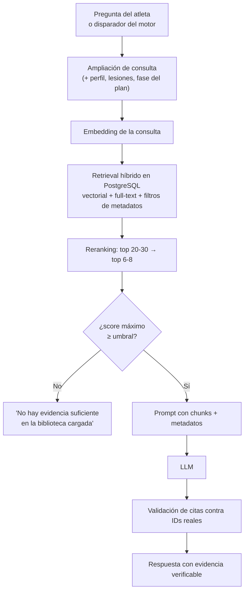
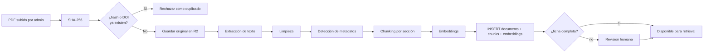

# 05 · Sistema RAG

Cómo la bibliografía científica en PDF se convierte en evidencia citable dentro de las
recomendaciones de entrenamiento.

---

## 1. Visión general



Esto sustituye a `refsRelevantes()`, conservando su función (seleccionar solo lo relevante)
pero operando sobre **fragmentos de texto real** en vez de fichas resumen de una línea.

---

## 2. Ingesta de PDFs



### 2.1 Extracción de texto

| Herramienta | Cuándo |
|---|---|
| **PyMuPDF (`fitz`)** | **Por defecto.** Rápido, preciso conservando el orden de lectura, sin dependencias pesadas |
| `pdfplumber` | Solo para extraer tablas con estructura (útil en papers de nutrición con tablas de macros) |
| OCR (Tesseract o LLM multimodal) | Excepción marcada manualmente: PDFs escaneados sin capa de texto |
| ~~Unstructured~~ | Descartado: arrastra OCR y modelos de layout, sobredimensionado para papers con texto nativo |

> Los PDF escaneados como imagen ya son un límite conocido del flujo actual
> (documentado en `GUIA-INSTALACION.md`). No los trates como caso general.

### 2.2 Limpieza

Antes de trocear, eliminar el ruido que degrada tanto los embeddings como el full-text:
- cabeceras y pies repetidos en todas las páginas,
- números de página sueltos,
- guiones de partición de línea (`recu-\nperación` → `recuperación`),
- la lista de referencias bibliográficas del final (no aporta contenido y contamina la
  búsqueda con nombres de autores de otros papers),
- pies de figura sueltos sin contexto.

### 2.3 Detección de metadatos

El prompt `SYS_PDF` que ya existe hace casi todo esto bien. Ampliarlo para que devuelva
también los campos nuevos de la tabla `documents`: `study_type`, `population_type`,
`sample_size` (ver [`03-modelo-datos.md`](03-modelo-datos.md) §6).

DOI: intentar primero extraerlo por regex del texto (`10.\d{4,9}/[-._;()/:A-Z0-9]+`) antes
de pedírselo al modelo. Es más fiable y gratis.

### 2.4 Deduplicación

Dos capas, ambas necesarias:
- `hash_archivo` (SHA-256 del PDF): detecta el mismo archivo re-subido.
- `doi` UNIQUE: detecta el mismo paper subido desde otro PDF (otra fuente, otra maquetación).

### 2.4b De dónde salen los proveedores

Las dos llamadas de IA de la ingesta tienen ámbitos distintos, y no es un detalle:

- **La ficha (LLM) es por usuario.** `server/routes/admin.js` resuelve el proveedor con
  `resolveUserLLMProvider(userId, { fallbackProvider })`: manda la clave que el admin haya
  guardado en sus ajustes y, si no tiene, la del servidor. Cada ingesta es independiente,
  así que no hay nada que homogeneizar.
- **Los embeddings son de instancia.** Los vectores van a un índice compartido
  (`embedding_index_state`, una sola fila con `active=true`) y solo son comparables entre sí
  si salen del mismo modelo. Se resuelven en `server/ai/instance-embeddings.js`, que lee la
  tabla `instance_embedding_settings` y cae a las variables `EMBEDDING_*` si no hay nada
  guardado. La restricción `solo_una_fila` de la migración 0009 impide tener dos
  configuraciones a la vez desde la propia base de datos.

Cambiar el proveedor o el modelo de embeddings invalida los vectores existentes: el panel
lo advierte al guardar y hay que ejecutar `npm run embeddings:reindex`. Anthropic no expone
API de embeddings; las parejas válidas son `voyage`, `openai` y `openai-compatible`.

### 2.5 Revisión humana

`revisado = true` sigue siendo la única condición para participar en el retrieval, pero no
se exige que la ponga siempre una persona: la decide `fichaCompleta()` en
`server/ingestion/pipeline.js`.

Un documento entra disponible si el modelo extrajo lo necesario para **citarlo**: título,
autores, año, `study_type` y `evidence_grade`. Los dos últimos son enums cerrados que
`normalizarFicha()` ya validó contra la lista real, así que un valor inventado llega como
null y el documento cae del lado de la revisión por sí solo. Sin proveedor de IA la ficha
viene vacía y nada entra automáticamente.

Lo que falte se enumera en `faltaRevision` y el panel lo muestra: un PDF que no aparece en
las respuestas tiene que decir por qué, no dejar al usuario adivinando.

El razonamiento: un modelo puede equivocarse leyendo y un error se propaga a cada
recomendación que cite ese documento, pero exigir revisión manual de *todo* hacía que en la
práctica la biblioteca se quedara vacía. La revisión se reserva para los casos dudosos, que
son justo aquellos en los que la extracción ya falló en algo comprobable. `revisado` se
puede volver a poner a false desde el panel en cualquier momento.

---

## 3. Chunking

**Estrategia: por sección del paper + límite de tokens dentro de cada sección.**

Cortar cada N caracteres es lo más simple y lo peor para este caso: parte frases, mezcla
métodos con resultados, y reparte la respuesta a "¿qué volumen semanal es adecuado para un
principiante?" entre dos chunks sin contexto.

### Algoritmo

1. **Detectar secciones** estándar (Abstract, Introduction, Methods, Results, Discussion,
   Conclusion) por patrones de encabezado. Lo que no encaje va como `other`.
2. **Trocear por párrafos** dentro de cada sección, agrupando párrafos consecutivos hasta
   **400-600 tokens** por chunk. Suficiente para una unidad de sentido completa; poco para
   que el embedding se diluya.
3. **Solape ~15%** entre chunks consecutivos de la misma sección, para no cortar una frase
   clave justo en el límite.
4. **Guardar `seccion`, `pagina_inicio`, `pagina_fin`** en cada chunk. La página es lo que
   permite el "Ver evidencia" con referencia verificable.

### Por qué la sección importa en el retrieval

| Tipo de pregunta | Secciones que priorizar |
|---|---|
| "¿Es recomendable X?" (aplicada) | Discussion, Conclusion |
| "¿Cuánto efecto tiene X?" (magnitud) | Results, Abstract |
| "¿En quién se estudió?" (aplicabilidad) | Methods |

Ejemplo real — *"¿es recomendable colocar fuerza de piernas el día antes de intervalos?"*:
la respuesta útil está casi siempre en Discussion/Conclusion, la magnitud del efecto de
interferencia en Results, y Methods sirve para juzgar si la población se parece al atleta.
El chunking por sección permite ponderar sin descartar nada.

### Semantic chunking: descartado

Cortar donde el embedding de frases consecutivas diverge añade una llamada de embeddings
extra por documento en ingesta. Para papers de ciencias del deporte, con estructura muy
estandarizada, el chunking por sección ya captura casi toda la señal que el semantic
chunking intenta descubrir a ciegas. Sobreingeniería para este problema.

---

## 4. Embeddings

Contrato del proyecto: **1024 dimensiones**, proveedor intercambiable.
Ver [`04-capa-ia.md`](04-capa-ia.md) §4.2 y §5.

Caso de uso específico: **papers mayoritariamente en inglés, consultas en español**. Eso
hace que importe el rendimiento *cross-lingual*, no solo la calidad en inglés.

| Modelo | ES↔EN | Coste / 1M tokens |
|---|---|---|
| Voyage `voyage-4` / `voyage-4-lite` | Muy bueno | $0,06 / $0,02 (+200M gratis al abrir cuenta) |
| OpenAI `text-embedding-3-large` (truncado a 1024) | Bueno | $0,13 |
| OpenAI `text-embedding-3-small` | Aceptable | $0,02 |
| BGE-M3 (local) | Muy bueno | cómputo propio |

**Detalle operativo:** vectorizar el chunk con `inputType: 'document'` y la consulta con
`inputType: 'query'`. Voyage y Cohere producen mejores resultados así.

---

## 5. Retrieval híbrido

La búsqueda puramente semántica falla en dos casos frecuentes con bibliografía científica:
1. **términos técnicos exactos** — siglas y nombres propios ("ACWR", "RIR", "Bosquet") donde
   la coincidencia léxica es más fiable que la semántica;
2. **consultas cortas y muy específicas**, donde el embedding pierde precisión.

### Diseño

Tres señales combinadas en una consulta SQL:

1. **Similitud vectorial** — `embedding <=> $query_embedding` sobre `chunk_embeddings`
   (operador de distancia coseno de pgvector).
2. **Full-text de PostgreSQL** — `tsv @@ plainto_tsquery('english', $q)` sobre
   `document_chunks.tsv`. El corpus es mayoritariamente inglés; la consulta en español se
   traduce a términos técnicos en la fase de ampliación (§6).
3. **Filtros duros de metadatos** — `study_type`, `anio`, `population_type`,
   `evidence_grade`, `revisado = true`. **Se aplican antes de rankear, no después.**

### Fusión: Reciprocal Rank Fusion

```
score_final(chunk) = Σ  1 / (k + rank_en_lista_i)      con k ≈ 60
```

Simple, sin dependencias, calculable directamente en SQL o en la capa de aplicación, y
robusto frente a que las dos listas tengan escalas de score incomparables (que es
exactamente el caso entre distancia coseno y `ts_rank`).

Opcionalmente, multiplicar por un peso de calidad de evidencia — el `PESO_GRADO` actual
(`fuerte: 1.6, moderada: 1.25, débil: 0.85, práctica: 0.6`) es un buen punto de partida y
puede conservarse tal cual.

### Ejemplo

Consulta: *"¿cuánto tiempo debería separar fuerza pesada de una sesión de intervalos?"*

- El **componente léxico** trae chunks que mencionan literalmente "concurrent training" o
  "interference effect".
- El **componente semántico** trae papers que describen el mismo fenómeno con otro
  vocabulario ("residual fatigue", "neuromuscular interference").

Ninguna de las dos señales sola habría traído el conjunto completo.

---

## 6. Ampliación de consulta

Antes de embeber, la consulta se enriquece con el contexto del atleta — es lo que ya hace
`buildContext()` al construir `consultaAmpliada`:

```
consulta_usuario
+ distancia objetivo
+ fase actual del plan
+ lesiones declaradas y molestias activas
+ prioridad principal
```

Esto mejora mucho el retrieval sin coste añadido. Un "me duele el gemelo" suelto recupera
poco; ampliado con "media maratón, fase de construcción, historial de sóleo y Aquiles
recurrente" recupera lo que hace falta.

**Traducción ES→EN**: como el corpus es inglés, conviene que la consulta ampliada incluya
también los términos técnicos en inglés. Dos opciones: (a) un diccionario fijo de
equivalencias para los ~50 términos del dominio (barato, determinista, suficiente), o
(b) una llamada corta al LLM para traducir la consulta. Empezar por (a).

---

## 7. Reranking

Patrón: retrieval inicial → 20-30 candidatos → reranker → 6-8 finales → LLM.

Merece la pena: el reranker es un modelo entrenado específicamente para juzgar relevancia
pregunta-documento, más fino que la similitud coseno de embeddings genéricos. Y el coste
marginal es irrelevante (~$0,001 por búsqueda con Cohere Rerank 3.5, que soporta 100+
idiomas).

Es opcional para la primera versión funcional (`RERANK_PROVIDER=noop`), pero debería estar
antes de dar la calidad por buena en producción.

---

## 8. Grounding — evitar respuestas inventadas

Cinco mecanismos, en orden de aplicación:

1. **Prohibición explícita en el prompt** de usar conocimiento general no presente en los
   chunks entregados. Ya está en `SYS_DECISIONES` ("apoyándote EXCLUSIVAMENTE en la
   bibliografía que se te entrega") — consérvalo literalmente.

2. **Umbral mínimo de relevancia, comprobado ANTES de llamar al LLM.** Si ningún chunk
   supera el umbral tras el reranking, el sistema devuelve directamente:

   > "No existe evidencia suficiente en la biblioteca cargada para justificar esta decisión."

   Comprobarlo antes ahorra tokens y, sobre todo, evita que el modelo rellene el hueco con
   conocimiento general cuando no tiene nada bueno que citar.

3. **Salida en JSON estructurado**, no prosa libre, para todo lo que cite evidencia. Mucho
   más fácil de validar mecánicamente. `extraerJSON()` ya lo resuelve.

4. **Validación de citas post-respuesta.** Todo ID de chunk citado que no esté en la lista
   realmente entregada en el prompt se descarta y se registra como aviso. Es exactamente lo
   que hace `validarPropuesta()` hoy con los IDs de referencia.

5. **Marcado de relleno.** Si se incluye una referencia por no haber nada mejor, va marcada
   como "sin relación directa con la consulta" — el patrón `_relleno` actual, que merece
   conservarse: impide que el modelo la fuerce como si respondiera a la pregunta.

---

## 9. Conflictos entre estudios

Cuando la literatura no es consistente, el sistema **no debe elegir arbitrariamente ni
promediar**.

- **Nivel 1 (suficiente para empezar):** instruir en el prompt que, si los chunks
  recuperados contienen posiciones contradictorias, la respuesta debe presentar ambas con
  sus citas y marcar el tema como evidencia mixta. Añadir un campo `evidencia_mixta: []` al
  JSON de salida, en la línea del `sin_respaldo` que ya existe.
- **Nivel 2 (más adelante):** añadir a `documents` un campo `finding_direction`
  (`favorable` \| `nulo` \| `desfavorable`) extraído en la ingesta, para detectar conflictos
  automáticamente antes de llamar al LLM.

---

## 10. Citas y "Ver evidencia"

Con chunks reales puedes ofrecer trazabilidad completa:

```
Motivo
  Se reduce el volumen de hoy por RPE elevado y recuperación insuficiente.

Evidencia
  [Wilson 2012] Entrenamiento concurrente: meta-análisis del efecto de interferencia
  [Bosquet 2007] Efectos del taper sobre el rendimiento

  → Ver evidencia
      · fragmento textual exacto
      · página 4
      · J Strength Cond Res · meta-análisis
      · DOI 10.xxxx/xxxxx
      · abrir PDF original (R2)
```

Implementación: el componente `RefChips` ya existe y ya abre un modal al pulsar una
referencia — solo hay que ampliar el contenido del modal con
`document_chunks.texto`, `pagina_inicio` y el enlace a `storage_key`.

Guardar `similarity_score` en `plan_decision_citations` permite además distinguir en
depuración una cita fuerte de una de relleno.

---

## 11. Nivel de evidencia

Dos ejes, no uno (hoy el campo `grado` los mezcla):

1. **`study_type`** — jerarquía metodológica objetiva:
   metaanálisis → revisión sistemática → ECA → observacional → posicionamiento / narrativa.
2. **`evidence_grade`** — confianza aplicada: `fuerte` / `moderada` / `debil` / `practica`.

No derives uno del otro automáticamente: un metaanálisis con muestra pequeña y alta
heterogeneidad puede merecer menos confianza que un ECA grande y bien ejecutado.

Con los dos campos, el usuario puede pedir "prioriza revisiones sistemáticas" (filtro por
`study_type`) sin ambigüedad, y el ranking puede ponderar por `evidence_grade` por separado.

---

## 12. Qué NO usar

| Descartado | Por qué |
|---|---|
| LangChain / LlamaIndex | Añaden abstracción, dependencias y prompts internos que no controlas, para resolver en 200-300 líneas de código directo un flujo que ya tienes definido: un tipo de documento, un vector store, un flujo de recuperación. Mismo criterio que el frontend, que no usa Redux para 2900 líneas |
| Pinecone / Qdrant / Weaviate | Dos fuentes de verdad que se desincronizan. Ver [`10-decisiones-tecnicas.md`](10-decisiones-tecnicas.md) §2 |
| Semantic chunking | §3 |
| Memoria vectorial del chat | §8 de [`04-capa-ia.md`](04-capa-ia.md) |
