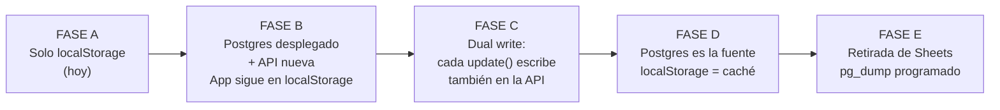

# 06 · Migración a PostgreSQL

**Aclaración de partida:** esto no es una migración desde archivos Excel. `HybridCoach-BaseDeDatos.xlsx`
no lo lee ni escribe ningún código. Las dos fuentes reales de datos son:

1. el blob JSON `hybridcoach:v2` en `localStorage` del navegador — **la fuente de verdad**;
2. la hoja de Google Sheets — un respaldo parcial de solo escritura.

---

## 1. Estrategia por fases



El riesgo real está en la Fase C. Regla para mitigarlo: **toda escritura a Postgres debe ser
idempotente** — `UPSERT` con clave natural, no `INSERT` a secas. Un fallo de red a mitad de
sincronización no debe duplicar filas.

---

## 2. Paso 1 — Inspección

### Exportar el estado del navegador

En la consola del navegador con la app abierta:

```js
copy(localStorage.getItem('hybridcoach:v2'))
```

Guardar como `migration/source/localstorage-YYYY-MM-DD.json`. **Hacerlo desde cada
dispositivo donde hayas usado la app**, porque cada navegador tiene su propio estado y
pueden divergir.

### Exportar las hojas

Descargar cada hoja de Google Sheets a CSV en `migration/source/sheets/`.

### Comparar

Antes de escribir una sola línea de migración, documentar en `migration/DISCREPANCIAS.md`:
- filas presentes en `localStorage` pero no en Sheets (lo normal: solo se sincronizan
  algunas hojas),
- filas presentes en Sheets pero no en `localStorage` (indicaría edición manual de la hoja),
- diferencias de valor para la misma fila.

**Regla de resolución de conflictos: `localStorage` gana**, salvo que la discrepancia se
explique por una edición manual deliberada de la hoja.

---

## 3. Paso 2 — Mapeo

Es mecánico porque `HEADERS` en `Codigo.gs` ya define el esquema columna por columna.

| Origen (hoja / clave JSON) | Tabla destino |
|---|---|
| `Perfiles` / `perfiles[].perfil` | `athlete_profiles` (+ `injuries` extraídas del array `lesiones`) |
| `Plan_Maestro` / `perfiles[].plan` | `training_plans` + `training_weeks` |
| `Plan_Semanal` / `perfiles[].weeks` | `planned_sessions` |
| `Running` / `perfiles[].running` | `completed_sessions` + `running_sessions` |
| `Fuerza` / `perfiles[].strength` | `completed_sessions` + `strength_sessions` + `strength_sets` |
| `Recovery` / `perfiles[].recovery` | `recovery_logs` |
| `Feedback` / `perfiles[].checkins` | `feedback_logs` |
| `Cambios_Plan` / `perfiles[].changes` | `plan_modifications` |
| `Bibliografia` / `biblio` | `documents` (sin chunks: son fichas resumen) |
| `Rutinas` / `perfiles[].rutinas` | `routines` |
| `Ejercicios_Propios` / `perfiles[].ejercicios` | `strength_exercises` (con `athlete_profile_id`) |
| `Decisiones_Plan` / `plan.decisiones` + `plan.ia` | `plan_decisions` |
| `Nutricion_*` / `perfiles[].comidas` | `nutrition_targets`, `meal_catalog` |
| `perfiles[].chat` | `conversations` + `messages` |

---

## 4. Paso 3 — Limpieza y normalización

| Problema | Tratamiento |
|---|---|
| Cadenas vacías de Sheets (`""`) | → `NULL` |
| Números que llegaron como texto | *cast* explícito y validado. El código ya lidia con esto (`+p.grasa \|\| null`) |
| Fechas | Ya están en `YYYY-MM-DD` de forma consistente vía el helper `iso()`. **No hay formatos mixtos que reconciliar** — una suerte |
| Valores fuera de rango (RPE 0 o 11, dolor negativo) | rechazar y registrar, no truncar en silencio |
| Ejercicios referenciados por nombre | mapear a `strength_exercises.id`. **Punto delicado:** la progresión de carga se asocia hoy al *nombre* del ejercicio; nombres con espacios distintos o mayúsculas distintas deben normalizarse antes de mapear o se pierde historial de progresión |

---

## 5. Paso 4 — IDs

Los IDs actuales son heterogéneos:
- `uid()` generado en cliente para la mayoría de entidades,
- `Date.now()` para carreras registradas a mano (`id: Date.now()`) — riesgo teórico de
  colisión si se registran dos en el mismo milisegundo,
- IDs fijos tipo `"b1"`, `"n1"` para las referencias semilla.

**Estrategia:** generar `uuid v4` nuevos en el backend y mantener `legacy_id_map`
(`old_id`, `new_id`, `tabla`, `fuente`) para poder rastrear cualquier discrepancia después.
Se borra la tabla al cerrar la migración.

---

## 6. Paso 5 — Duplicados

| Entidad | Clave de deduplicación |
|---|---|
| Sesión de carrera | `(athlete_profile_id, fecha, codigo_sesion, duracion_min)` |
| Sesión de gimnasio | `(athlete_profile_id, fecha, codigo_sesion)` |
| Registro de recuperación | `(athlete_profile_id, fecha)` — único por día |
| Actividad de Strava | `external_id` |
| Documento | `hash_archivo` o `doi` |

---

## 7. Paso 6 — Validación

No dar la migración por buena sin estos checks:

```
□ Nº de filas por tabla origen == nº de filas destino (menos duplicados eliminados,
  documentados uno a uno)
□ Suma de km corridos: origen == destino
□ Suma de kg movidos (peso × reps): origen == destino
□ Nº de check-ins: origen == destino
□ Rango de fechas (primera y última sesión): idéntico
□ Cada athlete_profile tiene exactamente un training_plan activo
□ Ningún strength_set huérfano (sin ejercicio mapeado)
□ Nº de referencias bibliográficas: origen == destino
□ La app, leyendo de Postgres, muestra el mismo plan y las mismas gráficas que leyendo
  de localStorage (comparación visual, pantalla a pantalla)
```

El último check es el que de verdad importa: los totales pueden cuadrar y la app verse mal
si un mapeo de relaciones está torcido.

---

## 8. Paso 7 — Dual write (Fase C)

Duración recomendada: **1-2 semanas**, no más. Cuanto más dure, más ocasiones de divergir.

Reglas:
- `localStorage` sigue siendo lo que la app lee (la UI no cambia de comportamiento).
- Cada `update()` dispara además una llamada a la API que hace `UPSERT`.
- Si la llamada a la API falla, se registra en una cola local de reintento; **no se bloquea
  al usuario** ni se pierde el dato local.
- Un job de conciliación diario compara los totales de §7 entre ambas fuentes y avisa si
  divergen.

Criterio para pasar a Fase D: **7 días consecutivos sin divergencias**.

---

## 9. Paso 8 — Corte (Fase D)

- La app lee de la API. `localStorage` pasa a ser caché de lectura para arranque rápido y
  tolerancia a desconexión momentánea, no fuente de verdad.
- Mantener el export a Sheets encendido — es barato y sirve de red de seguridad.
- Guardar una copia congelada del último `localStorage` exportado, fuera del repositorio.

---

## 10. Paso 9 — Retirada de Sheets (Fase E)

Condiciones para hacerlo, todas:
- 2-3 semanas con Postgres como fuente única sin incidencias,
- `pg_dump` programado funcionando **y restaurado con éxito al menos una vez en un entorno
  de prueba** (un backup no probado no es un backup),
- `APPS_SCRIPT_URL` se puede desactivar sin que nada falle.

Entonces: quitar la variable de entorno, dejar el código del puente unas semanas más por si
acaso, y borrarlo en una limpieza posterior.

---

## 11. Estructura de trabajo sugerida

```
migration/
├── source/                     volcados originales (NO commitear: datos de salud)
│   ├── localstorage-*.json
│   └── sheets/*.csv
├── DISCREPANCIAS.md            hallazgos del paso 1
├── scripts/
│   ├── 01-parse-localstorage.js
│   ├── 02-parse-sheets.js
│   ├── 03-transform.js
│   ├── 04-load.js
│   └── 05-verify.js            los checks de §7, ejecutables en un comando
└── README.md                   cómo ejecutar todo en orden
```

Añadir `migration/source/` a `.gitignore`. Son datos de salud reales.
