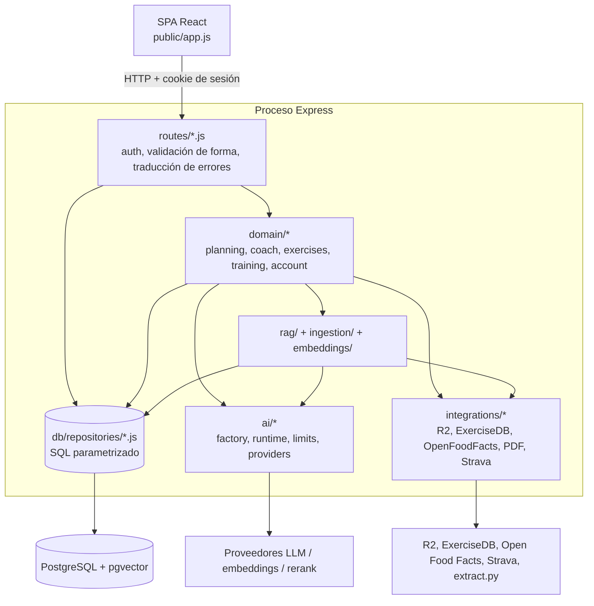
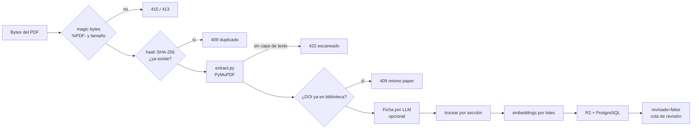
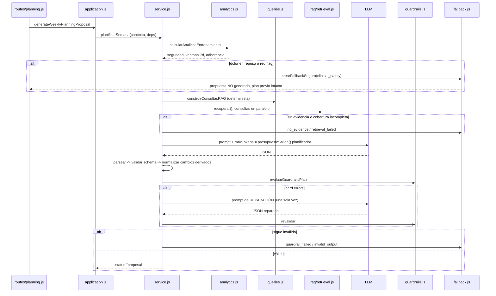

# 12 — Arquitectura del backend (estado real)

Este documento describe el servidor **tal y como está hoy**, no como se planificó. Todo lo
que se afirma aquí está verificado leyendo el código y se cita como `fichero:línea`. Si algo
del código contradice este documento, manda el código: entonces este documento está viejo y
hay que corregirlo.

El resto de `docs/` describe el *diseño* (04-capa-ia, 05-rag, 08-seguridad, 11-planificador).
Aquí se describe la *implementación*.

---

## 1. Mapa de capas

El servidor es un único proceso Node/Express que sirve además la SPA compilada
(`server.js:463-469`). Por dentro está separado en cinco capas con una regla que se cumple
sin excepciones en el código leído: **una capa nunca salta dos hacia abajo**.

| Capa | Dónde | Qué puede hacer | Qué tiene prohibido |
|---|---|---|---|
| Rutas | `server/routes/*.js`, `server.js` | Autenticación, forma de la petición, códigos HTTP, DTO público | Decidir nada de entrenamiento. `planning.js:1-5` y `application.js:1-5` lo dicen explícitamente: «ninguna decisión de entrenamiento vive en Express» |
| Dominio | `server/domain/` | Orquestar, validar, aplicar guardarraíles | Importar rutas o proveedores concretos. `service.js:35-38` marca `planificarSemana()` como «orquestador puro» y recibe todo por `deps` |
| Persistencia | `server/db/repositories/` | SQL parametrizado, transacciones, ownership en el `WHERE` | Recibir claves de columna que vengan de una petición (`_helpers.js:3-5`) |
| IA | `server/ai/` | Adaptar proveedores a un contrato único, imponer presupuestos | Conocer el dominio. Los adaptadores no saben qué es una tirada larga |
| Integraciones | `server/integrations/` | Hablar con servicios externos y normalizar su JSON | Persistir o decidir |

**Por qué esta separación y no un servidor plano.** Tres razones concretas que se ven en el
código:

1. **El dominio se prueba sin red ni base de datos.** `planificarSemana(contexto, deps)`
   recibe `retrieve` y `llmProvider` por parámetro (`service.js:39-48`), así que
   `planning.test.js` puede ejercitarlo con dobles. Si la ruta llamase al proveedor
   directamente, probar un guardarraíl exigiría levantar Express y una clave de API.
2. **La capa de IA es sustituible.** El servidor no depende de Anthropic; depende de la
   interfaz `LLMProvider { call(), capabilities() }` (`ai/providers/types.js:5-8`). Cambiar
   de proveedor es una variable de entorno, no un refactor.
3. **La seguridad vive en un solo sitio.** El perfil activo sale SIEMPRE de la sesión
   (`req.auth.athleteProfileId`), nunca de un parámetro (`routes/coach.js:1-3`). Si cada
   ruta hablase con la base sin pasar por el mismo par de middlewares, la comprobación se
   perdería en la ruta número treinta.

Una consecuencia práctica: el arranque **degrada, no muere**. Un proveedor mal configurado
se registra y se sigue sin IA (`server.js:95-101`); los embeddings rotos degradan a
retrieval léxico y se publica el motivo en `/api/estado` (`server.js:128-134`). Solo dos
cosas abortan el arranque: `SESSION_SECRET` ausente o corta (`server.js:85-87`) y embeddings
activados sin `DATABASE_URL` (`server.js:113-115`).

---

## 2. Inventario de endpoints reales

97 endpoints de API más el `GET *` que sirve la SPA (`server.js:469`). El montaje está en
`server.js:215-235`, y el orden importa: `/api/admin` va antes que `apiRoutes` porque su
subida de PDF parsea cuerpo binario y no debe caer en el manejador JSON genérico
(`server.js:223-226`).

Leyenda de middleware:
`A` = `requireAuth` · `P` = `requireActiveProfile` · `O` = `ownedProfile` ·
`ADM` = `requireAdmin` · `IA` = `aiRateLimiter` · `UP` = `uploadRateLimiter` ·
`LOG`/`REG` = limitadores de login/registro · `STV` = `requireLegacyStravaEnabled` ·
`—` = público.

### 2.1 Nivel servidor (`server.js`)

| Método | Ruta | Qué hace | Middleware |
|---|---|---|---|
| GET | `/health/live` | Vivo. Devuelve `{ok:true}` sin tocar nada | — |
| GET | `/health/ready` | Listo: consulta estado de BD y pgvector; 503 si no (`server.js:151-155`) | — |
| GET | `/health` | Estado agregado: BD + integraciones opcionales como `available`/`unavailable`, sin secretos (`server.js:160-179`) | — |
| GET | `/api/estado` | Capacidades para la UI: IA, hoja, Strava, pgvector, embeddings (con motivo de degradación), extractor PDF, modelo local (`server.js:180-214`) | — |
| POST | `/api/entrar` | Ruta heredada: 410 fijo. No existe contraseña compartida (`server.js:238`) | — |
| POST | `/api/ia` | Proxy al LLM con la clave en servidor. Resuelve el proveedor del usuario con respaldo al del servidor; `max_tokens` pasa por `topeSalidaPeticion()` (`server.js:243-265`) | A + IA |
| POST | `/api/sheets` | Escribe filas en Google Sheets vía Apps Script o cuenta de servicio; las hojas de estado se sustituyen por perfil (`server.js:291-348`) | A |
| GET | `/api/sheets` | Lee una hoja y la devuelve como objetos (`server.js:350-362`) | A |
| GET | `/api/strava/entrar` | Redirección al OAuth de Strava (legado monousuario) | A + STV |
| GET | `/api/strava/vuelta` | Callback OAuth: guarda tokens **en memoria del proceso** (`server.js:368`, `378-394`) | STV |
| GET | `/api/strava/actividades` | Importa carreras y salidas en bici desde una fecha (`server.js:413-434`) | A + STV |
| GET | `*` | Sirve `index.html` (SPA) | — |

> El estado de Strava es una variable de módulo (`server.js:368`): no persiste entre
> reinicios ni se comparte entre usuarios. Es legado explícito, no la vía principal.

### 2.2 Autenticación (`server/routes/auth.js`, montado en `/api/auth` **y** `/auth`)

| Método | Ruta | Qué hace | Middleware |
|---|---|---|---|
| POST | `/register` | Alta con Argon2id; crea perfil e inicia sesión. El rol es siempre `athlete` (`auth.js:41-44`) | REG |
| GET | `/registration-status` | Si las altas están abiertas (`auth.js:51-53`) | — |
| POST | `/login` | Verifica Argon2id y abre sesión (`auth.js:55-65`) | LOG |
| POST | `/logout` | Revoca la sesión en base de datos y borra la cookie (`auth.js:67-74`) | — |
| GET | `/me` | Usuario, perfiles y perfil activo (`auth.js:76-78`) | A |
| POST | `/select-profile` | Cambia el perfil activo **de la sesión** (`auth.js:80-86`) | A |
| POST | `/change-password` | Cambia contraseña y **revoca todas las demás sesiones** en la misma transacción (`auth.js:105-106`) | A |
| GET | `/export` | Exporta todos los datos del usuario como descarga (`auth.js:111-117`) | A |
| DELETE | `/account` | Borra la cuenta previa verificación de contraseña (`auth.js:119-...`) | A |

### 2.3 CRUD de dominio (`server/routes/api.js`, montado en `/api`)

`router.use(requireAuth)` en `api.js:14`; el helper `active()` añade `requireActiveProfile`
a cada ruta que toca datos de un perfil (`api.js:16`).

| Método | Ruta | Qué hace | Middleware |
|---|---|---|---|
| GET / POST | `/profiles` | Lista y crea perfiles del usuario | A |
| GET | `/profiles/:id` | Perfil por id, resuelto por ownership | A + O |
| GET / PATCH | `/profile` | Lee y actualiza el perfil activo (el `SELECT` filtra por `user_id`, `api.js:23`) | A + P |
| GET / POST | `/profile/injuries` | Lesiones activas | A + P |
| GET / PUT | `/profile/availability` | Disponibilidad semanal; valida índices 0-6 (`api.js:33-35`) | A + P |
| GET | `/plan`, `/plans` | Plan activo con sus semanas y sesiones | A + P |
| POST | `/plan` | Crea versión de plan y la activa (`api.js:46`) | A + P |
| GET | `/sessions` | Sesiones completadas con detalle de carrera y fuerza, filtrables por fechas | A + P |
| DELETE | `/sessions/:id` | Borra una sesión completada del perfil | A + P |
| POST | `/sessions/running` | Registra carrera | A + P |
| POST | `/sessions/strength` | Registra sesión de fuerza con series | A + P |
| GET / POST | `/checkins` | Registro de sensaciones | A + P |
| GET | `/recovery` | Historial de recuperación | A + P |
| PUT | `/recovery/:fecha` | Upsert del registro de un día | A + P |
| GET / PUT | `/routines` | Rutinas de gimnasio del perfil | A + P |
| GET / POST | `/nutrition/targets` | Objetivos nutricionales | A + P |
| GET / POST | `/nutrition/meals` | Catálogo de comidas | A + P |
| GET | `/documents` | Biblioteca paginada (lectura para cualquier usuario) | A |
| POST | `/documents` | Alta manual de ficha; entra con `revisado: false` (`api.js:134-141`) | A + ADM |
| PATCH | `/documents/:id` | Edita ficha. **409 si se intenta marcar `revisado` sin fragmentos** (`api.js:147-152`) | A + ADM |
| DELETE | `/documents/:id` | Borra documento | A + ADM |

### 2.4 Sincronización (`server/routes/sync.js`, montado en `/api`)

| Método | Ruta | Qué hace | Middleware |
|---|---|---|---|
| GET | `/sync-state` | Último snapshot del cliente para ese perfil | A + P |
| POST | `/sync` | Vuelca el estado de `localStorage`. Idempotente por `operationId`/`Idempotency-Key`, con `FOR UPDATE` y descarte de snapshots viejos (`sync.js:294-333`) | A + P |
| POST | `/reconciliation-snapshot` | Guarda solo los totales locales para comparar | A + P |
| GET | `/reconciliation-status` | Últimos 7 días de conciliación y `readyForCutover` con 7 verdes seguidos (`sync.js:349-367`) | A + P |

### 2.5 Ajustes de IA por usuario (`server/routes/ai-settings.js`, `/api/ai/settings`)

| Método | Ruta | Qué hace | Middleware |
|---|---|---|---|
| GET | `/` | Ajustes públicos: proveedor, modelo, última prueba. **Nunca la clave** (`user-provider.js:60-69`) | A |
| PUT | `/` | Guarda proveedor/modelo y cifra la clave con AES-256-GCM | A |
| POST | `/test` | Llamada real de prueba con `presupuestoSalida().prueba` (`ai-settings.js:72-76`) | A + IA |
| DELETE | `/` | Borra los ajustes y vuelve al proveedor del servidor | A |

### 2.6 Administración de la biblioteca (`server/routes/admin.js`, `/api/admin`)

`router.use(requireAuth, requireAdmin)` en `admin.js:26`: **todo** exige rol admin, porque la
bibliografía es un recurso compartido por todos los usuarios (`admin.js:1-3`).

| Método | Ruta | Qué hace | Middleware |
|---|---|---|---|
| POST | `/documents/upload` | Ingesta de PDF como cuerpo binario en bruto (`admin.js:53`, `61-89`) | A + ADM + UP |
| GET | `/documents/pending` | Cola de revisión | A + ADM |
| GET | `/documents/:id/chunks` | Fragmentos de un documento | A + ADM |
| GET | `/documents/:id/pdf` | Original: redirige si el bucket es público, si no lo sirve el servidor (`admin.js:105-116`) | A + ADM |
| GET | `/storage/estado` | Diagnóstico: extractor, R2, LLM, embeddings. Devuelve **nombres** de variables ausentes, nunca valores | A + ADM |
| POST | `/retrieval` | Banco de pruebas del RAG con filtros y sobrescrituras por petición (`admin.js:171-207`) | A + ADM |
| GET | `/retrieval/config` | Configuración activa de RAG/rerank/embeddings, sin claves (`admin.js:223-235`) | A + ADM |
| GET | `/planning/runs` | Diagnóstico de generaciones del planificador; sin datos de salud (`admin.js:243-249`) | A + ADM |
| GET | `/embeddings/config` | Ajuste de instancia de embeddings | A + ADM |
| PUT | `/embeddings/config` | Guarda y avisa si hay que reindexar por cambio de modelo (`admin.js:347-358`) | A + ADM |
| POST | `/embeddings/config/test` | Embebe un texto y verifica que devuelve 1024 dimensiones | A + ADM + IA |
| DELETE | `/embeddings/config` | Vuelve a la configuración de entorno | A + ADM |

### 2.7 Planificador (`server/routes/planning.js`, `/api/planning`)

| Método | Ruta | Qué hace | Middleware |
|---|---|---|---|
| GET | `/master` | Plan maestro activo | A + P |
| POST | `/master` | Genera el plan maestro completo con IA+RAG (`planning.js:58-72`) | A + P + IA |
| POST | `/weeks/:week/proposals` | Genera propuesta semanal | A + P + IA |
| GET | `/weeks/:week/accepted` | Revisión aceptada de esa semana | A + P |
| GET | `/proposals/:id` | Propuesta por id, validando UUID y ownership | A + P |
| POST | `/proposals/:id/accept` | Acepta con control optimista (`expectedRevision` obligatorio) | A + P |
| POST | `/proposals/:id/reject` | Rechaza, mismo control | A + P |

> El `aiRateLimiter` va **solo** en los dos endpoints que llaman a un modelo, no sobre el
> router. El comentario de `planning.js:74-79` documenta el fallo real que causó lo
> contrario: pulsar las flechas de semana gastaba cuota de IA sin invocar a nadie y dejaba
> el planificador bloqueado.

### 2.8 Coach (`server/routes/coach.js`, `/api/coach`)

| Método | Ruta | Qué hace | Middleware |
|---|---|---|---|
| POST | `/route` | Clasificación local de intención con Needle. No ejecuta la herramienta elegida (`coach.js:62-73`) | A + P + IA |
| POST | `/chat` | Turno de conversación completo: contexto, RAG, modelo, validación, acción y posible propuesta semanal (`coach.js:75-109`) | A + P + IA |
| POST | `/decisiones` | Genera las decisiones razonadas del plan con citas | A + P + IA |
| GET | `/decisiones` | Decisiones guardadas con sus citas resueltas | A + P |
| POST | `/decisiones/:id/accept` | Acepta una decisión pendiente (UPDATE con `athlete_profile_id` en el `WHERE`, `coach.js:135-139`) | A + P |
| POST | `/decisiones/:id/reject` | Rechaza | A + P |
| GET | `/conversations` | Conversaciones del perfil | A + P |
| GET | `/conversations/:id/messages` | Mensajes con estado de la propuesta asociada | A + P |
| DELETE | `/conversations/:id` | Borra conversación del perfil | A + P |
| POST | `/comparar` | Ejecuta las mismas preguntas contra RAG y contra el sistema léxico anterior, para detectar regresiones antes de apagar el viejo (`coach.js:182-193`) | A + P + IA |

### 2.9 Evidencia, ejercicios y alimentos

| Método | Ruta | Qué hace | Middleware |
|---|---|---|---|
| GET | `/api/evidence/chunks/:chunkId` | Fragmento citado, solo si pertenece a documento revisado | A + P |
| GET | `/api/evidence/chunks/:chunkId/pdf-url` | URL firmada temporal. La clave R2 se deriva en servidor; nunca se acepta del navegador (`evidence.js:1-3`, `50-61`) | A + P |
| GET | `/api/exercises/patrones` | 20 patrones de movimiento disponibles | A + P |
| GET | `/api/exercises/alternativas` | Alternativas para un patrón. El equipamiento sale del perfil, **nunca de la petición** (`exercises.js:6-9`, `33-36`) | A + P |
| GET | `/api/foods/buscar` | Búsqueda en el proveedor de alimentos, con atribución de licencia | A + P |
| GET | `/api/foods/codigo/:codigo` | Alimento por código de barras | A + P |
| POST | `/api/foods/consumo` | Registra consumo con snapshot de macros (1-5000 g) | A + P |
| DELETE | `/api/foods/consumo/:id` | Borra un registro del perfil | A + P |
| GET | `/api/foods/dia` | Objetivo, consumido y restante del día; el restante puede ser negativo a propósito (`foods.js:131-133`) | A + P |

---

## 3. Capa de IA

`server/ai/` tiene una única responsabilidad: **convertir cuatro proveedores distintos en un
contrato único**, para que ni el dominio ni las rutas sepan con quién están hablando.

### 3.1 Contratos y fábrica

`ai/providers/types.js` declara cuatro interfaces como clases base y, más importante,
**aserciones que se ejecutan al construir**: `assertLLMProvider()` exige `call()`,
`capabilities()` y cinco capacidades concretas (`types.js:43-52`). JavaScript no impone
interfaces, así que se comprueba pronto y en voz alta en vez de fallar a mitad de una
generación.

`ai/factory.js` valida el entorno y construye:

| Familia | Proveedores admitidos | Dónde |
|---|---|---|
| LLM | `anthropic`, `openai`, `openai-compatible`, `ollama` | `factory.js:15` |
| Embeddings | `voyage`, `openai`, `openai-compatible` | `factory.js:16` |
| Rerank | `noop`, `cohere`, `openai-compatible` | `factory.js:17` |
| Enrutado local | `needle` | `factory.js:18` |

Dos decisiones que se ven en el código y merecen nombre:

- **El rerank SIEMPRE devuelve un adaptador.** Sin configurar cae en `noop`, que conserva el
  orden de la fusión (`factory.js:109-111`). Así `retrieval.js` no tiene ni un `if (hay
  reranker)`: llama siempre (`retrieval.js:100-107`).
- **Ollama y Needle solo apuntan a local por defecto.** Salir del bucle requiere
  `OLLAMA_ALLOW_REMOTE=true` / `NEEDLE_ALLOW_REMOTE=true` (`factory.js:58-64`,
  `factory.js:154-160`). Un modelo «local» apuntando sin querer a un host ajeno es una fuga
  de datos de salud, no un detalle de configuración.

### 3.2 Runtime y proveedor por usuario

`ai/runtime.js` es el punto donde el coach y el planificador obtienen todo de golpe:
`resolveRAGRuntime(userId)` devuelve `db`, `repo`, `llmProvider`, `embeddingProvider`,
`rerankProvider`, `indice` y `config` (`runtime.js:25-38`). El LLM y el rerank se cachean
por proceso con `lazy()`; los embeddings **no**, porque su configuración vive en base de
datos y puede cambiarse desde el panel sin reiniciar (`runtime.js:1-3`).

`ai/user-provider.js` implementa la clave propia de cada usuario:

- Solo `openai` y `anthropic` pueden configurarse desde Ajustes (`user-provider.js:7`);
  `openai-compatible` y `ollama` son decisión de operador, no de usuario.
- La clave se guarda cifrada con AES-256-GCM y **el `userId` como AAD**
  (`settings-crypto.js:18-27`): un ciphertext robado de otra fila no descifra, porque el dato
  asociado no coincide.
- `resolveUserLLMProvider(userId, { fallbackProvider })` devuelve el proveedor del usuario o
  el del servidor (`user-provider.js:53-58`). Es el patrón que usan `/api/ia`
  (`server.js:245`), el coach (`runtime.js:30`) y la ingesta de PDF (`admin.js:76`).
- El timeout es 90 s por defecto y configurable. El comentario de `user-provider.js:24-33`
  registra el motivo: con 45 s se abortaban generaciones semanales válidas que en producción
  tardaban entre 33 y 68 s.

### 3.3 Por qué no se usa tool calling nativo

El modelo propone acciones dentro de un bloque delimitado `<<ACCION>>` en el texto, no
mediante la API de herramientas del proveedor. El motivo está escrito en
`domain/coach/acciones.js:9-12`: *el formato de herramientas difiere entre Anthropic y
OpenAI, y `LLMProvider` es neutro a propósito*. Un bloque delimitado funciona igual con los
cuatro proveedores y reutiliza el patrón que ya existía para `<<CAMBIO>>`.

El coste es un parseo propio. La ganancia es que añadir un proveedor no obliga a reescribir
la capa de acciones, y que un modelo servido por Ollama —que en la práctica no tiene tool
calling fiable— funciona exactamente igual que Claude.

Needle es la excepción aparente, y confirma la regla: es un **clasificador**, no un
ejecutor. `assertToolRouterProvider()` rechaza en el arranque cualquier adaptador cuyas
capacidades declaren `executesTools !== false` (`types.js:87-89`), y la lista de herramientas
que se le ofrece es deliberadamente de solo lectura (`local-tools.js:1-3`).

---

## 4. Presupuesto de tokens: `server/ai/limits.js`

`server/ai/limits.js` es la **única fuente de verdad** de los topes. Ningún otro fichero
debe contener un número literal de `maxTokens`.

### 4.1 Qué problema resuelve

La cabecera del fichero (`limits.js:1-13`) documenta el estado anterior: 1400 en un sitio,
1000 en el chat, 400 en el resumen, 3000 en el planificador, un tope duro de 4000 en
`/api/ia`, 1200 caracteres por fragmento de evidencia. Cada número se eligió pensando en un
modelo pequeño y, juntos, imponían una ventana estrecha a cualquier modelo grande que se
configurase después. **El síntoma real fue una propuesta semanal cortada a media generación
(`stopReason: "max_tokens"`) que el validador rechazaba entera**: una generación de casi un
minuto tirada a la basura por una constante escrita para otro modelo.

### 4.2 Las cuatro funciones

| Función | Firma | Qué devuelve |
|---|---|---|
| `topeSalida(env)` | `limits.js:42-44` | Techo global. `LLM_MAX_TOKENS`, por defecto **8000**, acotado a `[256, 200000]` |
| `presupuestoSalida(env)` | `limits.js:49-84` | Objeto con un presupuesto por tarea, todos derivados del techo |
| `presupuestoEntrada(env)` | `limits.js:87-101` | Cuánto **contexto** se entrega: caracteres por fragmento, turnos literales, umbral de resumen |
| `topeSalidaPeticion(solicitado, env)` | `limits.js:105-110` | El `max_tokens` que puede pedir un cliente en `/api/ia`: nunca más que el techo |

### 4.3 Cómo se deriva cada presupuesto de `LLM_MAX_TOKENS`

`derivado(variable, fraccion, minimo)` (`limits.js:51-54`) calcula
`min(tope, env[variable] ?? max(minimo, round(tope × fraccion)))`. Es decir: si defines la
variable específica, manda; si no, sale de una fracción del techo con un suelo propio; y en
ningún caso supera el techo.

| Tarea | Variable específica | Fracción | Suelo | Valor con el techo por defecto (8000) |
|---|---|---|---|---|
| `planificador` | `LLM_MAX_TOKENS_PLANIFICADOR` | 1 | 3000 | 8000 |
| `planMaestro` | `LLM_MAX_TOKENS_PLAN_MAESTRO` | — (no derivado) | `max(32000, tope)` | **32000** |
| `coach` | `LLM_MAX_TOKENS_COACH` | 0,5 | 1500 | 4000 |
| `decisiones` | `LLM_MAX_TOKENS_DECISIONES` | 0,5 | 2400 | 4000 |
| `pdf` | `LLM_MAX_TOKENS_PDF` | 0,35 | 1600 | 2800 |
| `resumen` | `LLM_MAX_TOKENS_RESUMEN` | 0,1 | 600 | 800 |
| `prueba` | `LLM_MAX_TOKENS_PRUEBA` | — | 512 fijo, acotado `[16, 4000]` | 512 |

`planMaestro` es el único que **no** se deriva por fracción (`limits.js:66-71`): doce
semanas con todas sus sesiones en un único JSON necesitan su propio suelo alto de 32000, y
quedarse corto ahí tira la generación más cara de la aplicación.

`resumen` es corto **a propósito**: el comentario de `limits.js:78-79` advierte de que
alargarlo empeora el resumen de compactación en vez de mejorarlo. No todo tope bajo es un
error.

### 4.4 Presupuesto de entrada

Salida y entrada no son lo mismo y conviene no confundirlas (`limits.js:15-24`): un tope de
salida alto **no cuesta nada mientras el modelo no lo use**, porque solo se paga lo generado;
la entrada se paga entera en cada llamada. Por eso los valores de entrada crecen de forma más
medida:

| Clave | Variable | Defecto | Rango | Para qué |
|---|---|---|---|---|
| `evidenciaChars` | `PLANNER_EVIDENCE_CHARS` | 3000 | 300–40000 | Caracteres por fragmento en el planificador |
| `coachEvidenciaChars` | `COACH_EVIDENCE_CHARS` | 3000 | 300–40000 | Ídem en el contexto del coach |
| `reparacionChars` | `PLANNER_REPAIR_CHARS` | 60000 | 2000–400000 | Cuánto del intento rechazado se devuelve al pedir reparación |
| `turnosLiterales` | `CHAT_TURNOS_LITERALES` | 24 | 2–200 | Turnos que viajan sin resumir |
| `umbralResumen` | `CHAT_RESUMEN_UMBRAL` | 60 | 4–1000 | A partir de cuántos mensajes se compacta |

`reparacionChars` es generoso por una razón concreta (`limits.js:93-94`): con un recorte
agresivo, el modelo repara a ciegas la parte del JSON que no ve.

### 4.5 Por qué nunca se escribe un `maxTokens` literal

Cuatro consecuencias reales, todas documentadas en el código:

1. **Recorte silencioso.** El literal `4000` de `/api/ia` recortaba la respuesta a un cuarto
   de lo que el proveedor podía dar con un modelo grande (`server.js:252-255`).
2. **Discriminación del usuario con clave propia.** `createUserLLMProvider()` fijaba 1400:
   quien configuraba su clave desde Ajustes quedaba con una ventana **cuatro veces más
   estrecha** que el resto de la aplicación (`user-provider.js:45-49`).
3. **Un solo mando.** `readLLMConfig()` valida `LLM_MAX_TOKENS` pero delega el cálculo en
   `topeSalida()` precisamente para no perseguirlo por seis ficheros
   (`factory.js:42-49`).
4. **Consistencia entre tareas.** Subir `LLM_MAX_TOKENS` sube todo a la vez y no hay que
   acordarse de seis variables (`limits.js:46-48`).

La forma correcta de pedir tokens es siempre la misma:
`presupuestoSalida().<tarea>` — así lo hacen `service.js:47`, `masterPlan.js:17`,
`chat.js:15` y `ai-settings.js:75`. En `/api/ia`, `topeSalidaPeticion(req.body?.max_tokens)`.

Detalle sutil que cuesta un incidente si se ignora: `entero()` trata `""` como «no definido»
(`limits.js:29-38`). Sin ese corte, un `LLM_MAX_TOKENS=` vacío en el panel de Railway no caía
en el valor por defecto sino en el mínimo, dejando al modelo con 256 tokens de salida.

---

## 5. RAG: de un PDF a una cita verificable

### 5.1 Ingesta (`server/ingestion/`)

`ingerirPDF()` (`pipeline.js:55-...`) ordena los pasos por coste creciente **a propósito**:
primero lo barato y lo que puede rechazar, después lo caro, y por último lo que deja rastro
(`pipeline.js:1-6`). Así un duplicado no gasta ni una llamada al modelo ni un objeto en R2.

| Paso | Fichero:línea | Por qué así |
|---|---|---|
| Tipo real por magic bytes | `pipeline.js:17` | La extensión y el `Content-Type` los controla quien sube |
| Límite de tamaño | `pipeline.js:13` | `PDF_MAX_BYTES`, 50 MB por defecto |
| Dedup por hash | `pipeline.js:59-62` | Antes de gastar nada |
| Dedup por DOI | `pipeline.js:79-83` | El mismo paper desde otro archivo |
| Fallo del extractor | `pipeline.js:68-74` | Distingue culpa del archivo (422) de culpa del servidor (503): devolver 500 para ambos hacía que un despliegue sin extractor pareciera un PDF malo |
| Ficha por LLM | `pipeline.js:85-90` | Si no hay proveedor, el documento entra igual: perder el PDF sería peor que una ficha incompleta |

**Troceado (`chunker.js`).** Se trocea por **sección del paper**, no cada N caracteres, y un
chunk nunca cruza el límite de una sección (`chunker.js:1-10`). Dos razones: cortar a ciegas
parte frases y mezcla métodos con resultados; y la sección es señal aprovechable en el
retrieval —una pregunta aplicada se responde en *Discussion*, la magnitud del efecto en
*Results*—. Objetivo 400-600 tokens con 15 % de solape (`chunker.js:12-14`), y el solape se
toma en **frases completas**, no cortando por carácter, para que el fragmento repetido siga
siendo legible y citable (`chunker.js:43-45`). El contador de tokens es una aproximación
deliberada de ~4 caracteres por token: un tokenizador real es otra dependencia y aquí solo
hace falta para agrupar (`chunker.js:16-20`).

**Vectorización (`embedder.js`).** Lotes configurables con reintento exponencial solo ante
429 y 5xx (`embedder.js:9-11`, `13-25`). Cada lote verifica que devuelve exactamente 1024
dimensiones y tantos vectores como chunks (`embedder.js:43-45`). El guardado es un
`INSERT ... ON CONFLICT (document_chunk_id, provider, model, dimensions) DO UPDATE`
(`embedder.js:69-75`): reindexar con otro modelo **no pisa** el índice anterior, convive.

### 5.2 Recuperación (`server/rag/`)

`recuperar()` (`retrieval.js:59-190`) es un híbrido de cinco pasos:

1. **Ampliación de consulta** (`query-expansion.js`). Una consulta como «me duele el gemelo»
   recupera poco; ampliada con la distancia objetivo, la fase y el historial de lesiones
   recupera lo que hace falta. Produce **una consulta por componente** porque el vectorial y
   el léxico necesitan cosas distintas (`query-expansion.js:1-7`).
2. **Vectorial y léxico en paralelo**, con los filtros duros ya dentro de cada consulta SQL
   (`retrieval.js:66-82`). El embedding de consulta usa `inputType: "query"`, no `"document"`
   (`retrieval.js:69-71`).
3. **Fusión RRF** (`fusionarRRF`, `retrieval.js:26-43`). Usa **rangos, no scores**: una
   distancia coseno y un `ts_rank` viven en escalas incomparables, y sumarlos o normalizarlos
   introduce sesgos arbitrarios (`retrieval.js:19-23`).
4. **Reranking**, siempre, sin ramas (`retrieval.js:100-107`).
5. **Umbral y top-K** (`retrieval.js:146-181`).

El **diccionario ES→EN** (`rag/diccionario-es-en.js`) existe porque el corpus es
mayoritariamente inglés y las consultas siempre en español: sin traducir, «entrenamiento
concurrente» no encuentra jamás «concurrent training» y **la mitad léxica del híbrido queda
muerta** (`diccionario-es-en.js:1-6`). Los términos se **añaden**, nunca sustituyen: la
consulta original en español sigue sirviendo al componente vectorial, que sí es cross-lingual
(`diccionario-es-en.js:11-13`). Es determinista y gratis, frente a gastar una llamada de LLM
por consulta.

**Qué señal se umbraliza** es la decisión más fina del módulo (`retrieval.js:109-119`):

| Situación | Señal | Por qué |
|---|---|---|
| Reranker con `scoresAbsolutos` | Su score | Calibrado y comparable entre consultas |
| `noop` + hay vectorial | Similitud coseno | Es la única señal absoluta disponible |
| `noop` sin vectorial | Ninguna: no se aplica umbral | Una coincidencia léxica sobre un término del dominio ya es señal; se declara en el diagnóstico en vez de rechazarlo todo en silencio |

El RRF **no** sirve como umbral: su valor solo depende de la posición, así que siempre hay un
«mejor» aunque no venga a cuento, y nunca detectaría la ausencia de evidencia.

Y el relleno tiene freno: solo se completa hasta `minResults` si los que superan el umbral
son menos, y los de relleno van **marcados** (`retrieval.js:165-181`). Rellenar siempre hasta
`topKFinal` metería fragmentos irrelevantes en el prompt: tokens pagados y ruido.

Cuando no hay evidencia se devuelve `hayEvidencia: false` con el mensaje `SIN_EVIDENCIA`
(`retrieval.js:15`) y los descartados viajan **solo para depuración**: quien construye el
prompt usa `chunks`, que está vacío (`retrieval.js:237-239`).

---

## 6. Planificación: maestro y semanal

Son **dos planificadores distintos** con ciclos de vida distintos. Confundirlos es el error
más fácil de cometer en este código.

| | Plan **maestro** | Plan **semanal** |
|---|---|---|
| Ficheros | `masterPlan.js`, `masterPlanPrompt.js`, `masterPlanSchema.js`, `masterQueries.js`, `masterEvidence.js`, `masterPlanApplication.js` | `service.js`, `prompt.js`, `schema.js`, `queries.js`, `guardrails.js`, `fallback.js`, `application.js` |
| Qué produce | La **estructura**: semanas, fases, tirada larga, sesiones maestras (`masterPlan.js:1-7`) | Una **propuesta de la semana N**, con cambios respecto al plan activo |
| Frecuencia | Una vez por bloque | Semanal o a petición del coach |
| Presupuesto | `presupuestoSalida().planMaestro` (32000) | `presupuestoSalida().planificador` |
| Evidencia | `seleccionarEvidenciaMaestro()`, hasta 14 chunks (`masterPlan.js:57`) | `seleccionarEvidencia()`, hasta 12 con **cobertura obligatoria** de las consultas `required` (`service.js:58-89`) |
| Guardarraíles | Schema + seguridad clínica | Schema + `evaluarGuardrailsPlan()` completo |
| Endpoint | `POST /api/planning/master` | `POST /api/planning/weeks/:week/proposals` |

Ambos son **orquestadores puros**: no importan repos, rutas ni proveedores concretos
(`masterPlan.js:9-10`, `service.js:35-38`). Quien une retrieval, orquestador y persistencia
auditable son las capas de aplicación (`application.js:1-5`, `masterPlanApplication.js:1-5`).

### 6.1 El ciclo del planificador semanal

Detalles que importan y están en el código:

- **Las consultas RAG no cuestan una llamada de modelo.** `queries.js:1-2` es explícito: las
  señales salen de hechos calculados por `analytics.js`, no de preguntarle al LLM qué buscar.
- **Los cortes clínicos van antes de la literatura.** «Las señales clínicas graves no
  necesitan literatura para decidir que no se debe generar entrenamiento de impacto»
  (`service.js:59-63`).
- **El prompt y el validador parten de los mismos límites.** Si no, el modelo recibiría un
  calendario que el validador luego rechazaría (`service.js:81-92`).
- **Solo hay un intento de reparación** (`service.js:105-123`), y se le devuelve el intento
  anterior recortado a `presupuestoEntrada().reparacionChars`.
- **`normalizarCambiosDerivados()`** (`service.js:113-161`) es la corrección de un fallo real:
  el diff entre la semana propuesta y la base lo calcula **siempre** el código, pero además se
  rechazaba la propuesta entera cuando la etiqueta del modelo no coincidía con ese cálculo.
  `SESSION_CHANGE_MISMATCH` y `MISSING_OR_INCORRECT_CHANGE` salían en casi todas las
  generaciones y con ellas se perdía la semana. Ahora la etiqueta se normaliza antes de
  validar: sigue pasando por schema y guardarraíles completos, y no se inventa nada —el motivo
  y la evidencia salen de lo que el propio modelo escribió.

### 6.2 `guardrails.js`: qué se comprueba después de generar

Los fallos **hard** invalidan la propuesta; los **soft** se muestran, pero **nunca se
«arreglan» cambiando carga** (`guardrails.js:1-2`). La versión de las reglas viaja en cada
resultado como `GUARDRAILS_VERSION = "weekly-guardrails.1"` (`guardrails.js:231`), para poder
auditar con qué reglas se generó cada propuesta.

| Familia | Códigos representativos | Línea |
|---|---|---|
| Seguridad clínica | `PAIN_HIGH_IMPACT`, `CLINICAL_RED_FLAG`, `CLINICAL_WARNING_REQUIRED` | 242, 245, 248 |
| Respeto al atleta | `UNAVAILABLE_DAY`, `RUNNING_NOT_SELECTED`, `STRENGTH_NOT_SELECTED` | 268, 274, 277 |
| Trazabilidad | `SESSION_WITHOUT_EVIDENCE`, `CHANGE_WITHOUT_EVIDENCE`, `NO_EVIDENCE_FOR_PLAN`, `MIXED_EVIDENCE_DETAILS` | 270, 286, 316, 386 |
| Integridad del histórico | `PAST_SESSION_NOT_COMPLETED`, `COMPLETED_IMMUTABLE` | 265, 324 |
| Progresión | `LONG_RUN_CEILING`, `WEEKLY_PROGRESSION_LIMIT`, `WEEKLY_DISTANCE_PROGRESSION_LIMIT`, `TAPER_VOLUME_INCREASE` | 330, 343, 351, 361 |
| Distribución híbrida | `HEAVY_BEFORE_LONG_RUN`, `QUALITY_AFTER_HEAVY`, `CONSECUTIVE_STRENGTH`, `MIN_REST`, `MAX_STREAK` | 375, 377, 379, 367, 370 |
| Antipatrones | `NO_CATCH_UP`, `UNSUPPORTED_LOAD_INCREASE`, `IMPLAUSIBLE_RUNNING_DISTANCE` | 384, 291, 356 |
| Avisos (soft) | `LIMITED_EVIDENCE`, `LOW_ADHERENCE` | 387, 388 |

`NO_CATCH_UP` merece explicación porque es política, no aritmética: las sesiones perdidas
**no se recuperan** acumulando o doblando carga. Un plan que «compensa» lo perdido es
exactamente el mecanismo por el que se lesiona alguien que ha estado una semana malo.

`COMPLETED_IMMUTABLE` protege el histórico: una sesión ya completada no se puede mover,
eliminar ni reescribir (`guardrails.js:324`), comparando fecha, código, modalidad y duración
(`coincideInmutable`, `guardrails.js:81-86`).

`seHaMovido()` (`guardrails.js:113-124`) documenta otro fallo real: comparar por fecha a secas
daba **siempre** «moved», porque `planned_sessions` guarda `dia_semana` y no tiene columna de
fecha. El modelo declaraba «unchanged» con toda la lógica del mundo y el diff lo contradecía
en todas y cada una de las sesiones.

### 6.3 `fallback.js`: cuándo y qué se devuelve

`crearFallbackSeguro()` (`fallback.js:14-24`) **referencia un plan existente; nunca fabrica
sesiones nuevas**. Esa es toda su razón de ser: cuando el sistema no puede justificar una
semana con evidencia, la respuesta correcta es mantener lo último aceptado, no improvisar.

| Código | Se activa cuando | Mensaje al atleta |
|---|---|---|
| `clinical_safety` | Dolor en reposo o red flags en analytics (`service.js:61`) | Respuesta conservadora, valoración profesional. **`requiresUserAction: true`** (`fallback.js:21`) |
| `no_evidence` | Cero chunks o cobertura de consultas `required` incompleta (`service.js:76-79`) | La biblioteca no tiene evidencia suficiente |
| `retrieval_failed` | **Todas** las consultas de retrieval fallaron (`service.js:77`) | Mensaje genérico de fallback |
| `llm_failed` | Excepción al llamar al modelo, en primera pasada o en reparación (`service.js:97`, `119`) | Genérico |
| `invalid_output` | El JSON no parsea o no cumple el schema tras la reparación (`service.js:126`) | Genérico |
| `guardrail_failed` | Sí hubo evaluación de guardarraíles y quedaron errores `hard` (`service.js:126`) | Genérico |
| `invalid_context` | Faltan `profile`, `plan`, `week`, `retrieve` o `llmProvider` (`service.js:50-52`) | Faltan datos necesarios |

`retainedSource` distingue si lo que se conserva es la revisión aceptada o la semana del plan
maestro (`fallback.js:19`), para que la interfaz pueda decir con precisión qué está mostrando.

---

## 7. Coach

`server/domain/coach/` implementa un asistente que **propone y cita**, nunca ejecuta ni
inventa.

### 7.1 Contexto reconstruido

`buildContext()` (`context.js`) arma el prompt desde PostgreSQL con **tres bloques
explícitamente separados** (`context.js:8-13`):

| Bloque | Contenido | Por qué separado |
|---|---|---|
| `DATOS` | Lo que sabemos del atleta. Hechos, no opiniones | |
| `REGLAS` | Lo que decidió el motor determinista y no se negocia | Mantenerlos separados es lo que impide que el modelo confunda un dato del atleta con una afirmación de un paper |
| `EVIDENCIA` | Fragmentos recuperados, **cada uno con su id citable** | |

El contexto del atleta se le pasa también al retrieval para ampliar la consulta
(`context.js:48-51`). Y el catálogo de acciones que se le enseña al modelo se filtra: si el
proveedor de ejercicios no está configurado o el planificador no existe, esas acciones **no
se le ofrecen** (`context.js:20-35`). Ofrecer «te preparo la semana» y fallar después es peor
que decir desde el principio que no se puede.

El `pantalla` que envía el cliente pasa por lista blanca en `describirPantalla()`: el cliente
**no puede inyectar texto arbitrario en el prompt** por esa vía (`coach.js:101-104`).

### 7.2 Los tres niveles de acción

`ACCIONES` (`acciones.js:51`) es un objeto congelado; cada entrada declara `ejecutor`,
`nivel`, `descripcion`, `ejemplo` y un validador `parametros` que devuelve `{ok, valor}` o
`{ok:false, motivo}`. No es JSON Schema porque, con una docena de acciones, escribir un
validador de JSON Schema completo sería más código que el que valida (`acciones.js:47-50`).

| Nivel | Semántica | Ejemplos |
|---|---|---|
| `lectura` | Se resuelve y se responde, sin confirmar nada | `consultar_entreno`, `buscar_alternativas` (ejecutor servidor) |
| `escritura` | Reservado. Hoy ninguna acción lo usa: todas las escrituras exigen confirmación (`acciones.js:17`) | — |
| `confirmacion` | Cambia datos o plan: se propone y el atleta acepta o rechaza | `registrar_recuperacion`, `registrar_sensaciones`, `registrar_entreno` |

Los rangos de los validadores replican los del formulario: «si la interfaz no deja registrar
20 horas de sueño, el coach tampoco» (`acciones.js:72-73`). Y `registrar_entreno` **no** exige
que hubiera algo programado ese día: el plan es una recomendación, se anota lo que el atleta
dice que hizo (`acciones.js:111-116`).

El reparto de ejecución es deliberado: la única acción que resuelve el servidor hoy es
`buscar_alternativas`, y es de lectura (`coach.js:35-56`). El equipamiento sale del perfil,
**nunca de lo que diga el modelo** (`coach.js:42-48`). Toda la programación semanal se delega
al planificador vía `onValidatedChange` (`coach.js:85-100`): el Coach no genera semanas.

### 7.3 Guardarraíles clínicos por código

`bloqueoClinico()` (`chat.js:26-51`) se ejecuta **antes de llamar al modelo** y puede
cortocircuitar el turno entero. Los cortes son `if` de código, no instrucciones de prompt:
bandera de salud declarada, dolor en reposo, dolor ≥5/10. Solo se aplican a preguntas de
entrenamiento: «¿cuántos km hice?» sigue respondiéndose aunque haya un registro de dolor
reciente (`chat.js:23-25`). Cuando se activa, la respuesta lleva el aviso explícito
«Guardrail clínico aplicado por código; no se ha llamado al modelo» (`chat.js:73`).

Hay un segundo cortocircuito: si no hay evidencia y la pregunta pide ciencia **o** es una
decisión de entrenamiento, se responde `SIN_EVIDENCIA_TEXTO` sin llamar al modelo
(`chat.js:78-90`). «Cualquier decisión sobre el calendario exige grounding aunque el atleta
no escriba literalmente *qué dice la ciencia*».

### 7.4 Validación de citas

`validarPropuesta()` (`validacion.js:22-...`) es el mecanismo de grounding. La regla es más
estricta de lo que parece: se valida contra los fragmentos **entregados en el prompt**, no
contra lo que exista en la base de datos, porque *citar un fragmento real que nunca se le
enseñó al modelo sigue siendo una cita inventada* (`validacion.js:10-12`).

Todo id que no esté entre los entregados se descarta y se registra un aviso legible
(`validacion.js:28-34`). Las citas que sobreviven se resuelven con título, autores, año,
sección, páginas, DOI, tipo de estudio y grado de evidencia (`validacion.js:36-62`), para que
la UI pueda mostrar «Ver evidencia» sin volver a consultar la base. El orden en que el modelo
cita se conserva, porque es el que usa para construir el argumento y de ahí sale el `rank`
(`validacion.js:26-27`).

Además se detecta por expresión regular si el texto propone tocar `CAMPOS_BLOQUEADOS`: se
marca y se muestra como texto, pero **no altera ningún número** (`validacion.js:67-71`).
`CAMPOS_BLOQUEADOS` y `AJUSTES_PERMITIDOS` viven en `coach/prompt.js` y se **importan**, no se
reescriben (`validacion.js:14`).

---

## 8. Seguridad

### 8.1 Autenticación (`middleware/auth.js`)

| Pieza | Cómo | Línea |
|---|---|---|
| Hash de contraseña | **Argon2id**, `memoryCost: 19456`, `timeCost: 2`, `parallelism: 1` | `auth.js:25` (rutas) |
| Token de sesión | 32 bytes aleatorios en base64url. En base de datos se guarda **solo su SHA-256** | `routes/auth.js:28-29`, `middleware/auth.js:6` |
| Cookie | `token.HMAC-SHA256(token, SESSION_SECRET)`, `httpOnly`, `sameSite: lax`, `secure` en producción | `middleware/auth.js:11`, `routes/auth.js:23` |
| Comparación de firma | `crypto.timingSafeEqual` previa comprobación de longitud | `middleware/auth.js:25-26` |
| Revocación | `findActiveSession()` consulta en cada petición: una sesión revocada deja de valer al instante | `middleware/auth.js:33-34` |

La cookie **nunca contiene la contraseña ni datos del usuario**: es un token opaco revocable.
Y la firma HMAC no sustituye a la comprobación en base de datos, la complementa: permite
descartar cookies manipuladas sin gastar una consulta.

Cambiar la contraseña **revoca todas las demás sesiones** en la misma transacción
(`routes/auth.js:105-106`). Es lo que convierte «me han robado el portátil» en una acción con
efecto real.

La elevación a admin es una operación explícita en base de datos y **nunca** se concede desde
datos aportados en el registro (`routes/auth.js:41-43`).

### 8.2 Autorización (`middleware/authorization.js`)

Dieciocho líneas, tres funciones, y son la base del aislamiento por perfil:

- `requireActiveProfile` → 409 si la sesión no tiene perfil activo (`authorization.js:3-6`).
- `ownedProfile` → resuelve `:id` **filtrando por `user_id`** y devuelve 404, no 403, si no es
  suyo (`authorization.js:8-15`). 404 y no 403 porque un 403 confirmaría que el perfil existe.
- `requireAdmin` → 403 si `req.auth.role !== "admin"` (`authorization.js:17-18`).

El principio que sostiene todo esto: **el perfil sale de la sesión, nunca de la petición**
(`routes/coach.js:1-3`). En la práctica se traduce en `const perfil = (req) =>
req.auth.athleteProfileId` (`coach.js:60`, `planning.js:31`, `api.js:17`, `foods.js:28`) y en
que las consultas SQL de borrado y actualización llevan el `athlete_profile_id` en el `WHERE`
(`api.js:49`, `coach.js:135-139`, `foods.js:76`).

### 8.3 Cabeceras y origen (`middleware/security.js`)

`securityHeaders` (`security.js:1-10`) fija `nosniff`, `X-Frame-Options: DENY`,
`Referrer-Policy`, `Permissions-Policy` con cámara/micrófono/geolocalización/pago/USB
denegados, HSTS a un año y una CSP con `default-src 'self'`, `frame-ancestors 'none'` y
`object-src 'none'`. Además pone `Cache-Control: no-store` en todo lo que empiece por `/api/`
o `/auth/`: son datos de salud y no deben quedar en caché intermedia.

`requireTrustedOrigin` (`security.js:12-31`) protege contra CSRF sin token: en `POST`, `PATCH`,
`PUT` y `DELETE` comprueba `Origin` contra `APP_ORIGIN` o, en su defecto, contra el `Host`. La
segunda regla es la que aguanta si el operador olvida configurar `APP_ORIGIN`: **una mutación
con cookie y sin `Origin` se rechaza** (`security.js:25-29`).

### 8.4 Secretos

| Secreto | Dónde vive | Cómo se protege |
|---|---|---|
| `ANTHROPIC_API_KEY` / `LLM_API_KEY` | Entorno del servidor | Nunca en el bundle; el cliente pasa por `/api/ia` |
| Clave de IA del usuario | `user_ai_settings.api_key_ciphertext` | AES-256-GCM, clave derivada por HKDF-SHA256, **`userId` como AAD** (`settings-crypto.js:14-27`) |
| Clave de embeddings de instancia | Base de datos | Mismo esquema (`admin.js:334-345`) |
| `SESSION_SECRET` | Entorno, ≥32 caracteres, obligatoria | Aborta el arranque si falta (`server.js:85-87`) |
| Credenciales R2 | Entorno | El navegador nunca ve bucket ni key: la ruta deriva la clave desde PostgreSQL y firma una URL temporal (`evidence.js:1-3`) |
| Secreto de Strava | Entorno | «El secreto vive aquí. La aplicación nunca lo ve» (`server.js:364-367`) |

Ningún endpoint devuelve una clave, ni siquiera a un admin: `/api/admin/retrieval/config`
devuelve proveedor, modelo y baseURL, y el comentario lo deja escrito (`admin.js:223-226`).

### 8.5 Límites de tasa

| Limitador | Ventana / límite | Clave | Nota |
|---|---|---|---|
| `loginRateLimiter` | 15 min / 5 | IP + email | `auth.js:41-47` |
| `registrationRateLimiter` | 1 h / 5 | IP | `auth.js:50-53` |
| `aiRateLimiter` | 1 min / 30 | userId o IP | Protege el bolsillo del dueño de la clave, no es restricción de producto. Se apaga con `AI_RATE_LIMIT_PER_MINUTE=0` mediante `skip`, **no** poniendo `limit: 0` —desde express-rate-limit v7, 0 significa «bloquea todo» (`auth.js:63-67`) |
| `uploadRateLimiter` | 1 h / 60 | userId o IP | Solo admins; para lotes grandes está `npm run biblio:ingest`, que no pasa por HTTP (`auth.js:78-85`) |

`app.set("trust proxy", 1)` (`server.js:73`) es obligatorio en Railway: sin él,
express-rate-limit aplica el límite a la IP del proxy o rechaza la petición con
`ERR_ERL_UNEXPECTED_X_FORWARDED_FOR`.

### 8.6 Manejo de errores

El manejador final (`server.js:436-455`) impone tres cosas:

1. **Los 500 se registran con método y ruta, recortando la query**: ahí es donde viajan los
   términos de búsqueda de alimentos, y no tienen por qué acabar en un log
   (`server.js:441-448`).
2. **Nunca sale un mensaje crudo de PostgreSQL**: un `code` de cinco caracteres alfanuméricos
   se detecta y se sustituye por un mensaje genérico (`server.js:449-453`).
3. `23505` (violación de unicidad) se traduce a **409** con «El registro ya existe».

Solo `error.publicMessage` y `error.publicCode` atraviesan la frontera: es lo que usan
`PlanningRequestError` y `PlanningGenerationError` (`application.js:20-44`) para dar mensajes
útiles al atleta sin filtrar interioridades.

---

## 9. Supervivencia del proceso

`server.js:41-64` documenta una decisión que conviene no revertir por descuido:

- El `Pool` de pg emite `error` cuando PostgreSQL cierra una conexión **ociosa** (reinicio de
  la base, corte de red). Sin oyente, EventEmitter lo convierte en excepción no capturada y
  el proceso cae. El cliente roto ya lo descarta el pool; basta con registrarlo.
- Una promesa rechazada sin capturar termina el proceso en Node 20+. Se registra y se sigue:
  perder una petición es preferible a perder el servidor entero.
- **`uncaughtException` NO se captura a propósito**: ahí el estado del proceso ya es
  desconocido y seguir vivo es peor que reiniciar.

El TLS de la base nunca degrada en silencio a texto plano: `resolveDatabaseSSL()`
(`pool.js:18-22`) solo lo desactiva en local, en la red privada de Railway, o con
`DATABASE_SSL=disable` explícito.

---

## 10. Resumen de invariantes

Lo que hay que respetar al tocar el backend, con su verificación:

1. **Ningún `maxTokens` literal.** Usa `presupuestoSalida().<tarea>` o
   `topeSalidaPeticion()`. → `limits.js`
2. **El perfil sale de la sesión, nunca de la petición.** → `req.auth.athleteProfileId`
3. **Toda salida de un LLM pasa por parseo, schema y guardarraíles antes de mostrarse.** →
   `validacion.js`, `schema.js`, `guardrails.js`
4. **Nunca se cita evidencia que no se entregó en el prompt.** → `validacion.js:10-12`
5. **Los cortes clínicos son `if` de código, no prompt.** → `chat.js:26-51`,
   `guardrails.js:242-248`
6. **El fallback conserva; no fabrica sesiones.** → `fallback.js:13`
7. **Sin tool calling nativo: bloques delimitados.** → `acciones.js:9-12`
8. **Los secretos no salen del proceso, ni para un admin.** → `admin.js:223-226`
9. **Una capacidad opcional rota degrada y se publica; no tumba el arranque.** →
   `server.js:95-134`
