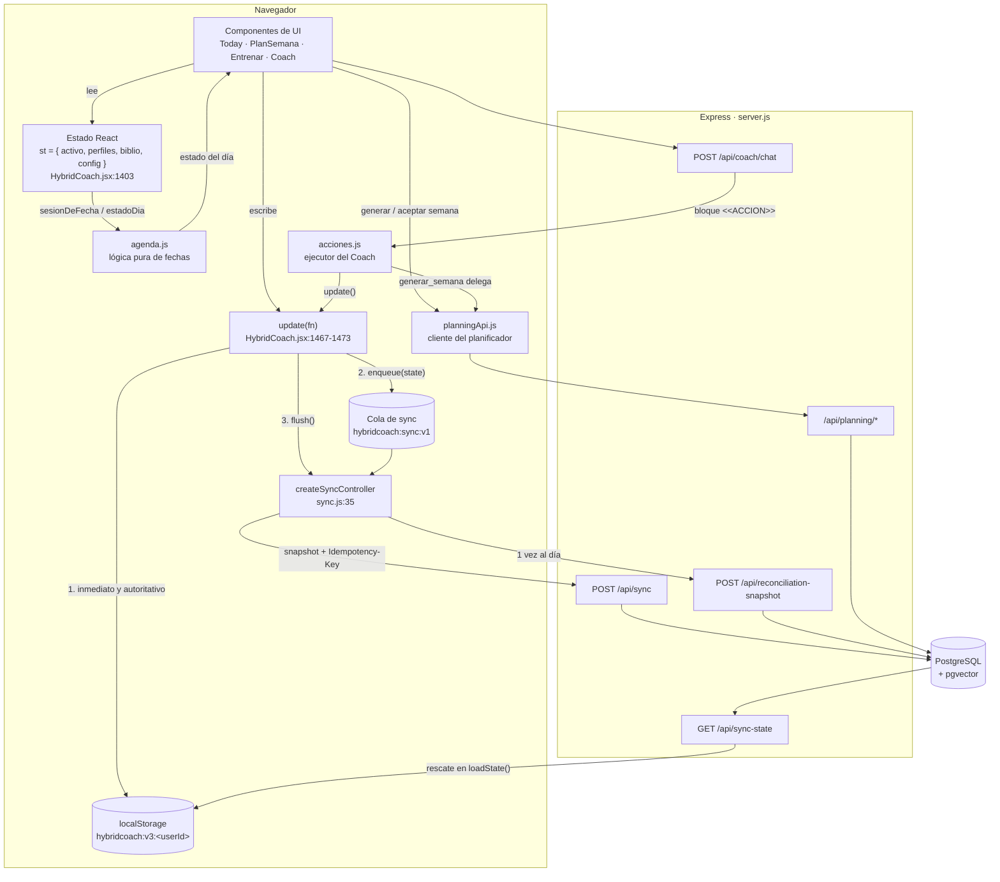

# 13 · El frontend y la lógica de agenda

Este documento describe el cliente tal y como está escrito hoy, no como debería
estar. Todo lo que sigue se ha verificado leyendo el código y ejecutando los
tests; cada afirmación no trivial lleva su `fichero:línea`.

Hay una razón para escribirlo ahora: el mapa de secciones que hay en
`CLAUDE.md` está desfasado. Dice que `src/HybridCoach.jsx` tiene «~2900 líneas»
y sitúa el motor determinista en «~L400-700». El fichero tiene **5162 líneas** y
el motor empieza en la 488. Trabajar con rangos falsos sobre un monolito de
350 KB es la forma más rápida de tocar lo que no se quería tocar, y el motor es
precisamente lo que no se toca sin permiso.

---

## 1. Qué es el frontend, en una frase

Una SPA de React sin router, sin gestor de estado y sin framework de
componentes, compilada a un único `public/app.js` con esbuild
(`build.mjs:5-17`). Toda la aplicación —salvo la lógica pura de fechas, el
ejecutor de acciones, el cliente del planificador y el sincronizador— vive en un
solo componente monolítico.

La austeridad es deliberada y está documentada en `docs/10-decisiones-tecnicas.md`.
Lo que este documento añade es la consecuencia práctica: **la única forma de
tener pruebas automáticas del cliente es sacar la lógica del JSX**, porque
`node --test` no sabe leer JSX. Eso explica por qué existen `src/agenda.js`,
`src/acciones.js`, `src/planningApi.js` y `src/sync.js` como ficheros separados,
y por qué el criterio para extraer algo no es «esto es reutilizable» sino «esto
se ha roto en silencio alguna vez y quiero un test que lo sujete».

### Arranque

`src/index.jsx` es el punto de entrada. No es un simple `createRoot`: contiene la
pantalla de autenticación completa.

| Pieza | Línea | Qué hace |
|---|---|---|
| `AuthForm` | `src/index.jsx:13-80` | Login y registro contra `/api/auth/login` y `/api/auth/register`. Consulta antes `/api/auth/registration-status` para decidir si ofrece siquiera crear cuenta (`:25`) |
| `Raiz` | `src/index.jsx:82-102` | Comprueba `/api/auth/me`. Con `session === null` pinta una pantalla vacía —estado «todavía no sé»— y solo cuando resuelve decide entre `AuthForm` y `HybridCoach` |
| Montaje | `src/index.jsx:104` | `createRoot(document.getElementById("raiz"))` |

La distinción entre `null` y `false` en `session` (`src/index.jsx:98-99`) evita el
parpadeo del formulario de login para quien ya tiene sesión válida.

---

## 2. Mapa real de `src/HybridCoach.jsx`

5162 líneas. Rangos verificados sobre el fichero actual.

| Rango | Zona | Contenido |
|---|---|---|
| 1-16 | Imports | React, recharts, y los cuatro módulos extraídos |
| 22-261 | `CSS` | La hoja de estilos entera como plantilla de texto, inyectada con `<style>` |
| 264-271 | `DIST` | Parámetros por distancia de carrera: techo de tirada larga, taper, tipo de calidad |
| 273-300 | `PAT` | Los 20 patrones de movimiento y su traducción a ejercicio según equipamiento |
| 302-321 | `PLANTILLAS` | Rutinas de gimnasio para 1, 2, 3 o 4 días |
| 326-414 | Biblioteca v2 | `normRef()` (`:350`), `refsRelevantes()` (`:383`) |
| 416-486 | `WIZARD` | Cuestionario de perfil, `allQuestions()` (`:481`), `completeness()` (`:482`) |
| **488-627** | **Motor: riesgo y plan maestro** | `riskScore()` (`:494`), `splitDays()` (`:513`), `buildPlan()` (`:526`), `decisiones()` (`:601`), `adaptaciones()` (`:616`) |
| **629-888** | **Motor: sesiones y reparto semanal** | `NavFecha` (`:652`), `sessionDetail()` (`:685`), `gymSession()` (`:715`), `sessionPool()` (`:780`), `priorityOrder()` (`:788`), `generateWeek()` (`:796`), `scoreAssignment()` (`:833`), `baseLoad()` (`:865`), `suggestLoad()` (`:870`) |
| 890-1156 | Nutrición (determinista) | `metabolismoBasal()` (`:910`), `gastoSesion()` (`:924`), `objetivosDia()` (`:931`), `cronogramaDia()` (`:982`), `avisosNutricion()` (`:1055`) |
| 1158-1217 | Capa de IA en cliente | `llamarIA()` (`:1165`), `extraerJSON()` (`:1185`), `decisionesActivas()` (`:1208`) |
| 1219-1291 | Importación de PDF | `cargarPdfJs()` (`:1226`) |
| 1293-1397 | Almacenamiento multiperfil | `store` (`:1302`), `loadState()` (`:1321`), `saveState()` (`:1345`), `cargarBibliografiaAPI()` (`:1346`), `pushToSheets()` (`:1362`) |
| **1399-1630** | **Componente raíz `HybridCoach`** | Estado global, efectos de sync, `update()`, `hydrateAcceptedWeek()`, layout y navegación |
| 1633-1783 | Bienvenida y cuestionario | `Bienvenida` (`:1633`), `Pregunta` (`:1649`), `Wizard` (`:1717`) |
| 1785-1895 | Componentes compartidos | `Strip` (`:1788`), `SessionCard` (`:1799`), `Metric` (`:1810`), `EvidenceModal` (`:1817`), `RefChips` (`:1877`) |
| 1897-1991 | **Hoy** | `Today` (`:1900`) |
| 1996-2035 | Barrera de error | `Barrera` (`:2007`), la única clase del proyecto |
| 2037-2366 | **Mi semana** | `Semana` (`:2037`), `PlanSemana` (`:2050`) |
| 2368-2438 | Calendario mensual | `CalendarioMes` (`:2375`), `etiquetaSesion()` (`:2434`) |
| 2440-2948 | **Entrenar** | `Entrenar` (`:2443`), `FichaDelDia` (`:2564`), `RunForm` (`:2582`), `CambiarEjercicio` (`:2654`), `StrengthForm` (`:2751`), `CheckIn` (`:2875`) |
| 2950-3417 | **Coach** | `api()` (`:2954`), `RAPIDAS` (`:2967`), `descripcionAccion()` (`:2987`), `Coach` (`:3018`) |
| 3419-3501 | Progreso | `Progreso` (`:3422`) |
| 3503-3542 | Perfiles | `Perfiles` (`:3506`) |
| 3544-3680 | Biblioteca de evidencia | `Biblioteca` (`:3549`) |
| 3682-3735 | Nutrición · interfaz | `BarraMacros` (`:3687`), `NutricionHoy` (`:3702`), `NutriLinea` (`:3724`) |
| 3737-3811 | Recetas del día | `RecetasDelDia` (`:3758`) |
| 3813-4178 | Conteo diario de alimentos | `ContadorDiario` (`:3826`), `Nutricion` (`:4000`) |
| 4180-4366 | Editor de rutinas | `EditorRutinas` (`:4183`), `NuevoEjercicio` (`:4298`), `ImportarPDF` (`:4320`) |
| 4368-4888 | Razonamiento y administración | `Razonamiento` (`:4368`), `AjustesEmbeddings` (`:4512`), `PanelAdmin` (`:4627`), `EditarRef` (`:4825`) |
| 4890-5162 | Ajustes | `AjustesIA` (`:4919`), `Ajustes` (`:5040`) |

Dos observaciones sobre este mapa que importan más que el mapa mismo:

**El componente raíz está en medio del fichero, no al principio.** `HybridCoach`
empieza en la 1402 porque todo lo que hay antes son constantes y funciones puras
que se declaran a nivel de módulo. Es coherente, pero implica que buscar «dónde
empieza la app» por la parte de arriba no funciona.

**Hay comentarios de sección huérfanos.** Entre `src/HybridCoach.jsx:633` y `:647`
sobrevive la cabecera «AGENDA — una fecha, una sesión» con sus comentarios
explicativos, pero las funciones que describían ya no están ahí: se movieron a
`src/agenda.js`. Lo mismo pasa en `:1993-1995` («MI SEMANA» seguido
inmediatamente de «BARRERA DE ERROR») y en `:2642-2646`. No son un error
funcional, pero sí una trampa para quien navegue por cabeceras.

---

## 3. `src/agenda.js`: la traducción entre fechas y plan

222 líneas de lógica pura. Su cabecera lo dice sin rodeos
(`src/agenda.js:4-7`): vive fuera del JSX porque aquí se puede probar con
`node --test`, y porque es el cimiento de tres pantallas a la vez, de modo que un
fallo silencioso se nota en las tres.

El problema que resuelve es de traducción. **El plan se guarda por número de
semana y día 0-6, nunca por fecha** (`src/agenda.js:77`). La interfaz, en cambio,
piensa en fechas: el calendario pinta días de agosto, Entrenar navega con flechas,
la nutrición calcula el día de hoy. Alguien tiene que convertir en ambos
sentidos, y ese alguien es este fichero.

### Primitivas de fecha

```js
export const parse = (s) => new Date(s + "T12:00:00");   // agenda.js:15
```

**Mediodía y no medianoche.** Es la decisión más pequeña del fichero y la que más
veces habría dado un fallo de un día. Al construir la fecha a las 00:00 en local,
cualquier desfase de zona horaria o cambio de horario de verano puede empujarla
al día anterior al convertir a ISO. A las 12:00 hay doce horas de margen por cada
lado. `src/agenda.test.js:24` lo fija explícitamente: `addDays("2026-03-28", 2)`
tiene que dar `2026-03-30`, y ese fin de semana es justo el del cambio de hora en
España.

| Función | Línea | Qué hace |
|---|---|---|
| `parse(s)` | 15 | ISO → `Date` a mediodía |
| `iso(d)` | 16 | `Date` → `"YYYY-MM-DD"` |
| `addDays(s, n)` | 17 | Suma días sobre una cadena ISO, devuelve ISO |
| `daysBetween(a, b)` | 18 | Diferencia en días, redondeada |
| `clamp(v, a, b)` | 19 | Acotar |
| `lunesDe(fecha)` | 56-60 | Lunes de la semana natural. `(getDay() + 6) % 7` convierte el domingo=0 de JavaScript en lunes=0 |

### Constantes y etiquetas

`DAYS`, `DSHORT` y `MESES` (`:21-23`) son las etiquetas en castellano. `esGym()`
y `colorOf()` (`:25-26`) clasifican un código en las tres familias visuales:
`gym`, `rest` (solo `RECOVERY`) y `run` (todo lo demás).

Los códigos de sesión están en dos listas cerradas:

```js
export const CODIGOS_RUN = ["RUN A", "RUN B", "RUN C", "RUN D", "RECOVERY", "LIBRE"];  // agenda.js:35
export const CODIGOS_GYM = ["GYM A", "GYM B", "GYM C", "GYM D"];                        // agenda.js:36
```

El comentario que las precede (`:28-34`) es una declaración de principio, no una
nota de implementación: *«Registrar no depende de que el planificador haya pasado
por ahí: el plan es una recomendación y el registro es un hecho.»* Y sobre
`LIBRE`: *«es la vía de escape deliberada: cubre lo que no encaja en ninguna
categoría —una pachanga, una clase, una caminata larga— y evita que el atleta
tenga que mentir eligiendo un código que no hizo.»*

#### `etiquetaCodigo(code)`

```js
export const etiquetaCodigo = (code) => NOMBRE_CODIGO[code] || code || "Sesión";  // agenda.js:52
```

Traduce el código a algo legible: `"RUN A"` → `"Tirada larga"`, `"LIBRE"` →
`"Entrenamiento libre"`, `"GYM A"` → `"Fuerza A"` (tabla en `:40-51`).

Lo interesante es la cascada de respaldos. Un código desconocido se devuelve **tal
cual**, no se sustituye por un genérico ni se descarta. `src/agenda.test.js:149`
fija ese contrato: `etiquetaCodigo("LO QUE SEA") === "LO QUE SEA"`. La razón es
que los códigos pueden venir de una propuesta del planificador IA, y el cliente no
tiene autoridad para decidir que un código que no conoce no existe. Solo el
`null`/`undefined` cae al genérico `"Sesión"` (`:150`).

### `weekOf(plan, dateStr)` — fecha a coordenadas del plan

```js
export function weekOf(plan, dateStr) {                                    // agenda.js:65
  if (!plan) return { w: 1, dayIdx: 0, fuera: true };
  const first = plan.semanas[0].inicio;
  const diff = daysBetween(first, dateStr);
  if (diff < 0) return { w: 1, dayIdx: 0, fuera: true };
  const w = Math.floor(diff / 7) + 1;
  return { w: clamp(w, 1, plan.totalSemanas), dayIdx: ((diff % 7) + 7) % 7, fuera: w > plan.totalSemanas };
}
```

`fuera` cubre las dos direcciones —antes del arranque del plan y después de su
última semana— porque en ambos casos la respuesta a «qué toca» es la misma:
nada. Nótese que `w` se acota con `clamp` **pero `fuera` se calcula antes del
acotado**: una fecha tres semanas después del final devuelve `w = totalSemanas`
(utilizable para agrupar) y `fuera: true` (que es lo que consultan las pantallas).

### `sesionDeFecha(P, fecha)` — el paso central

Es la función que usa toda la interfaz nueva. Devuelve, para una fecha:

| Campo | Origen |
|---|---|
| `w`, `dayIdx`, `fuera` | De `weekOf()` |
| `semana` | `P.weeks[w]`, la semana generada, si existe |
| `code` | El código asignado a ese día, o `null` |
| `hecha` | Ver abajo |
| `planificada` | `!!semana?.assign?.length` — si la semana llegó a generarse |
| `registros` | De `registrosDeFecha()` |

La línea que más importa es la 88:

```js
const hecha = !!(asignada && (semana?.done || []).includes(asignada.code)) || registros.length > 0;
```

**Una sesión está hecha si el plan la marcó como hecha O si hay cualquier registro
real de ese día.** El comentario de `:83-87` explica por qué se cambió: antes solo
contaba lo primero, *«y eso significaba que entrenar algo distinto a lo previsto
dejaba el día marcado como "omitido" por mucho que estuviera registrado: la app
llamaba fallo a haber entrenado.»*

### `registrosDeFecha(P, fecha)` — lo que de verdad se hizo

```js
export function registrosDeFecha(P, fecha) {   // agenda.js:103
```

Recorre `P.running` y `P.strength` filtrando por fecha, sin mirar el plan en
ningún momento. Es la pieza que sostiene todo el registro libre: **carreras y
sesiones de fuerza se guardan con su fecha, así que se pueden recuperar sin pasar
por la agenda del planificador** (`:99-102`).

Devuelve una lista de dos formas:

- Carreras: `{ tipo: "run", code: r.session_code || "LIBRE", ref: r }`. Una carrera
  sin código se etiqueta `LIBRE` en lugar de quedarse sin identidad.
- Fuerza: `{ tipo: "gym", code, series: [...] }`, **agrupando por sesión**
  (`:109-115`). Cuatro series de sentadilla son un registro de fuerza, no cuatro
  entradas en la lista del día. `src/agenda.test.js:104` lo fija: tres filas de
  `strength` más una carrera dan `dia.length === 2`.

### `ultimaVezEjercicio(strength, ejercicio, sesion)`

`src/agenda.js:153-164`. Busca la última vez que se hizo un ejercicio y devuelve
`{ fecha, peso, reps }`, donde `peso` es el de la serie **más pesada** de aquel día
y `reps` la lista de repeticiones ordenadas por número de serie.

El filtro por sesión (`:154`) no es cosmético: *«el mismo ejercicio puede ir a
cargas distintas según la rutina en la que aparezca»* (`:151-152`). El test de
`src/agenda.test.js:214-223` lo comprueba con un press banca a 70 kg en `GYM A` y
a 50 kg en `GYM B`, siendo el de `GYM B` más reciente: consultar `GYM A` debe
seguir devolviendo 70.

### `eligeEstable(lista, semilla)`

`src/agenda.js:168`. Selección determinista por índice. El comentario justifica el
diseño: *«Con `Math.random()` las recetas cambiarían al volver a la pestaña y
parecerían un sorteo.»* El `Math.abs()` hace que una semilla negativa no rompa el
índice (`src/agenda.test.js:243`).

### `contextoDelDia(sesiones)`

`src/agenda.js:137-145`. Clasifica el día en `descanso`, `larga`, `calidad`,
`fuerza` o `suave` para que la nutrición pueda contextualizarse. No decide nada
nutricional; solo etiqueta lo que el motor ya calculó. `RECOVERY` se filtra antes
de nada (`:138`), así que un día de solo recuperación cuenta como descanso.

---

## 4. Los estados de día

Este es el concepto que gobierna cómo se pinta la aplicación entera. `estadoDia()`
vive en `src/agenda.js:121-133` y son doce líneas que codifican una postura de
producto:

```js
export function estadoDia(P, fecha, hoy) {
  const { code, hecha, fuera, planificada, registros } = sesionDeFecha(P, fecha);
  if (registros.length && !code) return "libre";
  if (hecha && code) return "hecha";
  if (fuera) return "fuera";
  if (!planificada) return "sinplan";
  if (!code) return "descanso";
  return fecha < hoy ? "omitida" : "pendiente";
}
```

**El orden de los `if` es la especificación.** Un registro real se comprueba
primero, antes incluso de mirar si la fecha cae dentro del plan.

| Estado | Condición | Qué significa | Cómo se pinta |
|---|---|---|---|
| `libre` | Hay registros y el plan **no** proponía nada ese día | Se entrenó algo que el plan no contemplaba | Violeta de evidencia. Celda `.calcell.libre` (`:185-186`), punto `.dot.libre` (`:161`), etiqueta «Libre» con `tag evid` (`:2336-2337`), texto `LIBRE` en la celda (`:2418`) |
| `hecha` | `hecha && code` | La sesión que el plan proponía está registrada | Verde. `.calcell.hecha` con fondo `#16281E` (`:178`), punto `.dot.done` (`:160`), `tag ok` «Hecho» |
| `fuera` | La fecha cae fuera de las semanas del plan | Ni antes ni después hay nada que entrenar | Sin decoración especial; Entrenar muestra un aviso explicativo (`:2528-2532`) |
| `sinplan` | Dentro del plan pero la semana no se ha generado | La semana existe en el calendario, nadie ha repartido sus sesiones | Neutro; Entrenar ofrece generar o registrar (`:2533-2543`) |
| `descanso` | Semana generada, día sin sesión asignada | El plan propone descansar | Icono 🛌 con opacidad reducida (`:180`, `:2412`) |
| `omitida` | Sesión asignada, sin registrar, **fecha pasada** | Se recomendó y no consta que se hiciera | `.calcell.omitida` con `opacity: .55` (`:179`). Etiqueta neutra «Sin registrar», **nunca roja** |
| `pendiente` | Sesión asignada, sin registrar, hoy o futuro | Todavía no ha llegado el momento | Color del tipo de sesión |

### Por qué `omitida` solo existe en el pasado

`src/agenda.js:119-120` lo dice: *«"Omitida" solo existe en el pasado: una sesión
sin registrar de mañana está pendiente, no perdida.»* Es la última línea de la
función y depende de `fecha < hoy`. `src/agenda.test.js:74-79` lo fija con un
jueves como «hoy»: el miércoles anterior sin registrar es `omitida`, el viernes es
`pendiente`.

Y aunque sea pasado, **`omitida` no se pinta como error**. El comentario de
`src/HybridCoach.jsx:2331-2335` es explícito: *«No se pinta en rojo de alerta un
día sin registrar: saltarse una sesión recomendada no es un error, y una
aplicación que dice "el plan recomienda, no obliga" no puede tratarlo como tal.»*
La misma decisión se repite en `FichaDelDia` (`:2573-2574`).

### Por qué `libre` es el estado más importante

Porque es el que hace verdadera la frase «el plan recomienda pero nunca excluye».
Sin él, todo lo que el atleta hiciera fuera de lo previsto era invisible o, peor,
se contabilizaba como fallo.

La invariante es esta: **se puede registrar un entrenamiento cualquier día**, y en
cuatro situaciones donde el plan no dice nada:

1. **Sin semana generada.** `src/agenda.test.js:129-130`: un registro de fuerza en
   una semana no programada da `libre`, mientras el día de al lado sin registro
   sigue siendo `sinplan`.
2. **En día de descanso.** `src/agenda.test.js:114-118`: el martes sin sesión es
   `descanso`; con una carrera anotada pasa a `libre` y `sesionDeFecha().hecha`
   se vuelve `true`.
3. **Con código `LIBRE`.** El código existe en `CODIGOS_RUN` y siempre está en el
   desplegable de `RunForm` (`src/HybridCoach.jsx:2590`), venga o no de la semana.
4. **Fuera del rango del plan.** `src/agenda.test.js:125-126`: una carrera cinco
   días después de la última semana da `libre`; el día siguiente sin registro
   sigue siendo `fuera`.

Hay un caso simétrico que también está fijado, y es el que evita que `libre` se
coma todo lo demás: si el plan **sí** proponía esa sesión y se registra, el estado
es `hecha`, no `libre` (`src/agenda.test.js:134-143`). Lo consigue la guarda
`&& !code` de `src/agenda.js:127`.

Y hay una consecuencia de interfaz que se ve en `PlanSemana`: la etiqueta de
estado se muestra si hay sesión asignada **o si el estado es `libre`**
(`src/HybridCoach.jsx:2336`). Un día sin nada previsto pero con algo registrado
tiene que aparecer en la lista de la semana; si no, la semana mentiría por
omisión.

Esta postura se refleja también en la copia de la interfaz: «He entrenado
igualmente, registrarlo» (`:1951`), «Registrar lo que he hecho hoy» (`:1947`),
«Elige lo que de verdad has hecho, coincida o no con el plan» (`:2616`), «Toca
cualquier día para ver o registrar su entrenamiento, esté planificado o no»
(`:2428`).

---

## 5. El motor determinista en cliente

Sigue vivo en el cliente y es el **fallback** cuando el planificador IA + RAG del
servidor falla. `CLAUDE.md` lo protege con una regla dura: no se toca sin petición
explícita. Lo que sigue documenta qué hace, no propone cambiarlo.

### `buildPlan(p, hoy)` — el plan maestro

`src/HybridCoach.jsx:526-599`. Genera la estructura de semanas de aquí a la
carrera. Pasos:

1. **Riesgo.** `riskScore(p)` (`:494-511`) suma puntos por lesión recurrente (+3),
   molestia activa ≥3/10 (+3), parón largo (+2), ausencia de volumen de carrera
   (+2), problema estructural (+1), sueño <6,5 h (+1) e IMC >28 (+1), acotado a
   0-10. Devuelve además las causas en texto, que es lo que se enseña.
2. **Lunes de arranque** (`:530-531`). Si hoy es jueves o posterior (`dow >= 4`),
   el plan empieza el lunes **siguiente**; si no, el de esta semana. Empezar un
   plan de 12 semanas un viernes por la tarde no tiene sentido.
3. **Número de semanas** (`:532`): hasta la fecha de carrera, acotado entre 3 y 26.
4. **Taper y build** (`:533-534`): el taper de la distancia, acotado a un máximo de
   un cuarto del plan.
5. **Mezcla de días** (`:536`). `splitDays()` (`:513-523`) reparte los días
   disponibles entre gimnasio y carrera. La tabla cambia según si la primera
   prioridad del atleta es «Rendimiento en carrera» o no: con 6 días, 3/3 para
   quien prioriza músculo y 2/4 para quien prioriza carrera.
6. **Techo de la tirada larga** (`:541`): el menor entre el techo de la distancia,
   el techo seguro si el riesgo es ≥6, y los minutos que el atleta declara tener
   el fin de semana. Prescribir por tiempo y no por kilómetros es una decisión
   documentada (`:603`): el tiempo controla el coste de recuperación mejor.
7. **Descargas** (`:543-545`): cada 3 semanas si el riesgo es alto, cada 4 si no,
   nunca en la última semana de build.
8. **Progresión lineal** (`:547`): el paso es `(techo - inicio) / (progW - 1)`
   repartido solo entre las semanas que progresan.
9. **Fases** (`:554-590`): adaptación caminar-correr, construcción, específica,
   descarga, taper y semana de carrera; con checkpoints en tres momentos
   (`:571-573`).

Devuelve también `decisiones()` (`:601-614`) y `adaptaciones()` (`:616-627`): la
justificación textual de cada elección con sus referencias bibliográficas, y las
modificaciones por historial de lesiones. Es lo que hace que el plan sea
explicable sin llamar a ningún modelo.

### `generateWeek(plan, perfil, w, availDays, opts)` — el reparto semanal

`src/HybridCoach.jsx:796-831`. Tres etapas:

**a) Construir el pool.** `sessionPool()` (`:780-787`) toma las carreras de esa
semana más los códigos de gimnasio, con dos excepciones: en taper solo queda una
sesión de gimnasio, y en descarga se cae `RUN D`. `priorityOrder()` (`:788-794`)
lo ordena, y el orden depende de la prioridad declarada: quien prioriza
rendimiento pone `RUN A, RUN B, GYM A…`; quien prioriza músculo,
`RUN A, GYM A, GYM B, RUN B…`. **Ese orden es la prioridad de recorte**: si no
caben todas, se cae lo último.

**b) Filtros clínicos** (`:802-810`). Son `if` de código, no instrucciones de
prompt:

| Condición | Efecto |
|---|---|
| `dolor >= 5`, dolor en reposo, o cualquier bandera del perfil | Se retira **todo** el impacto: fuera todas las sesiones `RUN` |
| `dolor >= 3` | Fuera `RUN A` y `RUN B` (larga y calidad); se añade `RECOVERY` si hay cross-training |
| `fatiga >= 8` | Se quita la sesión de menor prioridad |

**c) Buscar el reparto.** Aquí se delega en `mejorReparto()` de `agenda.js`,
pasándole `scoreAssignment` como puntuador (`:819`).

Si no hay reparto, **se dice** (`:823-829`). El comentario explica por qué:
*«Devolver `assign: []` en silencio hacía que la aplicación afirmara luego que la
semana "no está programada", que es un mensaje falso: sí se intentó, y falló.»*

### `mejorReparto(sesiones, diasDisponibles, puntuar)`

`src/agenda.js:193-216`. Búsqueda combinatoria exhaustiva por backtracking. No
sabe nada de entrenamiento: prueba todas las permutaciones y devuelve la de mayor
puntuación según la función que le pasen. **Las reglas se quedaron en
`scoreAssignment`; solo la búsqueda se extrajo.**

Se extrajo por un fallo concreto y silencioso, documentado en `src/agenda.js:180-191`:
la permutación se hacía sobre `diasDisponibles.slice(0, 6)` cuando había más de 6
sesiones, así que la condición de corte `acc.length === sesiones.length` **no se
alcanzaba nunca**. Con 7 sesiones y 7 días no quedaba ningún candidato, `best`
seguía a `null` y la semana salía vacía sin ningún error por medio. El atleta
pulsaba «generar» y la aplicación le decía después que la semana no estaba
programada.

El tope era una defensa contra una explosión que no puede darse: una semana tiene
siete días y nunca se colocan más sesiones que días hay, de modo que el peor caso
son 7! = 5.040 combinaciones. Hoy se calculan enteras.

Salvaguardas actuales:

- Deduplica y ordena los días de entrada (`:194`), así que un día repetido no
  coloca dos sesiones (`src/agenda.test.js:199-203`).
- Nunca más sesiones que días (`:198`).
- Sin sesiones o sin días devuelve `null` explícitamente (`:195`), no un reparto
  vacío disfrazado.

Los cinco tests de `src/agenda.test.js:166-203` cubren exactamente estos casos, y
usan un **puntuador de juguete** (`:164`) precisamente para dejar claro que la
búsqueda no sabe de entrenamiento.

### `scoreAssignment()` y las reglas R1-R9

`src/HybridCoach.jsx:833-861`. Puntúa un reparto candidato y devuelve
`{ score, reasons, violations }`. Las violaciones aplican penalizaciones de tres
cifras, suficientes para descartar la combinación en la práctica; las
bonificaciones ordenan entre las que sí valen.

| Regla | Línea | Qué protege | Efecto |
|---|---|---|---|
| **R1** | 842-845 | Separación entre la sesión de pierna **pesada** y la tirada larga | Si la pierna va antes que la larga con menos de 48 h de margen: **−900** y violación. Con ≥2 días: +60, y +10 más si son ≥3 |
| **R2** *(implícita en R1)* | 844 | Pierna pesada **después** de la larga | +45, y +25 extra si es el día inmediatamente siguiente: concentra la fatiga de pierna en días contiguos y deja limpio el resto de la semana |
| **R4** | 846-850 | Sesiones de gimnasio en días consecutivos | Con `gymDias <= 2`: **−800** y violación. Con más días de gimnasio: −120 (penalización blanda). Separación ≥3 días: +20 |
| **R5** | 852 | Que quede al menos un día de descanso completo | Con 7 días disponibles y 7 sesiones colocadas: **−500** y violación |
| **R9** | 851 | Rodaje de calidad el día después de la pierna pesada | **−220** y violación |
| **R6** *(sin número explícito)* | 853 | Sinergia rodaje corto tras gimnasio ligero | +22. El trote suave el día después de la sesión menos exigente para la rodilla incluso ayuda a recuperar |
| **R7** | 854 | Tirada larga en fin de semana | +35 si cae en sábado o domingo (`day >= 5`), +12 extra si es domingo |
| **R8** | 855-858 | Rachas de días consecutivos | 4 o más días seguidos: −120. Exactamente 3: −25 |
| **R3** | 859 | Dispersión general | `(último día − primer día) × 3`: premia repartir a lo largo de la semana |

La numeración R1-R9 viene de `CLAUDE.md` y de los mensajes de violación; en el
código solo cuatro reglas se nombran explícitamente (R1, R4, R5, R9), que son
precisamente las que generan violaciones bloqueantes. Las demás son
bonificaciones que ordenan candidatos válidos.

`reasons` no es decoración: es lo que se enseña bajo «Por qué así»
(`src/HybridCoach.jsx:2343-2347`), y `violations` es lo que se enseña como
«Reglas forzadas» (`:2348-2351`).

### `gymSession()` — la rutina que no se negocia

`src/HybridCoach.jsx:715-778`. Construye la sesión de gimnasio concreta, y hace
algo que merece señalarse: **las adaptaciones por historial se aplican también
sobre las rutinas que el usuario ha editado a mano**. Si el atleta quita el sóleo
teniendo historial de gemelo o Aquiles, el motor lo devuelve y se lo dice
(`:734-741`). El comentario de `:730-733` lo justifica: *«Es la parte que no
negocias contigo mismo un martes a las 7 de la mañana.»*

El ajuste por tiempo (`:755-772`) solo se aplica a rutinas generadas; una rutina
editada a mano se respeta entera y se avisa de la duración. Y nunca se deja un
ejercicio en una sola serie: se baja a dos y, si aún no cabe, se elimina entero,
porque *«una serie suelta no es un estímulo, es un trámite»* (`:759`).

### `suggestLoad()` — la progresión de carga

`src/HybridCoach.jsx:870-887`. Mira el historial del ejercicio y decide:

- Sin registros: arranca en un 10 % por debajo de la carga declarada, o pide que
  se elija un peso con 2-3 repeticiones en recámara.
- Con **molestias recientes** (`painFlag`): repite carga, nunca sube. Es el primer
  `if` del bloque de decisión (`:883`).
- Repeticiones al tope del rango **y** RIR suficiente en todas las series: sube el
  incremento del ejercicio y vuelve al extremo bajo del rango.
- En cualquier otro caso: mantener.

---

## 6. Flujo de datos

### Diagrama



### `update()`: la escritura local es autoritativa

```js
const update = (fn) => setSt((prev) => {
  const next = fn(JSON.parse(JSON.stringify(prev)));
  saveState(stateKey, next);   // La escritura local sigue siendo inmediata y autoritativa durante 3b.
  syncRef.current?.enqueue(next);
  void syncRef.current?.flush();
  return next;
});
```

`src/HybridCoach.jsx:1467-1473`. Tres cosas en orden:

1. Copia profunda vía `JSON.parse(JSON.stringify(prev))`. Cruda pero suficiente:
   el estado es JSON puro y permite escribir los mutadores con asignaciones
   directas sobre la copia.
2. Guarda en `localStorage` de inmediato. El comentario en línea marca esta
   escritura como **autoritativa durante la fase 3b** del plan de migración.
3. Encola un snapshot y dispara el vaciado, sin esperar el resultado.

Un fallo de red no bloquea nada: la escritura local ya ocurrió.

### El dual write

**Qué es.** El cliente conserva `localStorage` como fuente de verdad operativa y,
en paralelo, envía a la API un **snapshot completo del perfil** para que
PostgreSQL vaya recibiendo lo mismo. No es una sincronización bidireccional: es
una réplica en un solo sentido mientras la BD se asienta.

**En qué estado está.** Activo y en fase de asentamiento. Lo dice `CLAUDE.md`
—«durante el asentamiento, el frontend conserva `localStorage` y hace dual write a
la API»— y lo confirma el comentario de `src/HybridCoach.jsx:1469`, que se refiere
a una fase «3b» concreta.

Hay tres excepciones donde el servidor **ya es la autoridad**, no la copia local:

| Dato | Autoridad | Dónde |
|---|---|---|
| Biblioteca de evidencia | Servidor | `cargarBibliografiaAPI()` sobrescribe `st.biblio` al arrancar (`:1427-1428`) |
| Plan maestro con `planSource === "ia-rag"` | Servidor | `fetchActiveMasterPlan()` rehidrata `p.plan` tras recargar (`:1435-1445`) |
| Revisión semanal aceptada | Servidor | `hydrateAcceptedWeek()` (`:1479-1504`) |

`hydrateAcceptedWeek` lleva un comentario que define la frontera con precisión
(`:1476-1478`): *«PostgreSQL es la autoridad de la revisión táctica aceptada. Esta
escritura solo reconcilia la caché local: no entra en la cola de dual-write ni
vuelve a mutar el servidor como efecto secundario de una lectura.»* Por eso usa
`setSt` + `saveState` directamente en lugar de `update()`.

### `src/sync.js`: la cola

136 líneas. `createSyncController({ storage, fetchImpl, now })` (`:35`) recibe sus
dependencias por parámetro, que es lo que permite probarlo con un
`localStorage` falso y un reloj controlado.

**`enqueue(state)`** (`:39-60`) construye un item con `operationId` (UUID o
respaldo temporal, `:32-33`), el perfil entero, unos totales calculados y una
marca de tiempo. Y hace algo importante en `:55`:

```js
queue.items = queue.items.filter((entry) => entry.profileLocalId !== item.profileLocalId);
```

**Un snapshot completo más nuevo sustituye cualquier snapshot pendiente del mismo
perfil.** Como cada envío contiene el estado entero, no tiene sentido acumular
versiones intermedias: la cola nunca crece más allá de un item por perfil.

**`flush()`** (`:62-120`) recorre los pendientes y los envía a `POST /api/sync`
con cabecera `Idempotency-Key` (`:76`). La clasificación de respuestas:

| Respuesta | Acción |
|---|---|
| `response.ok` | Se elimina de la cola |
| `401` | `pausedReason = "authentication"` y se **rompe el bucle**: sin sesión no tiene sentido seguir |
| `408`, `425`, `429`, o `5xx` | Se trata como reintentable: excepción con código |
| Cualquier otro `4xx` | `pausedReason = "blocked"`, reintento aplazado 6 horas. No se descarta el dato |
| Excepción de red | Reintento con retroceso exponencial |

El retroceso (`:110-111`) es `5000 × 2^(intentos-1)`, con techo de 6 horas y un
jitter de hasta el 25 % para no sincronizar a todos los clientes en el mismo
instante.

**`reportDaily(state)`** (`:122-133`) envía una vez al día unos totales de
conciliación (`runningCount`, `km`, `strengthSets`, `kg`, `checkins`) para poder
detectar divergencias entre el cliente y la BD. La clave de deduplicación es
`"<perfilId>:<fecha>"` en `localStorage` (`:127`).

**Cuándo se dispara** (`src/HybridCoach.jsx:1453-1462`): al volver la conexión
(`online`), al cambiar la visibilidad de la pestaña (`visibilitychange`), cada 30
segundos, y una vez al montar.

### La ruta de rescate en `loadState()`

`src/HybridCoach.jsx:1321-1344`. El orden es deliberado:

1. Intenta leer `localStorage`. Si el JSON está corrupto, se traga el error y
   sigue (`:1323`).
2. Si no hay copia local, pide `GET /api/sync-state` y reconstruye el perfil desde
   el último snapshot que llegó a la BD (`:1325-1341`). Es el dual write leyéndose
   en la dirección contraria: se escribió por si acaso, y aquí sirve.
3. Si tampoco hay eso, arranca con un perfil vacío. **Nunca se bloquea la
   entrada** (`:1342`).

---

## 7. `src/acciones.js`: lo que el Coach ejecuta en cliente

183 líneas. Es el ejecutor de las acciones que el Coach del servidor propone. El
reparto de responsabilidades está declarado en la cabecera (`:7-15`) y no es
casual:

- **Cliente:** consultas y registros propios (sueño, sensaciones, perfil,
  entrenamientos). Entran en el estado del cliente y viajan por el sync.
- **Planificador:** todo lo que toca la programación semanal. **No se ejecuta
  aquí**: se delega en `src/planningApi.js`, el mismo camino que usa la pantalla
  de planificación.

*«Por eso aquí no hay ningún `generateWeek()` ni escritura sobre `weeks`»*
(`:15`). Es la garantía de que no hay dos motores de planificación divergiendo.

El módulo no importa nada del JSX. Recibe lo que necesita de la interfaz por un
objeto `deps` (`:163-165`): `update`, `hoy`, `detalle`, `semanaDe`,
`semanaObjetivo`, que se construyen en `Coach` (`src/HybridCoach.jsx:3047-3052`).
Sin eso no sería probable.

### Catálogo

| Acción | Función | Nivel | Qué hace |
|---|---|---|---|
| `consultar_entreno` | `consultarEntreno` (`:29`) | Lectura | Qué toca un día y qué se registró |
| `registrar_recuperacion` | `registrarRecuperacion` (`:103`) | Escritura | Sueño, fatiga, estrés, calidad, motivación → `p.recovery` |
| `registrar_sensaciones` | `registrarSensaciones` (`:121`) | Escritura | RPE, dolor, energía → `p.checkins` |
| `registrar_entreno` | `registrarEntreno` (`:65`) | Escritura | Ver abajo |
| `actualizar_perfil` | `actualizarPerfil` (`:140`) | Confirmación | `Object.assign` sobre `perfil` |
| `generar_semana` | `proponerSemana` (`:150`) | Confirmación | Delega en `createWeekProposal()` |

Todas devuelven la misma forma: `{ ok, mensaje, resumen? }` (`:22-25`).

### `registrarEntreno()`

`src/acciones.js:65-97`. Es la acción que más dice sobre la postura del proyecto.
Su comentario (`:61-64`):

> *Escribe exactamente donde escriben los formularios —`running` y `strength`—
> para que no haya dos fuentes de verdad, y **no comprueba que el día estuviera
> planificado**: el plan recomienda, el registro es un hecho.*

Detalles:

- Calcula la semana con `weekOf(P.plan, fecha)` (`:67`), así que registrar el
  sábado desde el lunes guarda en la semana correcta.
- Calcula el ritmo si hay km y minutos (`:68-70`), igual que `RunForm`.
- Marca `source: "coach"` en la fila de carrera (`:76`), distinguible del
  `"manual"` de los formularios.
- Para fuerza **no inventa series** (`:82-88`): escribe una fila con
  `exercise: "Sesión completa"`, `weight: 0`, `reps: 0` y una nota que lo
  explica. *«El coach registra que la sesión se hizo, no inventa pesos ni
  repeticiones que el atleta no ha dicho.»*
- Crea `p.weeks[wk.w]` si no existe (`:90`) y añade el código a `done` con un
  `Set` para no duplicar.

### `consultarEntreno()`

Cuatro ramas —fuera de plan, semana sin programar, día de descanso, sesión
prevista— y **en las cuatro se cuenta lo registrado** (`:31-33`). El comentario
señala el fallo que corrige: *«antes, preguntar por un día fuera de plan o sin
programar devolvía "no hay nada" incluso con un entrenamiento anotado.»* Es la
misma corrección que `estadoDia()` hizo en la interfaz, aplicada a la conversación.

### `ejecutarAccion()`

`src/acciones.js:178-183`. Despacha por nombre y **envuelve todo en try/catch**,
devolviendo el fallo como resultado en lugar de propagarlo. Es `async` porque
delegar en el planificador es una llamada de red, y *«que el planificador esté
caído no puede tumbar la conversación entera»* (`:175-177`).

Una acción desconocida devuelve `{ ok: false }` con un mensaje claro (`:180`), no
una excepción.

---

## 8. Componentes de UI

### Jerarquía

```
Raiz                                    index.jsx:82
└── HybridCoach                         HybridCoach.jsx:1402
    ├── topbar (perfil, nutrición, rutinas, biblio, ajustes, salir)   :1580
    ├── Barrera zona={pantalla || tab}                                :1596
    │   ├── Perfiles | Biblioteca | EditorRutinas | Nutricion | Ajustes   (pantalla)
    │   └── Today | Semana | Entrenar | Coach | Progreso                  (tab)
    ├── Toast                                                        :1611
    ├── FAB del Coach + Coach modo="panel"                           :1615-1621
    └── nav inferior (5 pestañas)                                    :1623
```

**No hay router.** La navegación es `tab` (las cinco pestañas de la barra
inferior) y `pantalla` (las modales de pantalla completa), dos `useState` en el
componente raíz (`:1404-1405`). `pantalla` tiene prioridad sobre `tab`.

`Barrera` (`:2007-2035`) envuelve **solo el contenido**, no la barra superior ni
la navegación (`:1593-1595`), para que un fallo en una pantalla no impida salir de
ella. Su prop `zona` limpia el error al cambiar de pestaña (`:2011-2016`). Es la
única clase del proyecto: React no permite capturar errores de render con hooks.

### Contexto compartido

En lugar de un contexto de React o un store, se propaga un objeto por props:

```js
const ctx = { st, P, update, notify, today, setTab, setPantalla, tab, onLogout, user,
  fechaSel, setFechaSel, abrirDia, abrirCoach, hydrateAcceptedWeek, planningWeek, setPlanningWeek };
const full = { ...ctx, wk, curW: wk.w };   // :1544-1551
```

Cada pantalla recibe `{...full}`. Crudo, pero coherente con la austeridad
declarada y suficiente para una app de cinco pestañas.

`fechaSel` vive en el raíz y no en cada pantalla (`:1407-1410`) para que abrir un
día en el calendario y saltar a Entrenar conserve la fecha en lugar de volver a
hoy. `abrirDia(fecha)` (`:1540`) hace las dos cosas de una vez —fijar fecha y
cambiar a Entrenar— para que ninguna pantalla se olvide de una.

Hay un comentario de nueve líneas en `:1556-1563` que documenta un fallo pasado en
esa zona: escribir `curW` suelto en el cuerpo de `HybridCoach` era una variable
libre que lanzaba `ReferenceError`, y como el cálculo ocurre **fuera** de
`<Barrera>`, se desmontaba el árbol entero y la pantalla quedaba en negro sin
navegación. Es un buen recordatorio de qué protege la barrera y qué no.

### Componentes principales

#### `Today` — `:1900-1991`

La pantalla de inicio. Muestra la cuenta atrás hasta la carrera, la fase de la
semana, la tira semanal, el checkpoint si lo hay, la sesión de hoy, la nutrición,
las últimas sensaciones y un resumen de en qué se basa el plan.

Tres ramas mutuamente informativas:

- Sin semana generada (`:1941-1947`): ofrece planificar **y** registrar. El
  comentario lo explica: *«Planificar es la vía recomendada, no un peaje.»*
- Con semana pero sin sesión hoy (`:1949-1951`): explica el descanso y ofrece «He
  entrenado igualmente, registrarlo».
- Con registros libres hoy (`:1956-1963`): tarjeta verde de confirmación. *«Sin
  esto, un entrenamiento libre se guardaba pero la pantalla principal seguía sin
  dar señal de que existiera»* (`:1953-1955`).

`sessionDetail()` se llama dentro de un `try/catch` por sesión (`:1908-1912`),
porque un código huérfano de una propuesta antigua tumbaba la pestaña entera
(`:1903-1907`).

#### `Strip` — `:1788-1798`

Barras verticales de lunes a domingo, con altura proporcional a la duración de
cada sesión y color por tipo. El día de hoy lleva marca superior. Cada barra es un
botón: en `Today` abre ese día (`:1936-1937`), lo que antes era el único gesto
natural para llegar a registrar otro día.

#### `SessionCard` — `:1799-1809`

Tarjeta de una sesión: etiqueta con el código, título, duración y descripción.
Modo `compact` sin descripción. Delega en `sessionDetail()`, que a su vez —y esto
importa— **prefiere el detalle de la propuesta IA aceptada** sobre la prescripción
maestra cuando `P.weeks[w].source === "ai-rag"` (`:696-712`). Así Hoy, Entrenar y
Nutrición no siguen mostrando la prescripción anterior después de aceptar.

#### `NavFecha` — `:652-683`

Navegador de fechas reutilizable: flechas de día anterior/siguiente, etiqueta
legible en el centro (pulsable para volver a hoy) y tira de los siete días de la
semana. Lo usan Entrenar y Nutrición; el calendario mensual tiene cabecera propia
porque navega por meses.

Cada día de la tira lleva un punto de color decidido por `estadoDia`
(`:667-671`):

```js
const clase = est === "hecha" ? "done" : est === "libre" ? "libre" : info.code ? colorOf(info.code) : "";
```

*«Un registro libre tiene su propio punto: ni verde de "completado según el plan"
ni gris de "aquí no hubo nada"»* (`:669-670`). Las etiquetas ARIA también lo
distinguen (`:674`).

#### `Semana` y `PlanSemana` — `:2037` y `:2050-2366`

`Semana` es un conmutador entre vista semanal y calendario mensual.

`PlanSemana` es el componente más complejo del fichero (316 líneas) y hace de
cliente del planificador:

| Función | Línea | Qué hace |
|---|---|---|
| Efecto de hidratación | 2069-2105 | Al cambiar de semana consulta `getAcceptedWeekPlan(w)` |
| `gen()` | 2107-2122 | Pide propuesta al planificador IA + RAG |
| `baseline()` | 2123-2152 | Genera con el motor determinista local |
| `accept()` | 2153-2182 | Acepta en el servidor y luego escribe la semana local |
| `rejectDraft()` | 2183-2193 | Rechaza |

Tres decisiones documentadas en el propio código merecen mención:

**El timeout de hidratación** (`:2084-2087`). Un `Promise.race` a 15 segundos.
Porque la hidratación deshabilita **todos** los botones (`disabled={!!planningBusy}`)
y una petición que no resolviera dejaba «Generar», «Aceptar» y «Rechazar»
bloqueados para siempre, sin mensaje y sin forma de cancelar. Leer la semana
aceptada es una mejora sobre la copia local, no un requisito.

**Solo `CLINICAL_SAFETY` veta el plan base** (`:2277-2290`). `GUARDRAIL_FAILED` e
`INVALID_OUTPUT` son fallos técnicos del modelo, no diagnósticos clínicos.
Ocultar el fallback ahí dejaba al atleta sin semana cada vez que el LLM tenía un
mal día, *«que es justo el momento en que un motor determinista sirve para algo»*.
No se relaja nada: `baseline()` aplica sus propios cortes clínicos antes de
generar (`:2134-2139`).

**El detalle por sesión se protege sesión a sesión** (`:2205-2218`).
`proposalSessionsToAssignments()` **lanza** si una sesión no se puede situar
(`src/planningApi.js:187-203`), y aquí estamos en pleno render: una propuesta
guardada que ya no encaja tumbaba el árbol y dejaba la pestaña en blanco. Se
protege una a una para que una incompatible no se lleve por delante las demás. Y
el iterable se normaliza con `Array.isArray()` (`:2204`) porque un `sessions: null`
lanzaba «not iterable» antes incluso de entrar al bucle (`:2198-2201`).

Los avisos clínicos de `baseline()` dicen **cuál** de las tres condiciones se ha
activado (`:2134-2138`), porque una bandera del cuestionario es un dato permanente
y quien la marcó una vez se quedaba sin plan base para siempre sin ninguna pista
de qué hacer.

#### `CalendarioMes` — `:2375-2430`

Rejilla de lunes a domingo, un mes por pantalla. La celda dice lo justo —número,
icono y estado— *«porque en 44 px de ancho cualquier texto adicional deja de
leerse; el detalle está a un toque, en Entrenar»* (`:2371-2373`).

El icono se decide en cascada (`:2410-2412`): el código de la sesión si lo hay; si
el estado es `libre`, el icono del tipo de lo registrado; si es descanso, 🛌; si
no, un punto. *«Un día sin sesión prevista pero con algo registrado enseña lo que
se hizo, no un punto de "aquí no había nada"»* (`:2408-2409`).

#### `Entrenar` — `:2443-2560`

Tres etapas encadenadas: `ficha` → formulario → `sensaciones` → `hecho`. El estado
vive en el componente para que «Finalizar» encadene con el registro de sensaciones
sin obligar a buscar otra pestaña (`:2450-2452`).

Dos piezas de diseño llevan el peso del registro libre:

**`modalidad`** (`:2474`). Arranca en lo que el plan sugiere para ese día, pero se
puede cambiar siempre. *«Nunca "ninguna": siempre hay un formulario disponible»*
(`:2472-2473`).

**`selectorModalidad`** (`:2479-2488`). Tres botones: Carrera, Fuerza, Solo
sensaciones. *«Es lo que convierte cualquier día —descanso, sin plan, fuera de
plan— en un día registrable»* (`:2477-2478`).

Encima del formulario se muestra el contexto del día, con cuatro ramas según el
estado (`:2526-2550`), y el comentario es tajante: *«Ninguna de estas ramas corta
ya el registro; solo cambian lo que se cuenta antes del formulario»*
(`:2523-2525`).

`propio = { ...ctx, curW: wDia, today: fecha }` (`:2464`) reemplaza la semana y el
«hoy» del contexto por los del día que se está mirando: registrar el sábado desde
el lunes tiene que guardar en la semana correcta (`:2461-2462`).

#### `RunForm` — `:2582-2640`

| Aspecto | Línea | Decisión |
|---|---|---|
| Lista de códigos | 2589-2590 | Los de la semana **primero**, luego el catálogo completo. *«Antes solo se podían registrar los códigos que el planificador hubiera puesto en esa semana, así que salir a rodar un día de fuerza no tenía dónde anotarse»* |
| Validación | 2598 | Duración **o** distancia, no las dos. *«Exigir la duración dejaba fuera al que solo mira el GPS de distancia»* |
| Ritmo | 2593 | Calculado en vivo |
| Aviso clínico | 2633 | Dolor ≥4/10: no encadenar otra sesión de impacto |
| Al guardar | 2600-2601 | Escribe en `p.running` y añade el código a `done`, creando la semana si no existe |

#### `StrengthForm` — `:2751-2873`

Igual que `RunForm`, los códigos de la plantilla van primero pero `CODIGOS_GYM`
completo está siempre disponible (`:2756`).

Dos automatismos que reducen fricción sin bloquear:

**Precarga desde el historial** (`:2788-2796`). `ultimaVezEjercicio()` rellena el
peso de la última vez en todas las series, **sin marcarlas como tocadas** para que
la serie 1 pueda seguir arrastrando si se cambia.

**Arrastre de la serie 1** (`:2770-2780`). Escribir el peso de la primera serie lo
copia al resto de series que nadie haya editado. *«En la práctica se repite el
mismo peso y teclearlo cuatro veces es el mayor punto de fricción del registro.»*
El registro `tocadas` (`:2764`) guarda qué series se editaron a mano: *«La
automatización ayuda, no bloquea.»*

Al guardar, **la prueba de que una serie se hizo son las repeticiones, no el
peso** (`:2803`). Con la precarga el peso ya viene puesto en todas: guardar por
«hay peso» llenaría el historial de series fantasma con `reps: 0` (`:2800-2802`).

#### `CheckIn` — `:2875-2948`

Registra sensaciones (`p.checkins`) y recuperación (`p.recovery`) en un solo
formulario. Escala de RPE, cinco caras, dolor con detalle condicional
(localización, tipo, cuándo aparece) y energía.

El corte clínico está aquí también: dolor en reposo o ≥5/10 muestra el aviso de
que *«no es fatiga normal»* y de que la aplicación no diagnostica lesiones
(`:2928`).

**Fusiona por fecha en lugar de acumular** (`:2888-2894`). El comentario explica
por qué (`:2883-2887`): registrar dos veces el mismo día —normal si se entrena dos
veces, o si se corrige un dato— dejaba dos filas contradictorias, y el coach leía
las dos como días distintos. `src/acciones.js` ya fusionaba; esto alinea las dos
vías de escritura.

#### `Coach` — `:3018-3417`

Cliente del coach de servidor. Habla con `POST /api/coach/chat` y con
`/api/coach/conversations`; el contexto, el retrieval y el historial son del
servidor.

Funciona en dos modos: `tab` (pestaña completa, con tres columnas en pantallas de
≥1024 px, `:189-197` del CSS) y `panel` (hoja inferior en móvil, columna lateral
en escritorio, `:228-242`). El botón flotante lo abre desde cualquier pantalla
salvo su propia pestaña (`:1615-1618`), *«de forma que la pantalla de debajo sigue
visible»*.

`RAPIDAS` (`:2967-2982`) son atajos que cambian según dónde estaba el atleta. *«No
son rutas: solo redactan por él la primera frase de la conversación»* (`:2965-2966`).

`descripcionAccion()` (`:2987-3016`) traduce una acción propuesta a una frase en
castellano antes de aplicarla. El comentario lo justifica: *«Se muestra ANTES de
aplicar nada: una confirmación que no dice qué se confirma no es una
confirmación»* (`:2985-2986`).

---

## 9. Pruebas

`node --test` sobre los cuatro módulos extraídos. Verificado en local: **37 tests,
37 pasan**.

| Fichero | Tests | Qué fija |
|---|---|---|
| `src/agenda.test.js` | 261 líneas | Fechas sin desplazamiento, `weekOf`, `sesionDeFecha`, los siete estados, registro libre en las cuatro situaciones, `mejorReparto` (incluido el caso 7×7), `ultimaVezEjercicio`, nutrición, títulos de conversación |
| `src/acciones.test.js` | 193 líneas | Contrato del ejecutor de acciones |
| `src/planningApi.test.js` | 139 líneas | Normalización de propuestas y traslado a la agenda |
| `src/sync.test.js` | 57 líneas | Totales locales, reintento silencioso, que un fetch antiguo no pise un snapshot nuevo |

El script `npm test` de `package.json:11` los ejecuta junto a los del servidor con
`--test-concurrency=1`.

Un detalle sobre `agenda.test.js`: el bloque de reparto usa un **puntuador de
juguete** (`:161-164`) con un comentario que aclara que *«las reglas reales
(R1-R9) siguen en `scoreAssignment`, dentro del motor»*. La prueba comprueba que
la búsqueda explora y elige, no que las reglas de entrenamiento sean correctas.
Esa separación es exactamente la razón por la que `mejorReparto` se pudo extraer
sin tocar el motor.

---

## 10. Resumen de invariantes

Lo que no se puede romper sin romper el producto:

1. **El plan recomienda, nunca excluye.** Cualquier día es registrable: sin semana
   generada, en descanso, con código `LIBRE`, fuera del rango del plan.
2. **Un registro real manda sobre cualquier otra consideración.** Es el primer
   `if` de `estadoDia()` y la primera comprobación de `consultarEntreno()`.
3. **No haber registrado algo no es un error.** Ni color de alerta, ni lenguaje de
   fallo. «Sin registrar», neutro.
4. **Un código desconocido se muestra tal cual.** El cliente no tiene autoridad
   para decidir que algo que no conoce no existe.
5. **La escritura local es inmediata y no depende de la red.** El sync es una
   consecuencia, no un requisito.
6. **Las reglas R1-R9 y los cortes clínicos son código, no prompt.** Se pueden
   leer, probar y auditar.
7. **Un fallo de render no puede dejar sin navegación.** `Barrera` envuelve el
   contenido, nunca las barras.
