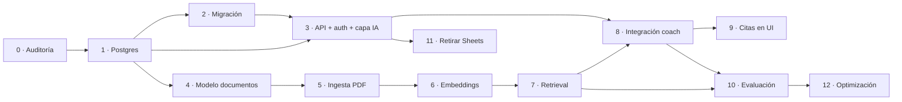

# Roadmap

13 fases, de auditoría a optimización. Cada una tiene su ficha con objetivo, tareas,
criterio de terminado y riesgos.

**Marca las casillas conforme avances.** Este archivo es el estado real del proyecto.

---

## Estado

| Fase | Título | Estado | Dificultad |
|---|---|---|---|
| [0](fase-00-auditoria.md) | Auditoría y volcado de datos | ☐ pendiente | Baja |
| [1](fase-01-postgres.md) | PostgreSQL + pgvector en Railway | ☐ pendiente | Media |
| [2](fase-02-migracion-datos.md) | Migración de datos existentes | ☐ pendiente | Media |
| [3](fase-03-api-auth-ia.md) | API real, autenticación y capa de IA neutra | ☐ pendiente | Alta |
| [4](fase-04-modelo-documentos.md) | Modelo de documentos | ☐ pendiente | Baja |
| [5](fase-05-ingesta-pdf.md) | Ingesta de PDFs con chunking real | ☐ pendiente | Alta |
| [6](fase-06-embeddings.md) | Embeddings + pgvector | ☐ pendiente | Media |
| [7](fase-07-retrieval.md) | Retrieval híbrido y reranking | ☐ pendiente | Media |
| [8](fase-08-integracion-coach.md) | Integración con el motor de decisiones | ☐ pendiente | Alta |
| [9](fase-09-citas-ui.md) | Citas y evidencia en la interfaz | ◐ implementada; QA con PDFs pendiente | Baja |
| [10](fase-10-evaluacion.md) | Evaluación formal y observabilidad | ☐ pendiente | Media |
| [11](fase-11-retirada-sheets.md) | Retirada de Google Sheets | ☐ pendiente | Baja |
| [12](fase-12-optimizacion.md) | Optimización y pruebas de proveedores | ☐ pendiente | Baja |

---

## Dependencias



## Orden recomendado

**Bloque 1 — dejar de perder datos (fases 0-3).**
Es lo menos entretenido de construir y lo más importante. Hoy borrar el navegador borra
meses de historial. Nada de lo demás importa si esto no está resuelto.

**Bloque 2 — biblioteca en base de datos (fase 4).**
Barata, rápida, habilita todo lo siguiente. Puede hacerse en paralelo al bloque 1.

**Bloque 3 — el RAG de verdad (fases 5-8).**
El salto real de calidad del coach. Es donde hay trabajo de diseño nuevo, no solo traducción
de lo existente.

**Bloque 4 — cerrar (fases 9-12).**
Lo que el usuario percibe (citas), lo que te permite mejorar con datos (evaluación) y la
limpieza.

---

## Reglas transversales

Aplican a **todas** las fases:

1. **No se toca el motor determinista** (`buildPlan`, `generateWeek`, reglas R1-R9,
   `progresionSugerida`) sin petición explícita.
2. **No se amplía `AJUSTES_PERMITIDOS`** sin decisión de producto.
3. **Toda salida de LLM pasa por validación** antes de mostrarse o aplicarse.
4. **Los avisos clínicos son código**, nunca instrucciones de prompt.
5. **Ninguna dependencia nueva sin justificarla** en `docs/10-decisiones-tecnicas.md`.
6. **Ningún archivo fuera de `server/ai/providers/`** conoce a un proveedor de IA concreto.
7. **Migraciones versionadas**, nunca editadas retroactivamente.
8. **Secretos solo en variables de entorno.**

---

## Cómo usar estas fichas con Claude Code

Al empezar una sesión de trabajo:

```
Lee CLAUDE.md y docs/roadmap/fase-0X-....md.
Vamos a implementar esa fase. Empieza por proponerme el plan de archivos
que vas a crear o modificar, antes de escribir código.
```

Al terminar, marcar las casillas de la ficha y actualizar la tabla de estado de este archivo.
